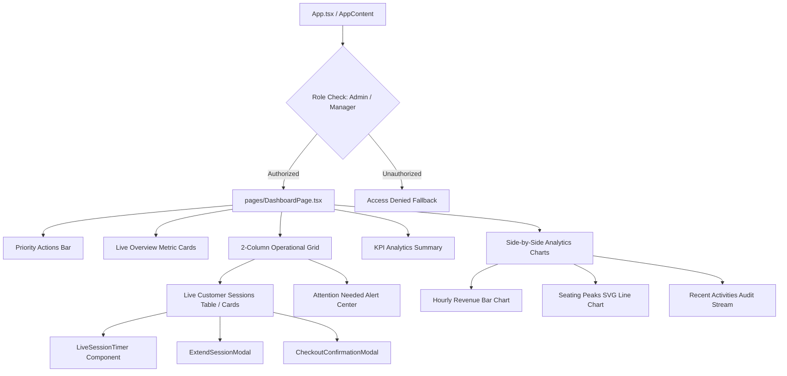

# Executive Technical & UX Audit Report: Admin Dashboard

## 1. Executive Summary
The **Admin Dashboard** (`/dashboard`) serves as the central operational command center for Venue Administrators, General Managers, and Floor Supervisors in the **F&B Registration + TableFlow Ordering** system. It combines real-time IoT table occupancy monitoring, guest session lifecycles, drink redemption tracking, financial performance metrics, and interactive hourly analytics into a high-density, responsive interface.

---

## 2. Architecture & Component Hierarchy

### 2.1 File Map & Responsibilities
| Component / Module | Path | Purpose |
| :--- | :--- | :--- |
| **Primary Page** | [`DashboardPage.tsx`](file:///d:/Cloud%20Shift%20Solutions%20Intern/NFC/NFC%20QR%20code/web-frontend/src/pages/DashboardPage.tsx) | Main executive dashboard containing metrics, session tables, charts, and alert streams. |
| **Admin Hub Page** | [`AdminPage.tsx`](file:///d:/Cloud%20Shift%20Solutions%20Intern/NFC/NFC%20QR%20code/web-frontend/src/pages/AdminPage.tsx) | Sub-tab configuration manager (Tables, Menu, Staff, Rates, Customers, Revenue Analytics). |
| **Sub-Tab Navigation** | [`AdminNavTabs.tsx`](file:///d:/Cloud%20Shift%20Solutions%20Intern/NFC/NFC%20QR%20code/web-frontend/src/components/admin/AdminNavTabs.tsx) | Navigation pills for switching between deep administration workspaces. |
| **Dedicated Revenue Chart** | [`RevenueAnalyticsChart.tsx`](file:///d:/Cloud%20Shift%20Solutions%20Intern/NFC/NFC%20QR%20code/web-frontend/src/components/admin/RevenueAnalyticsChart.tsx) | Dedicated evening shift (6 PM - 1 AM) revenue analytics with CSV export. |
| **Data Context** | [`DataContext.tsx`](file:///d:/Cloud%20Shift%20Solutions%20Intern/NFC/NFC%20QR%20code/web-frontend/src/context/DataContext.tsx) | Global polling, socket events, active tokens, tables, rates, and alerts. |
| **Auth Context** | [`AuthContext.tsx`](file:///d:/Cloud%20Shift%20Solutions%20Intern/NFC/NFC%20QR%20code/web-frontend/src/context/AuthContext.tsx) | Authentication token, user profile, role permissions, and theme state. |
| **Backend Route** | [`routes.ts`](file:///d:/Cloud%20Shift%20Solutions%20Intern/NFC/NFC%20QR%20code/backend/src/routes.ts#L6032-L6250) (`GET /reports/dashboard`) | Authoritative analytics aggregator (Sales, Table Utilization, Hourly Breakdown). |

---

## 3. Detailed Workflow & Feature Audit

### 3.1 Priority Actions Bar
- **Location**: Top of page.
- **Adaptive Role Routing**:
  - **Admin / Manager**: New Check-In (`/checkin`), Occupied Tables (`/tables/occupied`), Table Layout (`/tables`), Customer Sessions (`/admin/customers`).
  - **Receptionist**: Check-In, Occupied Tables, Table Layout, Attendance Kiosk (`/quick_attendance`).
  - **Bartender**: QR Scan (`/bartender/scan`), Occupied Tables, Table Layout, Attendance.
- **UX Evaluation**: Highly accessible, one-touch routing to critical operational functions with directional chevron indicators and subtle hover glow.

### 3.2 Live Overview Metric Cards
- **Grid Layout**: 2-column mobile, 3-column tablet, 5-column desktop (`xl:grid-cols-5`).
- **Metrics Calculated**:
  1. **Active Guest Sessions**: Count of active QR tokens (`tokens.length`) with occupied table count subtext.
  2. **Total Guests In-House**: Sum of `personsCount` across all active tokens.
  3. **Seating Occupancy**: `Math.round((totalGuestsInHouse / totalCapacity) * 100)%` comparing in-house headcount to total physical seat capacity.
  4. **Drink Redemptions**: Real-time sum of `redemptionsUsed` dispensed today.
  5. **Session Revenue**: Total verified sales collections from the daily dashboard report.
- **Visual Design**: Complies with Brand Design System with themed border accents (Primary Purple / Dark Gold, Emerald, Amber, Blue).

### 3.3 Live Customer Sessions Workspace
- **Desktop Table (`sm:block`)**:
  - Columns: Token #, Customer Name, Contact (Phone + Email), Persons Count, Drink Redemptions Fraction, Status Badge, Live Time Left, and Quick Action Buttons.
  - Status Treatments: `ACTIVE` / `EXTENDED` (Emerald), `EXPIRING` (Amber), `PENDING_PAYMENT` (Blue Pulse), `CLOSED` (Muted).
- **Mobile Card Grid (`sm:hidden`)**: High-density 2-column key-value cards with prominent timer displays and full-width touch targets.
- **LiveSessionTimer Component**:
  - Independent 1-second interval calculating exact time delta against `endTime`.
  - Color-coded urgency thresholds:
    - `> 15 mins`: Emerald text.
    - `5 - 15 mins`: Amber text.
    - `< 5 mins` or `EXPIRED`: Red pulsing text.
- **In-Place Actions**:
  - **Extend Session**: Opens `ExtendSessionModal` with dynamic rate card pricing.
  - **Checkout Session**: Opens `CheckoutConfirmationModal` with authoritative bill calculation and turnover automation.

### 3.4 Attention Needed Alert Center
- **Dynamic Aggregation**:
  - Session expiration warnings (< 15 mins remaining).
  - Sessions awaiting payment / checkout.
  - Tables newly vacated and available for guest assignment.
  - Pending customer check-ins.
- **Interaction**: Clicking an alert triggers targeted table inspection and cross-navigates to the Floor Plan with highlighted table selection.

### 3.5 KPI Analytics Summary (Management Only)
- **Average Checkout Value**: `todaySales / checkoutCount`.
- **Drink Conversion Rate**: `todayRedemptions / totalCustomers`.
- **Active QR Passes**: Live count of valid dining tokens.
- **Peak Seating Volume**: Peak concurrent token load from 24-hour hourly distributions.

### 3.6 Interactive Analytics Visualizations
1. **Hourly Revenue Overview (Bar Chart)**:
   - 24-hour dynamic histogram.
   - Dynamic Y-axis labeling with `k` formatting (`₹10k`, `₹20k`, etc.).
   - Peak sales hour identification with badge highlighting.
   - Interactive touch/hover tooltips showing exact timestamped sales values.
2. **Seating Peaks Trend (Custom SVG Line & Area Chart)**:
   - SVG `path` construction with gold gradient area fills (`#D4AF37`).
   - Interactive data node circles with expanded touch hitboxes for mobile devices.
   - Responsive X-axis tick filtering.
3. **Recent Activities Stream**:
   - Real-time chronologically sorted audit log of daily check-ins, checkouts, and session extensions with pulsing status indicators.

---

## 4. Backend Analytics Engine Audit (`GET /api/reports/dashboard`)

### 4.1 Sales Reconciliation
- Queries all tokens with `paymentVerified: true` within the target date range.
- Deconstructs base cover charge (`amountPaid - sum(extensions)`) and aggregates extension revenue from `TokenExtension` records to prevent duplicate counting.

### 4.2 Table Utilization & Turnover Analysis
- Evaluates `TableOccupancyLog` records intersecting the target window.
- Calculates exact `totalOccupancyHours`, `turnoverCount`, and `averageSessionDurationMinutes` per physical table.
- Derives overall venue occupancy rate: `totalOccupancyHoursSum / (periodHours * tables.length)`.

### 4.3 24-Hour Hourly Breakdown
- Iterates 0:00 to 23:00, mapping:
  - Drink redemptions stamped in that hour.
  - Check-in tokens initiated in that hour.
  - Average active concurrent tokens during that hourly window.
  - Revenue generated (cover charges + extensions) in that hourly slice.

---

## 5. Security, Permissions & Access Control

| Role | Access Level to `/dashboard` | Capabilities |
| :--- | :--- | :--- |
| **Administrator** | Full Access | Complete metrics, financial analytics, revenue charts, session management, and system administration. |
| **Manager** | Full Access | Operational oversight, revenue tracking, table turnover, session extensions, and checkout authorization. |
| **Receptionist** | Restricted / Redirected | Redirected to `/checkin`. If viewing overview, revenue and KPI analytics are omitted. |
| **Bartender** | Restricted / Redirected | Redirected to `/bartender/kds`. Bar redemption metrics visible; financial figures omitted. |
| **Chef / Waiter** | No Dashboard Access | Redirected to `/kds/kitchen` or `/waiter`. Direct dashboard access blocked by route guards. |

---

## 6. Strengths & Best Practices Identified

1. **Zero External Charting Dependencies**:
   - Built using lightweight, highly performant custom SVG paths and CSS flexbox bars, avoiding bulky third-party charting libraries like Chart.js or Recharts.
2. **Real-time Urgency Styling**:
   - Time-left visual color changes (green → amber → red pulse) ensure floor staff instantly recognize expiring tables without navigating away.
3. **Responsive Hybrid Presentation**:
   - Seamless transition from full desktop data tables to high-density mobile cards below `640px`.
4. **Resilient Data Reconciliation**:
   - Backend `tokenService.reconcileSystemState()` ensures expired tokens and orphaned table locks are cleaned up before computing dashboard metrics.
5. **Brand Design System Adherence**:
   - Consistent utilization of glass panels, dark theme gold highlights, and monochrome typography without distracting neon accent colors.

---

## 7. Recommendations & Optimization Opportunities

| Area | Current State | Recommended Enhancement | Impact |
| :--- | :--- | :--- | :--- |
| **Multi-Day Date Range** | Dashboard report defaults to current single day (`filter=day`). | Add quick selector for Yesterday, This Week, and Custom Date Range. | Higher executive visibility into trends. |
| **WebSocket Real-time Push** | Dashboard refreshes via polling and `app:global-refresh` events. | Subscribe dashboard metrics to specific socket channels (`staff:billing`, `tables:all`). | Instant chart and metric updates without polling lag. |
| **Table Revenue Breakdown** | Revenue chart shows venue aggregate. | Add top-performing tables / zones breakdown pill. | Actionable seating optimization insights. |
| **Export Capabilities** | CSV export available on `RevenueAnalyticsChart.tsx` subtab. | Add one-click "Export Daily Audit Summary (PDF/CSV)" directly from the primary Dashboard. | Streamlined manager end-of-shift reporting. |
