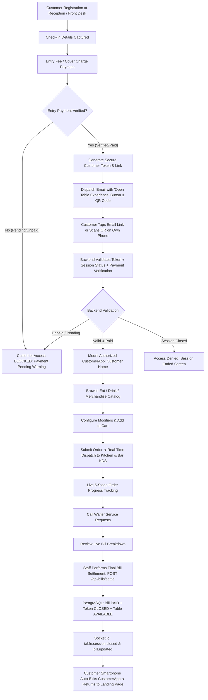
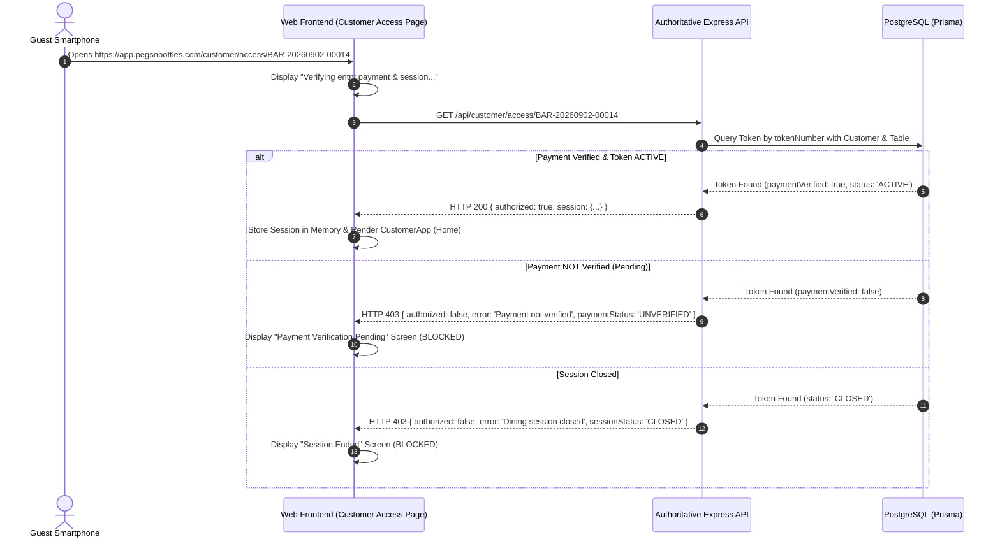
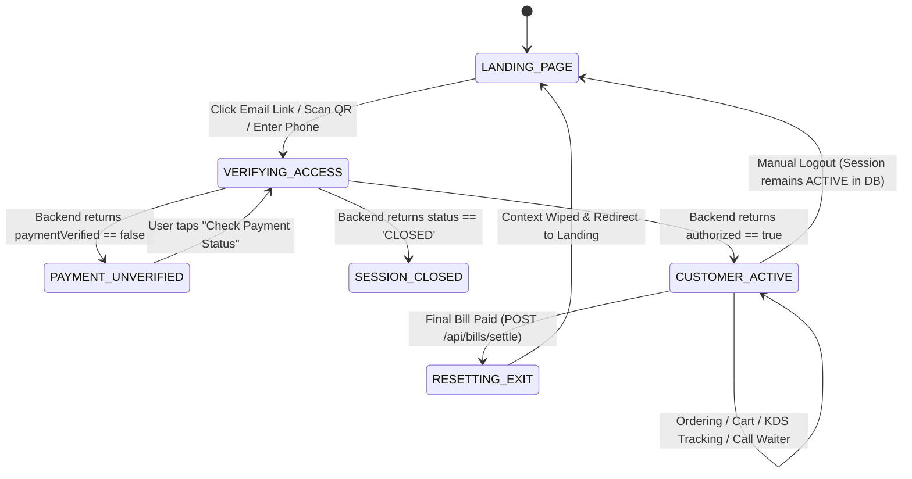

# Customer Entry / Landing Experience — Payment-Gated Customer Access
## Authoritative Functional and Technical Specification

---

## 1. Objective
This specification establishes a **mobile-first, email-delivered, payment-gated customer access architecture** for the TableFlow Ordering / F&B platform. 

Guests access the ordering interface using their **own personal mobile smartphones** via a secure customer access link and QR code sent to their registered email address following registration and entry payment verification. 

**No dedicated physical tablets or table-mounted displays are required at tables.**

---

## 2. Business Clarification
- **Device Ownership:** The customer uses their personal smartphone (iOS / Android browser).
- **Table Hardware:** Physical tables are equipped only with table identifiers / markers. No dedicated tablet hardware is required per table.
- **Entry Gatekeeper:** Registration alone does **NOT** unlock the customer ordering interface. Entry/cover charge payment must be **verified by the backend (`paymentVerified === true`)** before customer access is granted.
- **Dual Payment Separation:**
  1. **Entry / Registration Payment:** Mandatory access gate required to unlock CustomerApp.
  2. **Final Dining Bill Payment:** Settle food, beverages, service charge, and GST at the end of the dining experience, which atomically closes the session and wipes customer context.

---

## 3. Final Architecture



---

## 4. Customer Registration & Check-In
Registration establishes the guest's party and assigns seating:
- **Captured Fields:** Customer Name, 10-Digit Mobile Number, Email Address, Group Size, Seating Place Type (`STANDING_BAR` / `PREMIUM_LOUNGE`), and Assigned Table Number.
- **Outcome:** Generates a database `Token` entity with initial status `ACTIVE` and `paymentVerified` flag reflecting the cashier verification.

---

## 5. Entry Payment Gatekeeper
- The entry payment represents the cover charge or admission fee required before dining.
- **Server-Side Enforcement:** When a customer attempts to open the application, `GET /api/customer/access/:tokenNumber` checks:
  ```typescript
  if (!token.paymentVerified) {
    return res.status(403).json({
      authorized: false,
      error: 'Your entry payment has not been verified yet. Please complete payment at reception or contact staff.',
      paymentStatus: 'UNVERIFIED'
    });
  }
  ```
- **Zero Frontend Bypass:** Modifying `localStorage`, URL parameters (`?paid=true`), or client state is completely ineffective because every order and catalog query enforces server-side token validation.

---

## 6. Payment Verification Flow



---

## 7. Email Notification Dispatch
When check-in and payment verification complete:
- The system dispatches an HTML email via `EmailNotificationService`.
- **Email Content:**
  1. Welcome greeting and guest name.
  2. Assigned table and seating category.
  3. Prominent **"Open Your Table Experience"** CTA button linking to `https://<domain>/customer/access/<tokenNumber>`.
  4. High-resolution QR code encoding the same customer access URL.
  5. Summary of complimentary drink redemptions and shift validity.

---

## 8. Customer Access Link & QR Format
- **Access Link Format:** `/customer/access/:tokenNumber` (e.g. `/customer/access/BAR-20260902-00014`).
- **QR Code Content:** Direct URL `https://<domain>/customer/access/<tokenNumber>`.
- Scanning the QR with any standard smartphone camera app instantly opens the browser and triggers server-side validation.

---

## 9. Customer Landing Page (`/` or `/customer/landing`)
A public mobile-first landing portal featuring:
- Restaurant brand identity (**Pegs N Bottles**).
- **"Scan Customer QR"**: Launches camera or simulates quick QR code reading.
- **"Enter Token Number"**: Direct alphanumeric token entry.
- **"Find Session via Phone Number"**: Secondary recovery mechanism that prompts for the 10-digit phone number and strictly verifies that the associated session is active and entry payment is verified.

---

## 10. Customer Authorization Lifecycle



---

## 11. Customer Ordering Experience (`CustomerApp`)
Once authorized:
- **Eat / Drink / Merchandise Catalog:** Categorized menu with dietary filters (`Veg`, `Non-Veg`, `Egg`).
- **Customization Modal:** Real-time modifier selection (size, ice, spice level, cooking notes).
- **Cart Summary:** Automatic 5% Service Charge + 5% GST computation.
- **Order Submission:** `POST /api/orders` routes kitchen items to Kitchen KDS and beverages to Bar KDS.
- **Order Tracking:** 5-stage live status: `PLACED` ➔ `ACCEPTED` ➔ `PREPARING` ➔ `READY` ➔ `SERVED`.

---

## 12. Call Waiter Service Requests
- 1-tap service requests (`Water`, `Cutlery`, `Napkins`, `Clean-up`, `Assistance`, `Bill Request`).
- Dispatched to `staff:requests` room on all Waiter Stations.
- Waiter acknowledgement and completion statuses update the customer's screen in real time.

---

## 13. Live Bill Review
- Guests can review live billing calculations (`Food Subtotal`, `Beverage Subtotal`, `Applied Discounts`, `Taxes & Service Charges`).
- All calculations are synchronized authoritatively from the backend (`GET /api/bills/live/:tokenNumber`).

---

## 14. Final Bill Settlement & Atomic Session Closure
When dining concludes:
- Receptionist / cashier executes `POST /api/bills/settle`.
- Database transaction atomically:
  1. Updates `Bill.status = 'PAID'`.
  2. Updates `Token.status = 'CLOSED'` and records `closedAt`.
  3. Updates `Table.status = 'available'` and sets `Table.currentTokenId = null`.
  4. Finalizes `TableOccupancyLog` duration.
- Socket.io broadcasts `bill.updated`, `table.updated`, and `table.session.closed`.

---

## 15. Automatic Customer Exit After Final Payment
- Upon receiving `table.session.closed` via Socket.io:
  1. `CustomerApp` displays a brief notification: *"Your dining session has ended. Thank you for visiting Pegs N Bottles!"*
  2. All local guest data (`bar_active_token`, `bar_customer_cart`, `bar_active_table_num`) is wiped from memory and `localStorage`.
  3. The phone's browser automatically navigates back to the Customer Landing Page (`/customer/landing`).

---

## 16. Manual Logout Behavior
- If a customer taps **Logout** in the header:
  - Phone clears local access state and navigates to the Landing Page.
  - **The backend dining session remains ACTIVE.** Orders in preparation are not cancelled and the table remains occupied.
  - Re-opening the email link restores the customer session immediately.

---

## 17. Security & Customer Isolation
- Customer A (Table S-01, Token A) cannot view or access Customer B (Table L-01, Token B).
- Phone number recovery requires an exact 10-digit match against an **ACTIVE** token with **VERIFIED** payment.
- Reopening an old email link after final checkout returns `HTTP 403 Forbidden` with a safe message and prevents historical order leakage.

---

## 18. Backend APIs

| Endpoint | Method | Access | Purpose |
| :--- | :--- | :--- | :--- |
| `/api/customer/access/:tokenNumber` | GET | Public | Validates access token, session status, and entry payment |
| `/api/customer/recover` | POST | Public | Phone-based session lookup enforcing payment verification |
| `/api/orders` | POST | Customer / Token | Submits food and beverage order items |
| `/api/orders/my-orders` | GET | Customer / Token | Returns live order stream for token |
| `/api/service-requests` | POST | Customer / Token | Submits waiter assistance request |
| `/api/bills/live/:tokenNumber` | GET | Customer / Token | Retrieves live bill calculation |
| `/api/bills/settle` | POST | Staff (Auth) | Settle bill, mark paid, release table, and close session |

---

## 19. Socket.io Real-Time Events

| Event | Direction | Payload | Description |
| :--- | :--- | :--- | :--- |
| `order.created` | Server ➔ Client | `{ order }` | Appends new order to active stream |
| `order.item.updated` | Server ➔ Client | `{ itemId, status }` | Updates item progress badge |
| `service_request.created`| Server ➔ Client | `{ request }` | Confirms waiter call creation |
| `service_request.updated`| Server ➔ Client | `{ requestId, status }` | Updates waiter call status |
| `bill.updated` | Server ➔ Client | `{ bill }` | Refreshes live tab calculations |
| `table.session.closed` | Server ➔ Client | `{ tokenNumber, closedAt }` | Forces smartphone auto-exit to landing page |

---

## 20. Manual Testing Scenarios

### Scenario 1 — Registration & Payment Pending
1. Receptionist initiates check-in with `paymentVerified: false`.
2. Customer opens email link: `http://localhost:5173/customer/access/<token>`.
3. Verify access is **BLOCKED** showing *"Payment Verification Pending"*. CustomerApp does NOT open.

### Scenario 2 — Payment Verification & Access Granted
1. Cashier confirms entry payment (`paymentVerified: true`).
2. Customer reloads or taps *"Check Payment Status"*.
3. Verify access is **GRANTED** and Customer Home opens.

### Scenario 3 — Customer Ordering & Live Tracking
1. Browse categories (**Eat**, **Drink**), customize modifiers, and add to cart.
2. Submit order and observe status `PLACED`.
3. Progress order on Kitchen KDS to `PREPARING` and `READY`; observe live status updates on phone.

### Scenario 4 — Call Waiter Service Request
1. Tap **Call Waiter** and request **Water**.
2. Waiter acknowledges and completes on Waiter Station; observe status update on phone.

### Scenario 5 — Refresh / Reconnect
1. Refresh the smartphone browser during active session.
2. Verify active session is restored with cart and order tracking intact.

### Scenario 6 — Manual Logout & Resume
1. Tap **Logout** in customer header; phone returns to Landing Page.
2. Re-open email access link; verify session resumes seamlessly.

### Scenario 7 — Final Bill Settlement & Auto-Exit
1. Staff settles final bill (`POST /api/bills/settle`).
2. Observe customer smartphone automatically exits CustomerApp and returns to the Landing Page without manual refresh.

### Scenario 8 — Post-Checkout Access Denial
1. Re-open the old email access link after checkout.
2. Verify access is **DENIED** showing *"This dining session has ended."*

---

## 21. Summary of Architecture Rules
1. **Zero Tablet Hardware Requirement:** Mobile-first customer experience on guest phones.
2. **Payment-Gated Entry:** `paymentVerified === true` required to unlock ordering.
3. **Dual Payment Clarity:** Entry payment unlocks access; Final dining bill closes session.
4. **Real-Time Auto-Turnover:** Bill settlement automatically clears customer context and redirects to Landing Page.
5. **Frozen UI/UX:** Approved Phase 5 ordering interface preserved with 100% fidelity.
