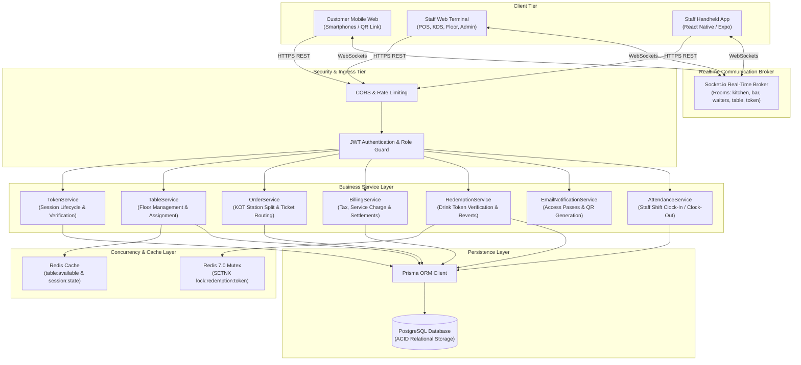

# F&B Registration — E2E Technical Documentation

---

## 1. Executive Summary & System Overview

### 1.1 Mission & Architectural Purpose
**Pegs N Bottles (F&B Registration & TableFlow Ordering Platform)** is an enterprise-grade, omnichannel food, beverage, and hospitality venue operations management platform. Engineered for high-velocity hospitality venues such as gastro-pubs, nightclubs, microbreweries, and dining lounges, the platform bridges front-of-house intake, dual-model guest journeys (**Standing Bar** counter redemption vs. **Premium / Lounge** table-side dining), payment-gated mobile self-ordering, kitchen/bar display workflows, floor service orchestration, bartender token redemptions, and real-time financial auditing.

### 1.2 The Two Operational Place Types

```mermaid
flowchart TD
    subgraph Intake["Front-of-House Registration & Payment Gating"]
        A[Receptionist Registers Guest Group & Party Size] --> B[Calculate Entry Fee & Select Place Type]
        B --> C{Place Type Selection}
    end

    subgraph StandingFlow["Standing Bar Flow (Voucher Redemption)"]
        C -->|Standing Bar| D[Assign Standing Zone e.g. SB-24]
        D --> E[Generate QR Redemption Pass]
        E --> F[Guest walks to Bartender Counter]
        F --> G[Bartender Scans QR at Terminal]
        G --> H[Atomically Deduct 1 Complimentary Drink/Snack]
        H --> I[Enforce Hard Quota Cap - No Table Ordering or Post-Bill]
    end

    subgraph PremiumFlow["Premium / Lounge Flow (Dining & Self-Ordering)"]
        C -->|Premium / Lounge| J[Assign Lounge Table e.g. LNG-08]
        J --> K[Dispatch Email Pass: QR + 'Place Your Order']
        K --> L{Payment Verified?}
        L -->|Pending| M[Block Ordering: 'Payment is not received. Please contact receptionist']
        L -->|Verified| N[Unlock Mobile Ordering App on Guest Smartphone]
        N --> O[Food Items -> Kitchen KDS | Drinks -> Bar KDS]
        O --> P[Waiter Serves Dishes Table-Side & Handles Calls]
        P --> Q[Calculate Bill: Excess Items + Drinks + 5% SC + 5% GST]
        Q --> R[Settle Bill -> Close Session -> Auto-Exit]
        R --> S[Old QR/Link Renders Read-Only Completed Bill Receipt]
    end
```

---

## 2. Detailed Business Logics & Sequence Workflows

---

### 2.1 Standing Bar Workflow & Technical Specifications

#### Business Scenario & Parameters
* **Example:** 4 customers arrive at the Standing Bar.
* **Standing Rate:** ₹1,000 per person.
* **Total Entry Fee:** $4 \times ₹1,000 = \mathbf{₹4,000}$.
* **Assigned Zone:** Standing Bar table/zone (e.g., `SB-24`).

#### Operational Flow & System Constraints
1. **Intake & Pass Creation:** Receptionist registers the 4 guests, collects ₹4,000 entry payment, assigns zone `SB-24`, and generates a digital token pass.
2. **Redemption Pass Delivery:** Customer receives their pass via SMS/WhatsApp or printed slip. The QR code functions strictly as a **counter redemption pass**.
3. **No Customer Self-Ordering:** The QR code does *not* provide access to the kitchen dining menu, live cart, or table self-ordering portal.
4. **Bartender Counter Scan:** Customer presents QR pass at the bar counter. The bartender scans the pass on `/bartender/scan`.
5. **Entitlement & Quota Verification:** The screen displays active status and remaining complimentary quota (e.g. *“Remaining: 4 of 4”*).
6. **Atomic Deduction:** Bartender taps **REDEEM** ➔ Backend executes an atomic decrement on `redemptionsUsed` protected by Redis distributed lock.
7. **Hard Quota Limit:** Redemptions cannot exceed the total allowed quantity. Once quota is exhausted, subsequent scan attempts return `400 Quota Exhausted`.
8. **No Post-Session Table Bill:** Standard standing bar entries do not generate table-side bills or live tabs.
9. **Session Cleanup:** Upon session expiry or departure, the standing zone is released back to `available`.

---

### 2.2 Premium / Lounge Workflow & Technical Specifications

#### Business Scenario & Parameters
* **Example:** 5 customers arrive at the Premium Lounge.
* **Premium Rate:** ₹2,500 per person.
* **Total Entry Fee:** $5 \times ₹2,500 = \mathbf{₹12,500}$.
* **Assigned Table:** Dedicated lounge table (e.g., `LNG-08`).

#### Operational Flow & System Constraints

#### Phase 1: Registration & Payment Gatekeeper
1. **Intake & Table Allocation:** Receptionist registers 5 guests and assigns Table `LNG-08`.
2. **Email Pass Dispatch:** Customer receives an email containing a QR code and a **“Place Your Order”** button (`/customer/access/:tokenNumber`).
3. **Seating:** Guests proceed to Table `LNG-08`.
4. **Before Payment Verification (Gatekeeper):**
   - If the receptionist has *not* verified the ₹12,500 payment:
   - When the customer taps **Place Your Order**, the backend returns `403 Forbidden` (`paymentStatus: 'UNVERIFIED'`).
   - The UI blocks access to the catalog and cart, displaying:
     > **“Payment is not received. Please contact the receptionist to complete your registration.”**
5. **After Payment Verification:**
   - Receptionist verifies payment collection in the system.
   - Customer taps **Place Your Order** again.
   - Backend returns `200 OK` (`authorized: true`) and mounts the full **Customer Mobile Ordering App** (`/customer/home`).

#### Phase 2: Ordering & Station Routing
6. **Menu Browsing & Modifiers:** Guests browse Eat (food), Drink (cocktails, beers, spirits), and Merchandise categories, configuring portion sizes and chef notes.
7. **Cart Submission:** Customer taps **Place Order** (`POST /api/orders`).
8. **KOT Station Routing:**
   - Items with `station === 'KITCHEN'` dispatch to the **Kitchen Display System** (`/kds/kitchen`).
   - Items with `station === 'BAR'` dispatch to the **Bar Display System** (`/kds/bar`).
9. **Table-Side Waiter Service:** Floor servers monitor the `Ready` queue on the **Waiter Station** (`/waiter`), pick up ready orders from the respective kitchen/bar counters, and serve them to Table `LNG-08`.
10. **Service Calls:** Guests can tap **Call Waiter** (`POST /api/service-requests`) for water, cutlery, or table assistance.

#### Phase 3: Complimentary Entitlements & Live Billing Engine
11. **Complimentary Deduction Calculation:**
    - Complimentary allowance is calculated based on registered party size ($5 \text{ guests} = 5 \text{ eligible complimentary items}$).
    - The billing engine applies a ₹0 deduction to the 5 eligible complimentary snacks/drinks ordered.
    - Items ordered beyond the complimentary allowance become **chargeable**.
12. **Financial Breakdown:**
    - Subtotal = Chargeable Food/Snacks + Liquor/Beverages + Merchandise.
    - **5% Service Charge** applied to the subtotal.
    - **5% GST** applied to the taxable base.
    - Grand Total = Subtotal + Service Charge + GST + Rounding.

#### Phase 4: Final Settlement & Closed-Session Enforcement
13. **Bill Presentation:** Waiter presents the itemized bill (`GET /api/bills/live/:tokenNumber`) showing food subtotal, drink subtotal, taxes, entry fee credit, and net balance due.
14. **Settlement & Table Release:**
    - Customer pays the outstanding balance (Cash, Card, UPI).
    - Waiter taps **Settle Bill** (`POST /api/bills/settle`).
    - Prisma executes an atomic `$transaction` marking Bill `PAID`, Token `CLOSED`, and Table `available`.
15. **Auto-Exit on Customer Phone:**
    - Socket event `table.session.closed` broadcasts to room `token:<tokenNumber>`.
    - Customer mobile UI displays a checkout overlay and concludes the active session.
    - Active ordering, cart actions, and add-to-cart controls are permanently disabled.
16. **Read-Only Bill View on Old QR / Links:**
    - If the customer scans the old QR or accesses the old link after closure:
    - Backend returns `sessionStatus: 'CLOSED'` with complete settled bill details.
    - The client renders a **clean, read-only printed-bill receipt** showing Bill Number, Table Number, itemized charges, 5% Service Charge, 5% GST, Grand Total, and a **"PAYMENT COMPLETED"** badge.
    - No menu or ordering actions are available. A new check-in is strictly required for any future orders.

---

## 3. Technology Stack & Infrastructure

| Layer / Scope | Technology | Version | Purpose & Rationale |
| :--- | :--- | :--- | :--- |
| **Backend Runtime** | Node.js | v20 LTS | Asynchronous event-driven I/O engine for concurrent HTTP and WebSocket traffic. |
| **Language** | TypeScript | v5.x | Static typing across database entities, service payloads, and real-time events. |
| **API Framework** | Express.js | v4.18 | REST routing, middleware pipeline, and error handling. |
| **Real-Time Engine** | Socket.io | v4.8 | Low-latency bi-directional WebSocket broker with room-based pub/sub. |
| **Relational Database** | PostgreSQL | v14+ | ACID-compliant relational data storage with strong transactional guarantees. |
| **ORM / Data Access** | Prisma ORM | v5.10 | Type-safe query building, declarative schema migrations, and relational joins. |
| **Caching & Mutex** | Redis / ioredis | v7.x | Distributed locks (`SETNX`), table availability cache, and rate limiting. |
| **Web Frontend** | React | v19 | Declarative UI component library with fast virtual DOM diffing. |
| **Frontend Tooling** | Vite | v8.x | Lightning-fast ESM dev server and optimized Rollup client build system. |
| **Styling System** | Tailwind CSS | v4.x | Utility-first responsive CSS styling with standardized luxury dark theme. |
| **Mobile Client** | React Native / Expo | RN v0.85 / Expo 56 | Native staff handheld app with hardware camera QR scanning. |
| **QR Decoding** | jsQR / Expo Camera | Latest | Real-time client-side barcode decoding without server-side image processing. |
| **Security & Auth** | JWT & bcrypt | Latest | Cryptographically signed stateless bearer tokens and salted password hashing. |

---

## 4. End-to-End System Topology



---

## 5. Complete Database Schema (Prisma Data Model)

```prisma
datasource db {
  provider = "postgresql"
  url      = env("DATABASE_URL")
}

generator client {
  provider = "prisma-client-js"
}

enum Station {
  KITCHEN
  BAR
  CASHIER
}

enum FoodType {
  VEG
  NON_VEG
  EGG
}

enum TokenStatus {
  IN_CHECKIN
  ACTIVE
  EXTENDED
  COMPLETED
  CLOSED
  CANCELLED
  EXPIRED
}

enum OrderStatus {
  PLACED
  ACCEPTED
  PREPARING
  READY
  SERVED
  CANCELLED
}

model Role {
  id          String   @id @default(uuid())
  name        String   @unique
  description String?
  users       User[]
  createdAt   DateTime @default(now())
}

model User {
  id           String    @id @default(uuid())
  username     String    @unique
  passwordHash String
  fullName     String
  pin          String?
  roleId       String
  role         Role      @relation(fields: [roleId], references: [id])
  isActive     Boolean   @default(true)
  createdAt    DateTime  @default(now())
  updatedAt    DateTime  @updatedAt
}

model PlaceType {
  id                   String   @id @default(uuid())
  name                 String   @unique
  description          String?
  ratePerPerson        Float    @default(0.0)
  durationMinutes      Int      @default(120)
  redemptionsPerPerson Int      @default(2)
  tables               Table[]
  tokens               Token[]
  createdAt            DateTime @default(now())
}

model Table {
  id             String    @id @default(uuid())
  tableNumber    String    @unique
  capacity       Int       @default(4)
  placeTypeId    String
  placeType      PlaceType @relation(fields: [placeTypeId], references: [id])
  status         String    @default("available") // available, in_checkin, occupied, reserved, maintenance
  currentTokenId String?
  occupiedSince  DateTime?
  tokens         Token[]
  createdAt      DateTime  @default(now())
  updatedAt      DateTime  @updatedAt
}

model Customer {
  id          String   @id @default(uuid())
  name        String
  phoneNumber String   @unique
  email       String?
  tokens      Token[]
  createdAt   DateTime @default(now())
}

model Token {
  id                      String       @id @default(uuid())
  tokenNumber             String       @unique
  customerId              String
  customer                Customer     @relation(fields: [customerId], references: [id])
  tableId                 String
  table                   Table        @relation(fields: [tableId], references: [id])
  placeTypeId             String
  placeType               PlaceType    @relation(fields: [placeTypeId], references: [id])
  personsCount            Int          @default(1)
  totalRedemptionsAllowed Int          @default(2)
  redemptionsUsed         Int          @default(0)
  entryAmountPaid         Float        @default(0.0)
  paymentVerified         Boolean      @default(false)
  status                  TokenStatus  @default(IN_CHECKIN)
  startTime               DateTime?
  endTime                 DateTime?
  orders                  Order[]
  bills                   Bill[]
  redemptions             Redemption[]
  createdAt               DateTime     @default(now())
  updatedAt               DateTime     @updatedAt
}

model MenuCategory {
  id        String     @id @default(uuid())
  name      String     @unique
  slug      String     @unique
  station   Station    @default(KITCHEN)
  sortOrder Int        @default(0)
  items     MenuItem[]
  createdAt DateTime   @default(now())
}

model MenuItem {
  id          String       @id @default(uuid())
  name        String
  description String?
  basePrice   Float
  categoryId  String
  category    MenuCategory @relation(fields: [categoryId], references: [id])
  station     Station      @default(KITCHEN)
  foodType    FoodType     @default(VEG)
  isAvailable Boolean      @default(true)
  imageUrl    String?
  orderItems  OrderItem[]
  createdAt   DateTime     @default(now())
  updatedAt   DateTime     @updatedAt
}

model Order {
  id          String      @id @default(uuid())
  orderNumber String      @unique
  tokenId     String
  token       Token       @relation(fields: [tokenId], references: [id])
  status      OrderStatus @default(PLACED)
  totalAmount Float       @default(0.0)
  items       OrderItem[]
  createdAt   DateTime    @default(now())
  updatedAt   DateTime    @updatedAt
}

model OrderItem {
  id          String      @id @default(uuid())
  orderId     String
  order       Order       @relation(fields: [orderId], references: [id])
  menuItemId  String
  menuItem    MenuItem    @relation(fields: [menuItemId], references: [id])
  quantity    Int         @default(1)
  unitPrice   Float
  lineTotal   Float
  station     Station     @default(KITCHEN)
  foodType    FoodType    @default(VEG)
  modifiers   Json?       // e.g. { size: "Full", spice: "Medium", ice: "Low" }
  notes       String?
  status      OrderStatus @default(PLACED)
  createdAt   DateTime    @default(now())
  updatedAt   DateTime    @updatedAt
}

model Bill {
  id                  String   @id @default(uuid())
  billNumber          String   @unique
  tokenId             String
  token               Token    @relation(fields: [tokenId], references: [id])
  foodSubtotal        Float    @default(0.0)
  drinkSubtotal       Float    @default(0.0)
  merchandiseSubtotal Float    @default(0.0)
  subtotal            Float    @default(0.0)
  serviceCharge       Float    @default(0.0) // 5%
  gst                 Float    @default(0.0) // 5%
  discountAmount      Float    @default(0.0)
  rounding            Float    @default(0.0)
  grandTotal          Float    @default(0.0)
  paymentMethod       String?  // CASH, UPI, CARD
  status              String   @default("OPEN") // OPEN, BILL_REQUESTED, PAID
  paidAt              DateTime?
  createdAt           DateTime @default(now())
  updatedAt           DateTime @updatedAt
}

model Redemption {
  id          String   @id @default(uuid())
  tokenId     String
  token       Token    @relation(fields: [tokenId], references: [id])
  quantity    Int      @default(1)
  reverted    Boolean  @default(false)
  redeemedBy  String?
  createdAt   DateTime @default(now())
}
```

---

## 6. Authoritative REST API Catalog

### 6.1 Authentication & Staff Clock-In
* `POST /api/auth/login`: Staff authentication via 4-digit PIN or Username/Password. Returns signed JWT bearer token and user object.
* `POST /api/auth/logout`: Invalidates active staff session.
* `POST /api/attendance/clock`: Records employee shift clock-in or clock-out timestamp.

### 6.2 Customer Access & Session Recovery
* `GET /api/customer/access/:tokenNumber`: 
  - Validates guest token.
  - If `!token.paymentVerified`: returns `403` with message `"Payment is not received. Please contact the receptionist to complete your registration."`.
  - If `token.status === 'CLOSED'`: returns `200` with `sessionStatus: 'CLOSED'`, `error: 'This dining session has ended. Payment was successfully completed.'`, and includes settled bill breakdown for read-only presentation.
  - If active and verified: returns `200` with full session object.
* `POST /api/customer/recover`: Mobile number lookup for active table session pass recovery.

### 6.3 Guest Registration & Floor Management
* `POST /api/tokens/checkin`: Initiates customer intake and creates draft token.
* `PUT /api/tables/:tableId/assign`: Assigns table, marks payment verified, transitions token to `ACTIVE`, and dispatches email QR pass.
* `GET /api/tables`: Retrieves real-time floor plan matrix with occupancy countdowns.
* `POST /api/tokens/:id/extend`: Extends session duration and updates rate balances.
* `POST /api/tables/:tableId/release`: Manually releases table back to `available`.

### 6.4 Menu & KOT Ordering
* `GET /api/menu`: Retrieves categorized food, beverage, and merchandise items.
* `POST /api/orders`: Submits customer cart, generates KOT order tickets, routes items to KDS stations, and triggers `order.created`.
* `PATCH /api/orders/items/:itemId/status`: Updates item preparation lifecycle (`PLACED` ➔ `ACCEPTED` ➔ `PREPARING` ➔ `READY` ➔ `SERVED`).

### 6.5 Waiter Service Requests & Billing Engine
* `POST /api/service-requests`: Dispatches customer service request (*Water, Cutlery, Clean Up, Bill*).
* `PATCH /api/service-requests/:id`: Updates request status (`ACKNOWLEDGED`, `RESOLVED`).
* `GET /api/bills/live/:tokenNumber`: Computes dynamic itemized bill breakdown.
* `POST /api/bills/settle`: Executes atomic transaction closing bill, closing token, and freeing the table.

### 6.6 Bartender Operations
* `POST /api/redemptions/verify`: Verifies customer pass QR token at the bar counter.
* `POST /api/redemptions/redeem`: Decrements complimentary drink quota with distributed Redis mutex lock.
* `POST /api/redemptions/revert`: Reverts accidental drink deductions.

---

## 7. Real-Time Socket.io Event Specification

| Event Name | Direction | Payload | Purpose |
| :--- | :--- | :--- | :--- |
| `order.created` | Server ➔ Clients | `{ orderId, orderNumber, tableNumber, items, station }` | Alerts KDS kitchen/bar displays of incoming tickets. |
| `order.item_status_updated` | Server ➔ Clients | `{ orderId, itemId, status, station }` | Updates item progress across KDS, waiter station, and customer phone. |
| `service_request.created` | Server ➔ Clients | `{ id, tableNumber, requestType, note, timestamp }` | Triggers audio/visual alerts on waiter terminals. |
| `service_request.updated` | Server ➔ Clients | `{ id, status, acknowledgedBy }` | Synchronizes request resolution across floor servers. |
| `table.status_changed` | Server ➔ Clients | `{ tableId, tableNumber, status, currentTokenId }` | Updates floor plan color states on POS and host desks. |
| `bill.updated` | Server ➔ Clients | `{ billId, tokenNumber, tableNumber, status, grandTotal }` | Refreshes live bill tabs on customer phone and waiter terminal. |
| `table.session.closed` | Server ➔ Clients | `{ tableNumber, tokenNumber, closedAt }` | Terminates active customer ordering session upon final payment. |

---

## 8. Security, Data Integrity & Fault Tolerance

1. **Distributed Mutex Locking:** Prevents concurrent duplicate drink redemptions during high-traffic nightclub rushes using Redis atomic key leases (`SETNX`).
2. **ACID Transactional Isolation:** Bill settlements and table releases execute in strict PostgreSQL database transactions, preventing orphaned occupied tables.
3. **Payment Verification Gating:** Customer mobile web access links strictly return `403 Forbidden` if payment verification is pending or if the token is unverified.
4. **Resilient Local Scanning:** The React Native handheld app and web scanner decode QR barcodes locally using camera hardware feeds, guaranteeing zero lag without roundtrip image uploads.
5. **State Sanitization & Security:** Staff routes enforce JWT verification with encrypted passwords hashed via bcrypt.
