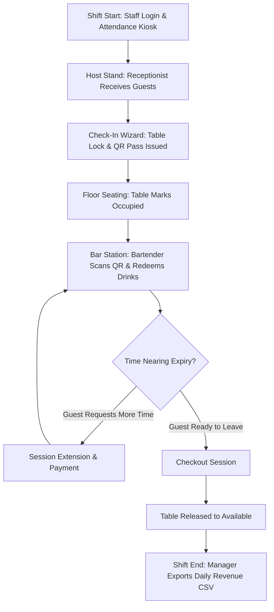

# F&B Registration — Complete End-to-End Web User Manual

---

## 1. System Overview

### 1.1 Purpose of the Platform
The **F&B Registration (Bar & Lounge Management System)** is an enterprise-grade, omnichannel food and beverage operations platform designed for high-volume dining, nightlife, and hospitality venues. The system digitizes guest intake, seating allocation, drink entitlements, real-time bartender operations, session duration countdowns, and financial reconciliation.

### 1.2 Core Capabilities
- **Digital Guest Intake Wizard:** 5-step structured registration with email QR pass delivery.
- **Dynamic Seating & Floor Plan Management:** Real-time table states (`available`, `in_checkin`, `occupied`, `reserved`, `maintenance`).
- **High-Throughput Bartender Station:** Sub-second drink redemptions, multi-drink steppers, instant reverts, session extensions, and checkout controls.
- **Authoritative Entitlement Engine:** Automatic mathematical calculation of drink balances based on guest headcount, zone rate cards, and carried-forward entitlements.
- **Role-Based Access Control (RBAC):** Distinct permission boundaries for Receptionists, Bartenders, Managers, and Administrators.
- **Live Operations Dashboard & Analytics:** Real-time KPI cards, seating breakdown graphs, and session audit logs.
- **Staff Attendance Kiosk:** PIN-based clock-in/clock-out tracking.

---

## 2. Prerequisites & System Requirements

### 2.1 Supported Devices & Screen Sizes
| Device Type | Recommended Resolution | Primary Role Usage |
| :--- | :--- | :--- |
| **Desktop Workstations** | 1920 × 1080 (1080p) or higher | Reception desk, Host stand, Management back-office |
| **Laptops & POS Terminals** | 1366 × 768 or 1280 × 800 | Fixed bar stations, cashier points |
| **Tablets (Landscape & Portrait)** | 1024 × 768 to 1280 × 800 (iPad, Galaxy Tab) | Mobile host stand, bar counter tablets |
| **Handheld Smartphones** | 360 × 640 to 430 × 932 (iOS / Android browsers) | Roaming bartenders, floor managers |

### 2.2 Supported Web Browsers
- Google Chrome (v110+) — *Recommended*
- Mozilla Firefox (v115+)
- Apple Safari (v16+)
- Microsoft Edge (v110+)

### 2.3 Hardware & Permissions
- **Camera Access:** Required for QR code barcode scanning on both desktop webcams and mobile device cameras.
- **Audio / Sound:** Required for audio chimes on successful drink redemptions and expiry warnings.
- **Network:** Continuous broadband or private local Wi-Fi connectivity to the backend server (Port 4000).

---

## 3. User Roles & Permissions

The platform enforces strict Role-Based Access Control (RBAC).

| Module / Feature | Receptionist (`receptionist`) | Bartender (`bartender`) | Manager (`manager`) | Administrator (`admin`) |
| :--- | :---: | :---: | :---: | :---: |
| **Customer Check-In Wizard** | ✅ Full Access | ❌ Restricted | ✅ Full Access | ✅ Full Access |
| **Table Floor Plan View** | ✅ View & Assign | ✅ View Only | ✅ Full Control | ✅ Full Control |
| **Table Lock / Unlock / Maintenance** | ✅ Temporary Locks | ❌ Restricted | ✅ Full Control | ✅ Full Control |
| **Create / Delete Tables** | ❌ Restricted | ❌ Restricted | ❌ Restricted | ✅ Full Control |
| **Bartender Scan & Check-Ins** | ❌ Restricted | ✅ Full Access | ✅ Full Access | ✅ Full Access |
| **Drink Redemption & Reverts** | ❌ Restricted | ✅ Full Access | ✅ Full Access | ✅ Full Access |
| **Session Extension & Checkout** | ✅ Checkout Only | ✅ Full Access | ✅ Full Access | ✅ Full Access |
| **Cancel Reservation** | ✅ Full Access | ❌ Restricted | ✅ Full Access | ✅ Full Access |
| **Operations Dashboard KPIs** | ❌ Restricted | ❌ Restricted | ✅ View All | ✅ View All |
| **Rate Card & Pricing Config** | ❌ Restricted | ❌ Restricted | ❌ View Only | ✅ Full Control |
| **Staff Directory & Accounts** | ❌ Restricted | ❌ Restricted | ❌ View Only | ✅ Full Control |
| **Staff Attendance Kiosk** | ✅ Clock In/Out | ✅ Clock In/Out | ✅ Clock In/Out | ✅ Clock In/Out |

---

## 4. Login & Authentication

### 4.1 Login Procedure
**Purpose:** Securely authenticate staff members and assign their session role.
**Who can use it:** All registered staff members.

#### Step-by-Step Instructions:
1. Open the application URL in your web browser (e.g., `http://localhost:5173` or venue URL).
2. Enter your assigned **Username** (e.g., `ADM-01`, `REC-01`, `BAR-01`, `MGR-01`).
3. Enter your secret **4-digit PIN** or password.
4. Click the **Sign In** button (or press `Enter`).

#### End-to-End System Execution Flow:
```
Staff enters Credentials -> POST /auth/login
-> Backend verifies bcrypt hash -> Generates JWT Token & StaffSession record (24h TTL)
-> Frontend stores JWT in localStorage -> Sets user role in AuthContext
-> Redirects user to their default role landing page.
```

#### Expected Results:
- **Receptionist:** Redirected automatically to **Customer Check-In** (`/checkin`).
- **Bartender:** Redirected automatically to **Bartender Service Station** (`/bartender`).
- **Manager / Admin:** Redirected automatically to **Operations Dashboard** (`/dashboard`).

#### Common Errors:
- `Invalid username or PIN`: Check caps lock and verify role prefix format (`REC-XX`, `BAR-XX`).
- `Account Inactive`: Contact venue Administrator to reactivate the account.

---

## 5. Web Application Navigation & Layout

### 5.1 Main Layout Elements
- **Navigation Sidebar (Left):** Access all permitted functional modules. Collapsible on mobile and tablet screens.
- **Top Header Bar:**
  - Active Section Title.
  - System Health Capsule (`System Active` with green status dot).
  - Global Rapid **Refresh Button** (Spins smoothly and reconciles cache).
  - Session Expiry **Notifications Bell** (Dropdown showing sessions expiring within 5 minutes).
  - User Profile Menu (Displays Staff Name, Role Badge, and **Sign Out** button).
- **Central Workspace:** Dynamic view rendering active page content with smooth transitions.

---

## 6. Dashboard (Operations Command Center)

### 6.1 Purpose & Role Access
**Purpose:** Central executive monitoring of live guest attendance, active seating, floor utilization, and revenue statistics.
**Who can use it:** Managers and Administrators (`manager`, `admin`).

### 6.2 Key Metric Cards
1. **Active Check-Ins:** Total number of currently active guest tokens.
2. **Current Occupancy:** Total seated guests across all active tables.
3. **Table Utilization:** Percentage of tables currently occupied vs total capacity.
4. **Daily Gross Revenue:** Total monetary value collected from check-in covers and session extensions.

### 6.3 Live Customer Sessions Table
- Lists all active seating tickets in real-time with Customer Name, Phone, Table Number, Headcount, Start Time, and Live Countdown Timer.
- **Action Menu:** Direct quick-actions to **Extend Session** or **Checkout Session**.
- **Auto-Refresh:** Updates in the background every 5 seconds.

---

## 7. Table Management & Floor Plan

### 7.1 Purpose & Role Access
**Purpose:** Visual overview and operational control over physical venue tables across seating zones.
**Who can use it:** All roles (Receptionists assign; Managers/Admins manage configurations).

### 7.2 Seating Zones & Color Legend
| Seating Zone | Table Number Prefix | Default Capacity | Base Cover Time | Default Drinks |
| :--- | :--- | :--- | :--- | :--- |
| **Standing Bar** | `S-01` to `S-99` | 2 – 4 Persons | 30 Minutes | 2 Drinks / Person |
| **Premium Lounge** | `L-01` to `L-99` | 4 – 10 Persons | 60 Minutes | 4 Drinks / Person |

| Table Status | Badge Color | Meaning & Allowed Actions |
| :--- | :--- | :--- |
| **Available** | Emerald Green | Table is vacant and clean. Ready for new guest check-in. |
| **In Check-In** | Sky Blue | Table is temporarily held (15s lock) during guest registration. |
| **Occupied** | Rose / Coral | Guests seated. Live countdown timer active. Click to inspect or checkout. |
| **Reserved** | Amber Gold | Reserved in advance. Ready for guest arrival or cancellation. |
| **Maintenance** | Slate Purple | Out of service for cleaning or repairs. Locked by Admin. |

### 7.3 Table Inspector Drawer
1. Click any table card in the floor grid.
2. A slide-over inspector drawer opens displaying:
   - Table Number, Zone, and Maximum Capacity.
   - Current Occupant Name, Phone Number, and Seated Time.
   - Action Buttons: **New Check-In**, **Extend Time**, **Release Table**, or **Toggle Maintenance**.

---

## 8. Customer Check-In Workflow

### 8.1 Step-by-Step 5-Stage Check-In Procedure

#### Stage 1: Guest Information & Zone Selection
1. Enter the guest's **Customer Name** (e.g., "John Doe").
2. Enter the guest's **Mobile Phone Number** (10-digit format).
3. Enter the guest's **Email Address** (Required for instant QR pass delivery).
4. Select the **Headcount / Number of Persons** (Use `+` / `-` buttons).
5. Select the **Seating Zone** (`Standing Bar` or `Premium Lounge`).
6. Click **Continue to Seating Selection**.

#### Stage 2: Table Selection & Locking
1. The screen displays available tables filtered for the chosen zone.
2. Click the desired available table (e.g., `S-04`).
3. *System Action:* Acquires a temporary 15-second Redis lock (`table:lock:{tableId}`) to prevent double-booking.
4. *Overcapacity Handling:* If guest headcount exceeds table capacity, a warning modal appears. Click **Confirm Seating** to proceed or select a larger table.
5. Click **Proceed to QR Verification**.

#### Stage 3: QR Code Pass Association
1. **Camera Scanner Option:** Click **Start Camera** and align the guest pass QR code within the view box.
2. **Manual Input Option:** Enter the alphanumeric token code (e.g., `BAR-20260827-10492`).
3. Click **Verify Code**.
4. The system validates uniqueness and marks the token code as verified with a green checkmark.
5. Click **Proceed to Payment**.

#### Stage 4: Payment Collection
1. Review the **Calculated Total Amount** (Headcount × Zone Rate).
2. Select **Payment Method**:
   - **Cash:** Collect cash payment from guest.
   - **UPI / QR Code:** Displays dynamic venue UPI QR code with exact amount.
3. Check the confirmation checkbox: `[x] Payment Verified & Collected`.
4. Click **Complete Check-In & Issue Pass**.

#### Stage 5: Pass Issued & Dispatch
1. The screen displays the confirmed digital guest pass with Token Number, Table, Start Time, and Drink Entitlement.
2. *System Action:* Enqueues background email dispatch containing the digital QR pass directly to the guest's email.
3. Click **Start New Check-In** or **View Active Table**.

---

## 9. QR / Token Verification

### 9.1 Verification Engine
- **Decoded Client-Side:** Utilizes `jsQR` for zero-latency camera frame scanning.
- **Token Format:** `BAR-YYYYMMDD-XXXXX` (Standardized regex `^BAR-\d{8}-\d{5}$`).
- **Validation Criteria:**
  - Token exists in database.
  - Status is `ACTIVE` or `EXTENDED`.
  - Session has not expired (`now < endTime`).
  - Remaining drinks > 0.

---

## 10. Bartender Service Station

### 10.1 Bartender Scan View (`/bartender/scan`)
- Dedicated camera scanner feed for high-speed guest drink redemption at the bar counter.
- **Scanned Guest Card Details:**
  - Customer Name & Phone Number.
  - Table Number & Place Type.
  - Live Session Countdown Timer (Green > 15m, Amber 5-15m, Red < 5m).
  - Total Drinks Allowed vs Drinks Redeemed.
  - Interactive Drink Quantity Stepper (`+` / `-`).

### 10.2 Bartender Check-Ins View (`/bartender/checkins`)
- Real-time list of all active guest sessions in the venue.
- **Mobile & Tablet Optimized:** Compact density cards with progressive disclosure accordions (`[ ▾ INFO ]`).
- Allows bartenders to find guests by Name, Table, or Phone and redeem drinks directly without scanning.

---

## 11. Drink Redemption Workflow

### 11.1 Step-by-Step Drink Redemption

#### Execution Flow:
1. Scan the guest's QR code or locate their active card in Check-Ins.
2. Review remaining drink balance:
   $$\text{Remaining Balance} = \text{Total Allowed} - \text{Redemptions Used}$$
3. Adjust the quantity stepper (`+` / `-`) to the number of drinks being served (e.g., 2).
4. Click the purple **Redeem Drink(s)** button.

#### End-to-End System Processing Flow:
```
Bartender clicks Redeem -> POST /tokens/:tokenNumber/redeem { quantity: N }
-> Backend acquires distributed mutex Redis lock: SETNX lock:redemption:{tokenNumber}
-> Transaction executes: SELECT ... FOR UPDATE on Token row
-> Validates: (redemptionsUsed + N) <= totalRedemptionsAllowed
-> Inserts Redemption log records (timestamp, bartender user ID, quantity)
-> Updates Token redemptionsUsed counter
-> Invalidates tokens:active and table status caches in Redis
-> Releases Redis lock via Lua script
-> Returns 200 OK with updated balance
-> Frontend plays audio chime, updates drink progress bar, and displays success toast.
```

---

## 12. Redemption Revert / Undo Workflow

### 12.1 Purpose & Execution
**Purpose:** Revert an accidental or incorrect drink redemption within the active session.
**Who can use it:** Bartenders, Managers, Admins.

#### Step-by-Step Instructions:
1. On the active guest card, click the **Revert** button (Undo icon `RotateCcw`).
2. A confirmation prompt appears asking to undo 1 drink redemption.
3. Click **Confirm Revert**.
4. The system deletes the last redemption record, decrements `redemptionsUsed`, increments remaining drinks, and plays an audio confirmation.

---

## 13. Session Extension Workflow

### 13.1 Purpose & Execution
**Purpose:** Extend a guest's table time and grant additional drink allowances.
**Who can use it:** Receptionists, Bartenders, Managers, Admins.

#### Step-by-Step Instructions:
1. Click the **Extend** button on any active customer card or table inspector.
2. Select the extension duration:
   - **+20 Minutes**
   - **+30 Minutes**
   - **+60 Minutes**
   - **Custom Duration** (Enter specific hours & minutes).
3. The modal automatically calculates:
   - **Additional Amount Due:** Pro-rated based on zone hourly rate card.
   - **Additional Drink Entitlement:** Pro-rated based on zone drink allowance.
4. Select payment method (`Cash`, `UPI`, or `Complimentary`).
5. Click **Confirm Extension**.
6. *System Action:* Updates Token `endTime`, increments `totalRedemptionsAllowed`, creates `TokenExtension` financial record, and extends live countdown timer.

---

## 14. Checkout Workflow

### 14.1 Purpose & Execution
**Purpose:** Formally conclude a guest session, release the table back to `available`, and archive financial logs.
**Who can use it:** Receptionists, Bartenders, Managers, Admins.

#### Step-by-Step Instructions:
1. Click the **Checkout** button (`LogOut` icon) on any active card or table drawer.
2. The **Checkout Confirmation Dialog** appears displaying:
   - Customer Name, Phone, Table Number, and Token Code.
3. Select the **Reason for Closure**:
   - `Customer Vacated Early`
   - `Standard Guest Checkout`
   - `Session Time Expired`
   - `Session Opened by Mistake`
   - `Other / Administrative Closure` (Requires explanation text).
4. Click **Yes, Checkout** (or press `Enter`).
5. *System Action:*
   - Sets Token status to `COMPLETED`.
   - Releases table status from `occupied` to `available`.
   - Calculates total occupancy duration and logs to `TableOccupancyLog`.
   - Invalidates Redis caches.
   - Closes modal and displays success toast.

---

## 15. Reservations & Advance Booking

### 15.1 Table Reservation Procedure
1. Navigate to **Tables & Seating ➔ Reservations Tab**.
2. Click **New Advance Reservation**.
3. Enter Guest Name, Phone, Desired Table, and Reservation Time.
4. Click **Save Reservation**.
5. The table badge turns amber (`Reserved`).
6. When guest arrives, click **Assign & Check-In** to launch the check-in wizard with pre-filled table details.
7. To cancel, click **Cancel Reservation**, select reason, and confirm.

---

## 16. Customer Sessions Management Directory

### 16.1 Purpose & Capabilities
**Purpose:** Historical auditing and reporting across all guest sessions.
**Who can use it:** Managers and Administrators.

#### Features:
- **Filter by Status:** All, Active, Extended, Completed, Cancelled.
- **Search:** Instant lookup by Customer Name, Phone, Email, or Token Number.
- **Export Data:** Click **Export CSV** to download complete session logs for accounting.
- **View History:** Click eye icon (`Eye`) to inspect full session audit logs, extension timestamps, payment receipts, and redemption history.

---

## 17. Staff Management & RBAC Directory

### 17.1 Purpose & Administration
**Purpose:** Manage venue staff accounts, assign operational roles, and manage PINs.
**Who can use it:** Administrators (`admin`).

#### Adding a New Staff Member:
1. Navigate to **Admin Control ➔ Staff Management**.
2. Click **Add Staff** button.
3. Enter Full Name (e.g., "Sarah Jenkins").
4. Select Role (`receptionist`, `bartender`, `manager`, `admin`).
5. System auto-generates Username with role prefix (`REC-02`, `BAR-03`).
6. Set a secret **4-digit PIN** (e.g., `5821`).
7. Click **Create Staff Account**.

---

## 18. Rate Management & Pricing Configuration

### 18.1 Purpose & Rate Card Editing
**Purpose:** Define pricing rules, base seating hours, and drink allowances per seating zone.
**Who can use it:** Administrators (`admin`).

#### Editing a Rate Card:
1. Navigate to **Admin Control ➔ Rate Cards**.
2. Click the **Edit** icon on the target zone (`Standing Bar` or `Premium Lounge`).
3. Update fields:
   - **Rate per Person (₹):** Standard entry cover price per guest.
   - **Base Duration (Minutes):** Seating time included (e.g., 30m, 60m).
   - **Drink Allowance per Person:** Number of redeemable drinks included.
4. Click **Save Rate Card**. All future check-ins immediately reflect the updated pricing.

---

## 19. Revenue & Analytics Dashboard

### 19.1 Purpose & Financial Metrics
**Purpose:** Executive financial oversight and seating efficiency analysis.
**Who can use it:** Managers and Administrators.

#### Visual Analytics Cards:
- **Gross Revenue Trend:** Line chart comparing hourly revenue collections.
- **Zone Revenue Distribution:** Pie chart breaking down income between Standing Bar and Lounge.
- **Payment Method Breakdown:** Ratio of Cash payments vs UPI QR digital transactions.
- **Average Seating Duration:** Average minutes guests occupy tables before checkout.

---

## 20. Notifications, Alerts & Audio Signals

### 20.1 System Audio Signals
- **Drink Redemption Chime:** Pleasant two-tone bell confirming valid drink redemption.
- **Revert Chime:** Soft low chime confirming drink deduction reversal.
- **Error Tone:** Warning buzz when double-scan or expired token is presented.

### 20.2 Expiry Notification Popups
- When any active session reaches $\le 5\text{ minutes}$ remaining, an alert capsule slides into the top-center screen.
- Clicking the alert opens the Table Inspector directly for quick session extension or checkout preparation.

---

## 21. Loading, Empty & Error States

| UI State | Visual Treatment | User Action Required |
| :--- | :--- | :--- |
| **Data Fetching** | Smooth rapid spinning icon on refresh button. | Wait ~0.5s for data synchronization. |
| **No Active Sessions** | "No active customer sessions found" with "New Check-In" button. | Click button to start new guest intake. |
| **No Available Tables** | "All tables currently occupied" amber notification. | Check countdown timers or place guests on waiting list. |
| **Camera Permission Denied** | "Camera access blocked. Please enable permissions." | Enable camera in browser settings or use manual token input. |
| **Network Disconnected** | Toast warning: "Network offline. Retrying connection..." | Reconnect to venue Wi-Fi; offline requests queue automatically. |

---

## 22. Role-Based Workflow Examples

### Workflow A: Receptionist (Guest Check-In)
1. Login with `REC-01` + PIN.
2. Greet guest and open **Check-In**.
3. Input Name, Phone, Email, 2 Persons, Standing Bar.
4. Select available table `S-02`.
5. Scan pre-printed pass or generate digital pass.
6. Collect ₹1,000 cash and click Complete Check-In.
7. Hand guest pass and direct them to Table `S-02`.

### Workflow B: Bartender (Drink Redemption & Extension)
1. Login with `BAR-01` + PIN.
2. Open **Scan Station**.
3. Guest presents phone with email QR code.
4. Camera scans QR code instantly.
5. Bartender sees 4 drinks available; guest orders 2 beers.
6. Stepper set to 2 ➔ Click **Redeem 2 Drinks**.
7. Chime sounds ➔ Drinks served.
8. Later, guest requests 30 more minutes ➔ Click **Extend** ➔ Collect ₹500 ➔ Confirm.

---

## 23. Complete Daily Operational Workflow



---

## 24. Troubleshooting Guide & Common Mistakes

| Problem | Root Cause | Solution |
| :--- | :--- | :--- |
| **Screen turns blank when clicking Checkout** | Outdated browser cache. | Hard refresh browser (`Ctrl + F5` / `Cmd + Shift + R`). |
| **Camera shows black box** | Browser camera permission blocked or another tab is using webcam. | Close other camera apps; allow camera in browser address bar permissions. |
| **"Table is currently locked" error** | Another receptionist opened check-in for the same table within 15 seconds. | Wait 15 seconds for lock TTL to auto-expire or pick an alternate table. |
| **QR code won't scan** | Low ambient lighting or phone screen brightness too low. | Ask guest to increase phone screen brightness or type token number manually. |
| **"Token Expired" warning on scan** | Seating session duration has elapsed. | Click "Extend Session" to add time and drink balance before redeeming. |

---

## 25. Backend & System Behavior Reference

### 25.1 Distributed Redis Mutex Locks
- **Redemption Mutex:** `lock:redemption:{tokenNumber}` with 10-second TTL prevents concurrent double-redemptions across multiple bartenders.
- **Table Hold Lock:** `table:lock:{tableId}` with 15-second TTL prevents host stand collision during simultaneous check-in wizards.

### 25.2 Entitlement Calculations
- **Base Entitlement:**
  $$\text{Current Entitlement} = \min(\text{totalAllowed}, \text{personsCount} \times \text{redemptionsPerPerson})$$
- **Carried-Forward Balance:**
  $$\text{Carried Forward} = \max(0, \text{totalAllowed} - \text{Current Entitlement})$$

---

## 26. End-to-End Workflow Summary

1. **Intake:** Guest arrives ➔ Receptionist registers guest ➔ Table locked ➔ Payment confirmed ➔ QR Pass dispatched via email.
2. **Service:** Guest visits bar ➔ Bartender scans QR ➔ Real-time balance displayed ➔ Drink redeemed under distributed mutex lock ➔ Audio chime confirms.
3. **Turnover:** Session ends ➔ Bartender/Receptionist clicks Checkout ➔ Table automatically returns to Available ➔ Occupancy logs archived.

---

## 27. Frequently Asked Questions (FAQ)

**Q1: Can a guest redeem drinks at different bar stations in the venue?**
*Yes. Because drink redemptions use synchronized PostgreSQL transactions and Redis distributed locks, guests can visit any bartender station seamlessly.*

**Q2: What happens if the internet goes down temporarily?**
*The frontend caches active sessions locally and queues offline actions. As soon as connectivity restores, state reconciles with PostgreSQL automatically.*

**Q3: Can an Admin force-release a table if guests left without checking out?**
*Yes. Click the occupied table in Table Management ➔ Click "Release Table" ➔ Select "Customer Vacated Early" to archive the session and free the table.*

**Q4: How do I change the default drink allowance for Lounge tables?**
*Navigate to Admin Control ➔ Rate Cards ➔ Edit Premium Lounge ➔ Adjust "Drink Allowance per Person" ➔ Click Save.*
