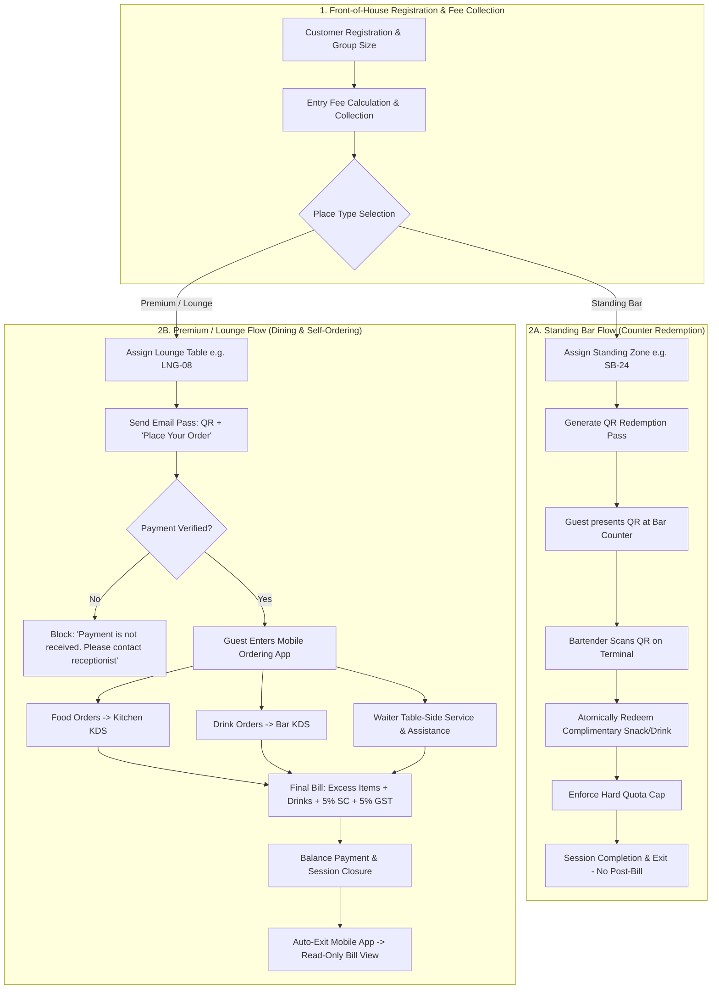

# Pegs N Bottles (F&B Registration & TableFlow Ordering) — Master End-to-End User Manual

---

## 1. System Overview & Mission

### 1.1 Platform Purpose
**Pegs N Bottles** is an enterprise-grade, omnichannel food, beverage, and hospitality venue operations management platform. Engineered for high-energy dining lounges, bars, nightclubs, gastro-pubs, and microbreweries, the system unifies guest intake, payment-gated customer smartphone ordering, floor table management, high-throughput bartender redemptions, kitchen and bar display systems (KDS), waiter service triage, dynamic bill reconciliation, and executive business intelligence into a single synchronized workflow.

### 1.2 Two Distinct Place Types & Core Operational Flows

The venue operates with two distinct place types, each having a specialized operational model:

---

## 2. Complete Role & Permission Matrix

The platform enforces strict Role-Based Access Control (RBAC) across 7 distinct roles:

| Module / Feature | Guest / Customer | Waiter / Server | Kitchen Chef | Bartender | Receptionist | Venue Manager | Administrator |
| :--- | :---: | :---: | :---: | :---: | :---: | :---: | :---: |
| **Welcome Landing & Pass Recovery** | ✅ Full Access | ❌ | ❌ | ❌ | ❌ | ❌ | ❌ |
| **Customer Mobile Ordering (Premium)** | ✅ Full Access | ❌ | ❌ | ❌ | ❌ | ❌ | ❌ |
| **Call Waiter (Water, Cutlery, Bill)** | ✅ Full Access | ❌ | ❌ | ❌ | ❌ | ❌ | ❌ |
| **Review Live Tab & Bill** | ✅ Full Access | ✅ Access | ❌ | ❌ | ❌ | ✅ Access | ✅ Access |
| **Receptionist Check-In Wizard** | ❌ Restricted | ❌ Restricted | ❌ | ❌ | ✅ Full Access | ✅ Full Access | ✅ Full Access |
| **Floor Plan & Table Layout** | ❌ Restricted | ✅ Full Access | ❌ | ❌ | ✅ Full Access | ✅ Full Access | ✅ Full Access |
| **Table Details & Session Extension**| ❌ Restricted | ✅ Access | ❌ | ✅ Access | ✅ Access | ✅ Full Access | ✅ Full Access |
| **Waiter Station (Overview/Calls/Ready)**| ❌ Restricted | ✅ Full Access | ❌ | ❌ | ❌ | ✅ Full Access | ✅ Full Access |
| **Kitchen KDS Queue & Item Bump** | ❌ Restricted | ❌ Restricted | ✅ Full Access | ❌ | ❌ | ✅ View Only | ✅ View Only |
| **Bar KDS Queue & Item Bump** | ❌ Restricted | ❌ Restricted | ❌ | ✅ Full Access | ❌ | ✅ View Only | ✅ View Only |
| **Bartender QR Scan & Redemptions** | ❌ Restricted | ❌ Restricted | ❌ | ✅ Full Access | ❌ | ✅ Full Access | ✅ Full Access |
| **Staff Attendance Kiosk (Clock In/Out)**| ❌ Restricted | ✅ Access | ✅ Access | ✅ Access | ✅ Access | ✅ Access | ✅ Access |
| **Executive Operations Dashboard** | ❌ Restricted | ❌ Restricted | ❌ | ❌ | ❌ Restricted | ✅ View All | ✅ Full Access |
| **Menu Catalog CRUD & Live 86 Switch**| ❌ Restricted | ❌ Restricted | ❌ | ❌ | ❌ Restricted | ❌ View Only | ✅ Full Control |
| **Table Management & QR Generator** | ❌ Restricted | ❌ Restricted | ❌ | ❌ | ❌ Restricted | ❌ View Only | ✅ Full Control |
| **Staff Directory & PIN Management** | ❌ Restricted | ❌ Restricted | ❌ | ❌ | ❌ Restricted | ❌ View Only | ✅ Full Control |
| **Rate Cards & Place Types Config** | ❌ Restricted | ❌ Restricted | ❌ | ❌ | ❌ Restricted | ❌ View Only | ✅ Full Control |
| **Customer Sessions Audit Trail** | ❌ Restricted | ❌ Restricted | ❌ | ❌ | ❌ Restricted | ✅ View All | ✅ Full Control |
| **Revenue Analytics & Financial Exports**| ❌ Restricted | ❌ Restricted | ❌ | ❌ | ❌ Restricted | ✅ View All | ✅ Full Control |

---

## 3. Place Type Workflows & Business Logics

---

### 3.1 Standing Bar Workflow

#### Scenario & Example
* **Group Size:** 4 customers arrive at the Standing Bar.
* **Standing Rate:** ₹1,000 per person.
* **Total Entry Fee Collected:** $4 \times ₹1,000 = \mathbf{₹4,000}$.
* **Assigned Zone:** Standing Bar table/zone (e.g. `SB-24`).

#### Step-by-Step Standing Bar Journey
1. **Registration & Fee Collection:** Receptionist registers the 4 guests and collects the ₹4,000 entry fee.
2. **QR Pass Generation:** A digital token pass and QR code (e.g., mapped to `SB-24`) is generated and sent to the customer via SMS/WhatsApp or printed slip.
3. **Counter-Only Redemption Pass:** The QR code in this flow is strictly a **redemption pass** (it does *not* open the customer self-ordering dining app).
4. **Presenting at Bar:** The customer walks up to the bartender counter and presents their QR pass.
5. **Bartender Scan & Verification:** The bartender scans the QR pass using the Bartender Terminal / Mobile Scanner (`/bartender/scan`).
6. **Quota Display:** The screen displays the customer's entitlement and remaining balance (e.g., *"Complimentary Snacks / Drinks Remaining: 4 of 4"*).
7. **Atomic Redemption:** The bartender taps **REDEEM** to serve the item. The system atomically deducts one redemption.
8. **Hard Quota Cap:** Redemptions cannot exceed the allowed quota. Once the limit is reached, further redemption attempts are rejected.
9. **No Table-Side Dining or Post-Bill:** Standing Bar entries do not use table-side dining, waiter service, or post-session bills.
10. **Session Completion:** Once the visit concludes, the standing session/table allocation is closed and released.

---

### 3.2 Premium / Lounge Workflow

#### Scenario & Example
* **Group Size:** 5 customers arrive at the Premium Lounge.
* **Premium Rate:** ₹2,500 per person.
* **Total Entry Amount:** $5 \times ₹2,500 = \mathbf{₹12,500}$.
* **Assigned Table:** Dedicated lounge table (e.g. `LNG-08`).

#### Step-by-Step Premium / Lounge Journey

#### Phase 1: Registration & Payment Gating
1. **Intake & Table Assignment:** Receptionist registers the 5 guests and assigns Table `LNG-08`.
2. **Email Pass Sent:** A registration email is sent to the customer containing the access QR code and a **"Place Your Order"** button.
3. **Customer Seats at Lounge Table:** The party sits at Table `LNG-08`.
4. **Before Payment (Payment-Gated Security):**
   - If the receptionist has *not* yet verified the ₹12,500 payment, and the customer taps **Place Your Order** or scans the QR code:
   - The customer **must NOT** get access to the menu, cart, or ordering actions.
   - The screen prominently displays the payment-pending notice:
     > **“Payment is not received. Please contact the receptionist to complete your registration.”**
5. **After Payment Verification:**
   - Receptionist verifies the ₹12,500 payment.
   - Customer taps **Place Your Order** again.
   - The customer is immediately authorized into the **Customer Mobile Ordering App** (`/customer/home`).

#### Phase 2: Ordering & Station Routing
6. **Browsing & Customization:** Guests browse food, snacks, cocktails, spirits, and merchandise, adding modifiers (sizes, spice levels, ice preferences).
7. **Submitting Order:** Customer reviews cart and taps **Place Order**.
8. **Smart KOT Routing:**
   - **Food orders** route immediately to the **Kitchen KDS** (`/kds/kitchen`).
   - **Drink orders** route immediately to the **Bar KDS** (`/kds/bar`).
9. **Preparation & Waiter Delivery:**
   - Chefs and bartenders prepare items and tap **Mark Ready**.
   - Floor servers receive instant notifications and serve dishes table-side.
10. **Calling Waiter:** Customer can tap **Call Waiter** anytime to request water, extra cutlery, table cleanup, or the bill.

#### Phase 3: Complimentary Entitlement & Billing Calculation
11. **Complimentary Allowance:**
    - Entitlement is based on party size ($5 \text{ people} = 5 \text{ eligible complimentary snacks/drinks}$).
    - When ordered items include eligible complimentary snacks, the system deducts the 5 items at ₹0.
    - Any items ordered beyond the 5 complimentary items become **chargeable**.
12. **Bill Calculation:**
    - Chargeable Excess Items + Liquor/Beverages + Merchandise.
    - **5% Service Charge** is calculated on the discounted subtotal.
    - **5% GST** is calculated on the taxable base.
    - Formula:
      $$\text{Subtotal} = \text{Chargeable Items Subtotal}$$
      $$\text{Service Charge (5\%)} = \text{round}\left(\frac{\text{Subtotal} \times 5}{100}\right)$$
      $$\text{Taxable Base} = \text{Subtotal} + \text{Service Charge}$$
      $$\text{GST (5\%)} = \text{round}\left(\frac{\text{Taxable Base} \times 5}{100}\right)$$
      $$\text{Grand Total} = \text{Taxable Base} + \text{GST} + \text{Rounding}$$

#### Phase 4: Final Settlement & Session Closure
13. **Bill Presentation:** Waiter reviews the live tab under Waiter Station (`/waiter` ➔ `Bills`) and presents the itemized bill to the table.
14. **Balance Payment:** Customer pays the remaining balance via Cash, Card, or UPI.
15. **Closing Session:** Waiter marks the bill as settled / paid.
16. **Automatic Customer Exit:**
    - The customer's mobile ordering session terminates immediately.
    - An overlay appears confirming session completion.
    - Guests cannot add new products or place orders against the closed session.
17. **Read-Only Bill View on Old Links:**
    - If the customer re-opens or scans the old QR/link after closure:
    - They **must NOT** receive an active ordering interface.
    - They **must NOT** see Add Product, Cart, or Place Order buttons.
    - They are presented with a **clean, read-only printed-bill-style receipt** showing bill number, table, line items, 5% Service Charge, 5% GST, grand total, and a **"PAYMENT COMPLETED"** badge.
    - Ordering becomes available again only when the guest completes a new check-in/registration for a subsequent visit.

---

## 4. Role Guides for Staff Members

---

### 4.1 Waiter / Server Guide (`/waiter`)

1. **Login & Landing:** Log in with 4-digit PIN. Land directly on **Waiter Station** (`/waiter`).
2. **Overview Tab:** Monitor floor summary, high-priority service calls, and dishes ready for delivery.
3. **Requests Tab:** Acknowledge guest requests (*Water, Cutlery, Clean Up, Bill*). Tap **Complete** upon fulfilling.
4. **Ready Tab:** Pick up ready food from the Kitchen KDS counter and ready drinks from the Bar KDS counter. Deliver to table and tap **Mark Served**.
5. **Bills Tab:** Open table bill, verify itemized charges, present to guest, collect payment, and tap **Settle Bill**.

---

### 4.2 Kitchen Chef Guide (`/kds/kitchen`)

1. **KDS Queue:** Monitor incoming food tickets across 4 Kanban columns: `Placed`, `Preparing`, `Ready`, `Served`.
2. **Ticket Details:** Review table number, guest notes, and modifier choices (e.g. *Spice: Hot, Extra Crispy*).
3. **Status Bumps:** Tap **Accept** to move to `Preparing`. When plated, tap **Mark Ready** to notify the floor waiter immediately.

---

### 4.3 Bartender Guide (`/bartender`, `/kds/bar`)

1. **Bar Display System (`/kds/bar`):** View cocktail, beer, and beverage tickets. Review pour sizes (30ml, 60ml, Pint) and ice preferences. Tap **Ready at Bar** upon pouring.
2. **Bartender Station & QR Scanner (`/bartender/scan`):**
   - Scan customer pass QR code for Standing Bar guests.
   - Verify remaining complimentary quota on screen.
   - Tap **Redeem** to deduct an eligible drink.
   - Use **Revert** if an accidental deduction occurs.

---

### 4.4 Receptionist Guide (`/checkin`, `/tables`)

1. **Guest Registration Wizard (`/checkin`):**
   - **Step 1:** Enter customer 10-digit mobile number, full name, and email.
   - **Step 2:** Select party size (+ / -) and Place Type (**Standing Bar** vs **Premium / Lounge**).
   - **Step 3:** Assign a table from the live floor grid (`SB-xx` for Standing Bar, `LNG-xx` for Lounge).
   - **Step 4:** Collect cover payment (Cash/UPI/Card) and confirm activation.
   - The backend marks payment verified, generates an active token, and sends an email pass with access link + QR code to the customer.
2. **Floor Plan Management (`/tables`):**
   - View real-time color-coded table occupancy (*Green: Available, Red: Occupied, Purple: Check-in, Amber: Reserved, Gray: Maintenance*).
   - Click any table to view the drawer, extend session duration, or release the table.

---

### 4.5 Venue Manager & Administrator Guide (`/dashboard`, `/admin/*`)

1. **Operations Dashboard (`/dashboard`):** Real-time analytics on revenue, table turnover rate, active occupancy, and sales trend graphs.
2. **Menu Catalog (`/admin/menu`):** Create and update menu items, manage categories, and use the **Live 86 Availability Switch** to instantly toggle out-of-stock items across all customer mobile menus.
3. **Staff Management (`/admin/staff`):** Register employees, assign roles (`admin`, `manager`, `receptionist`, `waiter`, `chef`, `bartender`), and reset PINs.
4. **Rate Management (`/admin/rates`):** Configure hourly rates, cover charges, and complimentary drink quotas per Place Type.
5. **Session Audit & Reports (`/admin/customers`, `/admin/chart`):** Search historical guest tabs, export financial reconciliation reports, and audit staff actions.

---

### 4.6 Staff Attendance Kiosk (`/attendance`)

1. Open the **Attendance Kiosk** (`/attendance`) on any staff device.
2. Enter your 4-digit PIN on the numeric keypad.
3. Tap **Clock In** at shift start or **Clock Out** at shift end.
4. System records timestamp and confirms employee attendance status.

---

## 5. Frequently Asked Questions (FAQ)

**Q1: How does the system handle Standing Bar vs. Premium Lounge QR codes differently?**
> **A:** For Standing Bar, the QR code is strictly a **redemption pass** scanned by the bartender at the counter. For Premium Lounge, the QR code and email link open the full **Customer Mobile Self-Ordering App**.

**Q2: What happens if a customer scans their Lounge QR code before paying the receptionist?**
> **A:** The system blocks menu access and displays: *“Payment is not received. Please contact the receptionist to complete your registration.”* Ordering is unlocked only after payment verification.

**Q3: Can a customer place orders after their bill has been settled and closed?**
> **A:** No. Once the session is closed, ordering is permanently disabled for that token. Opening the link displays a read-only printed receipt confirming payment completion. A new check-in is required for any subsequent orders.
