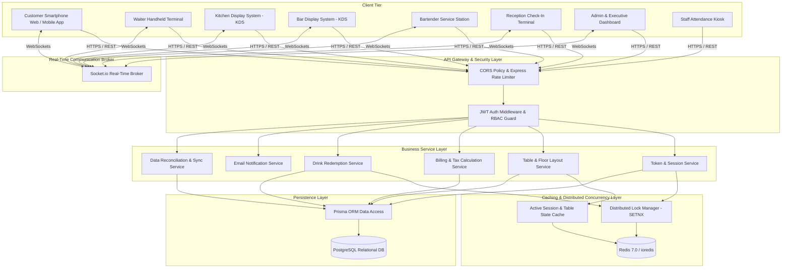
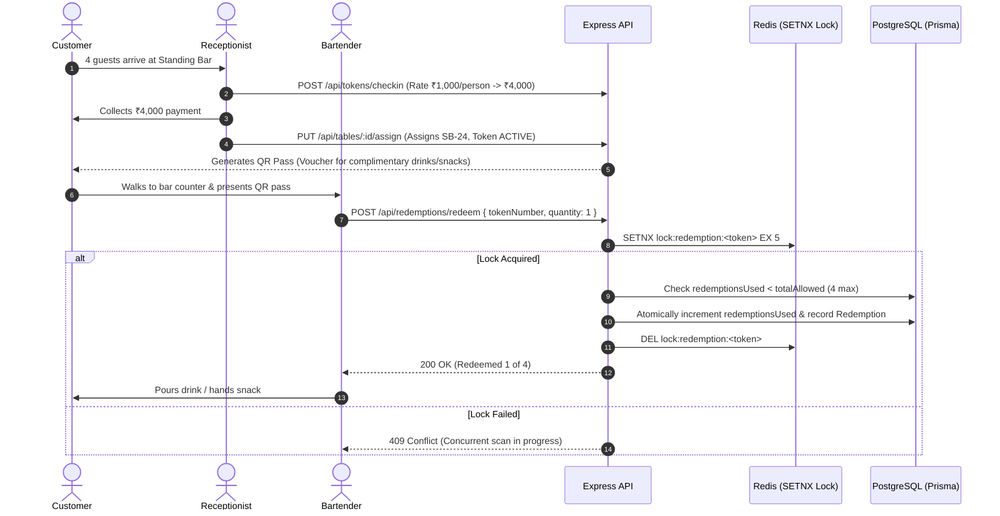
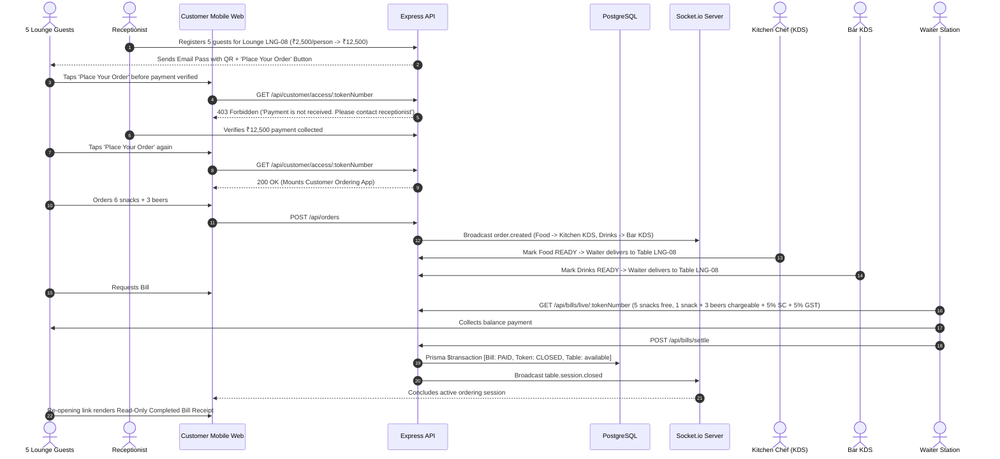

# Pegs N Bottles (F&B Registration & TableFlow Ordering) — High-Level & Low-Level Design (HLD & LLD) Specification

---

# PART 1: HIGH-LEVEL DESIGN (HLD)

---

## 1. Executive Summary & System Vision

**Pegs N Bottles** is an enterprise-grade, omnichannel food, beverage, and venue operations management platform. The system orchestrates high-throughput hospitality workflows across customer mobile devices, receptionist check-in terminals, floor staff handhelds, kitchen/bar display systems (KDS), and executive management dashboards without requiring dedicated tablet hardware at physical tables.

### 1.1 Dual Operational Models: Standing Bar vs. Premium / Lounge
1. **Standing Bar Model:** High-velocity counter service where customer entry fees generate a **redemption pass** for complimentary items (scanned and redeemed atomically by bartenders at `/bartender/scan`). No table-side dining, self-ordering cart, or post-session bills.
2. **Premium / Lounge Model:** Table-side dining experience where customer entry fees unlock a **self-ordering mobile web portal** (`/customer/access/:tokenNumber`). The customer orders food and drinks, KOTs route to Kitchen/Bar KDS, servers deliver table-side, and final billing accounts for complimentary allowances, excess items, 5% Service Charge, 5% GST, and entry credit.

### 1.2 Core Architectural Principles:
1. **Separation of Concerns:** Clear boundary separation between Presentation, API Gateway, Business Services, Concurrency/Caching, and Relational Persistence layers.
2. **Real-Time Synchronicity:** Sub-second event broadcasting via WebSockets/Socket.io ensuring zero state lag across stations.
3. **Strict Concurrency & ACID Integrity:** Distributed Redis mutex locking preventing double redemptions and PostgreSQL transactions ensuring consistent financial billing.
4. **Payment-Gated Customer Experience:** Eliminates unverified table occupancy by gating smartphone ordering passes behind receptionist check-in and cover payment verification.

---

## 2. System Architecture & Topology



---

## 3. End-to-End Data Flow Diagrams

### 3.1 Standing Bar Counter Redemption Flow


### 3.2 Premium / Lounge Payment-Gated Ordering & Billing Flow


---

# PART 2: LOW-LEVEL DESIGN (LLD)

---

## 4. Database Schema & Entity Relationships

```prisma
datasource db {
  provider = "postgresql"
  url      = env("DATABASE_URL")
}

generator client {
  provider = "prisma-client-js"
}

enum Station {
  KITCHEN
  BAR
  CASHIER
}

enum FoodType {
  VEG
  NON_VEG
  EGG
}

enum TokenStatus {
  IN_CHECKIN
  ACTIVE
  EXTENDED
  COMPLETED
  CLOSED
  CANCELLED
  EXPIRED
}

enum OrderStatus {
  PLACED
  ACCEPTED
  PREPARING
  READY
  SERVED
  CANCELLED
}

model Role {
  id          String   @id @default(uuid())
  name        String   @unique
  description String?
  users       User[]
  createdAt   DateTime @default(now())
}

model User {
  id           String    @id @default(uuid())
  username     String    @unique
  passwordHash String
  fullName     String
  pin          String?
  roleId       String
  role         Role      @relation(fields: [roleId], references: [id])
  isActive     Boolean   @default(true)
  createdAt    DateTime  @default(now())
  updatedAt    DateTime  @updatedAt
}

model PlaceType {
  id                   String   @id @default(uuid())
  name                 String   @unique
  description          String?
  ratePerPerson        Float    @default(0.0)
  durationMinutes      Int      @default(120)
  redemptionsPerPerson Int      @default(2)
  tables               Table[]
  tokens               Token[]
  createdAt            DateTime @default(now())
}

model Table {
  id             String    @id @default(uuid())
  tableNumber    String    @unique
  capacity       Int       @default(4)
  placeTypeId    String
  placeType      PlaceType @relation(fields: [placeTypeId], references: [id])
  status         String    @default("available") // available, in_checkin, occupied, reserved, maintenance
  currentTokenId String?
  occupiedSince  DateTime?
  tokens         Token[]
  createdAt      DateTime  @default(now())
  updatedAt      DateTime  @updatedAt
}

model Customer {
  id          String   @id @default(uuid())
  name        String
  phoneNumber String   @unique
  email       String?
  tokens      Token[]
  createdAt   DateTime @default(now())
}

model Token {
  id                      String       @id @default(uuid())
  tokenNumber             String       @unique
  customerId              String
  customer                Customer     @relation(fields: [customerId], references: [id])
  tableId                 String
  table                   Table        @relation(fields: [tableId], references: [id])
  placeTypeId             String
  placeType               PlaceType    @relation(fields: [placeTypeId], references: [id])
  personsCount            Int          @default(1)
  totalRedemptionsAllowed Int          @default(2)
  redemptionsUsed         Int          @default(0)
  entryAmountPaid         Float        @default(0.0)
  paymentVerified         Boolean      @default(false)
  status                  TokenStatus  @default(IN_CHECKIN)
  startTime               DateTime?
  endTime                 DateTime?
  orders                  Order[]
  bills                   Bill[]
  redemptions             Redemption[]
  createdAt               DateTime     @default(now())
  updatedAt               DateTime     @updatedAt
}

model MenuCategory {
  id        String     @id @default(uuid())
  name      String     @unique
  slug      String     @unique
  station   Station    @default(KITCHEN)
  sortOrder Int        @default(0)
  items     MenuItem[]
  createdAt DateTime   @default(now())
}

model MenuItem {
  id          String       @id @default(uuid())
  name        String
  description String?
  basePrice   Float
  categoryId  String
  category    MenuCategory @relation(fields: [categoryId], references: [id])
  station     Station      @default(KITCHEN)
  foodType    FoodType     @default(VEG)
  isAvailable Boolean      @default(true)
  imageUrl    String?
  orderItems  OrderItem[]
  createdAt   DateTime     @default(now())
  updatedAt   DateTime     @updatedAt
}

model Order {
  id          String      @id @default(uuid())
  orderNumber String      @unique
  tokenId     String
  token       Token       @relation(fields: [tokenId], references: [id])
  status      OrderStatus @default(PLACED)
  totalAmount Float       @default(0.0)
  items       OrderItem[]
  createdAt   DateTime    @default(now())
  updatedAt   DateTime    @updatedAt
}

model OrderItem {
  id          String      @id @default(uuid())
  orderId     String
  order       Order       @relation(fields: [orderId], references: [id])
  menuItemId  String
  menuItem    MenuItem    @relation(fields: [menuItemId], references: [id])
  quantity    Int         @default(1)
  unitPrice   Float
  lineTotal   Float
  station     Station     @default(KITCHEN)
  foodType    FoodType    @default(VEG)
  modifiers   Json?
  notes       String?
  status      OrderStatus @default(PLACED)
  createdAt   DateTime    @default(now())
  updatedAt   DateTime    @updatedAt
}

model Bill {
  id                  String   @id @default(uuid())
  billNumber          String   @unique
  tokenId             String
  token               Token    @relation(fields: [tokenId], references: [id])
  foodSubtotal        Float    @default(0.0)
  drinkSubtotal       Float    @default(0.0)
  merchandiseSubtotal Float    @default(0.0)
  subtotal            Float    @default(0.0)
  serviceCharge       Float    @default(0.0) // 5%
  gst                 Float    @default(0.0) // 5%
  discountAmount      Float    @default(0.0)
  rounding            Float    @default(0.0)
  grandTotal          Float    @default(0.0)
  paymentMethod       String?  // CASH, UPI, CARD
  status              String   @default("OPEN") // OPEN, BILL_REQUESTED, PAID
  paidAt              DateTime?
  createdAt           DateTime @default(now())
  updatedAt           DateTime @updatedAt
}

model Redemption {
  id          String   @id @default(uuid())
  tokenId     String
  token       Token    @relation(fields: [tokenId], references: [id])
  quantity    Int      @default(1)
  reverted    Boolean  @default(false)
  redeemedBy  String?
  createdAt   DateTime @default(now())
}
```

---

## 5. Concurrency & Concurrency Locking Implementation

```typescript
export async function redeemDrinkAtomic(
  tokenId: string,
  quantity: number = 1,
  staffId?: string
): Promise<{ success: boolean; remaining: number }> {
  const lockKey = `lock:redemption:${tokenId}`;
  const acquired = await redisService.set(lockKey, '1', 'EX', 5, 'NX');

  if (!acquired) {
    throw new Error('A redemption request is already processing for this token.');
  }

  try {
    return await prisma.$transaction(async (tx) => {
      const token = await tx.token.findUnique({
        where: { id: tokenId },
      });

      if (!token) throw new Error('Token not found');
      if (token.status !== 'ACTIVE') throw new Error('Session is not active');
      if (!token.paymentVerified) throw new Error('Entry payment not verified');

      const remaining = token.totalRedemptionsAllowed - token.redemptionsUsed;
      if (remaining < quantity) {
        throw new Error(`Insufficient complimentary allowance. Remaining: ${remaining}`);
      }

      const updated = await tx.token.update({
        where: { id: tokenId },
        data: { redemptionsUsed: { increment: quantity } },
      });

      await tx.redemption.create({
        data: {
          tokenId,
          quantity,
          redeemedBy: staffId || null,
        },
      });

      return {
        success: true,
        remaining: updated.totalRedemptionsAllowed - updated.redemptionsUsed,
      };
    });
  } finally {
    await redisService.del(lockKey);
  }
}
```

---

## 6. Financial Billing Engine

$$\text{Subtotal} = \text{Chargeable Food} + \text{Liquor / Drinks} + \text{Merchandise}$$
$$\text{Service Charge (5\%)} = \text{round}\left(\frac{\text{Subtotal} \times 5}{100}\right)$$
$$\text{Taxable Amount} = \text{Subtotal} + \text{Service Charge}$$
$$\text{GST (5\%)} = \text{round}\left(\frac{\text{Taxable Amount} \times 5}{100}\right)$$
$$\text{Grand Total} = \text{Taxable Amount} + \text{GST} + \text{Rounding}$$
