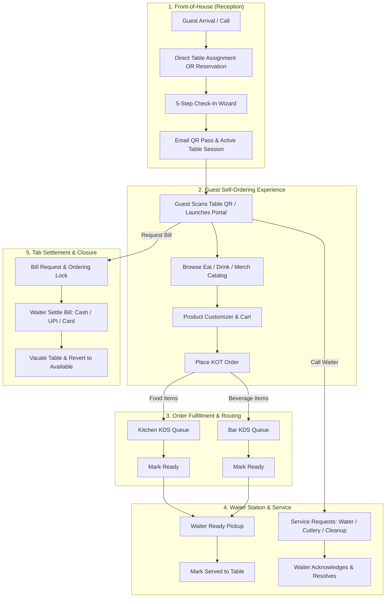
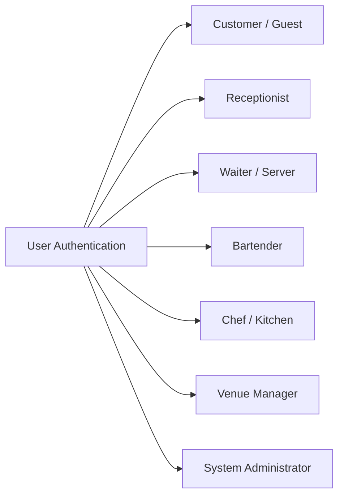
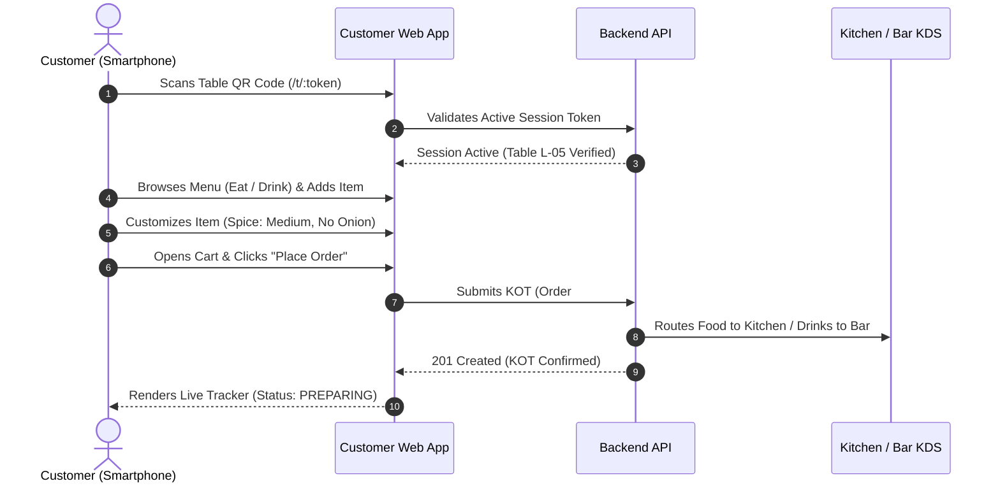
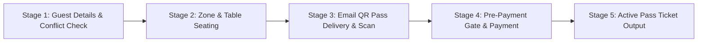
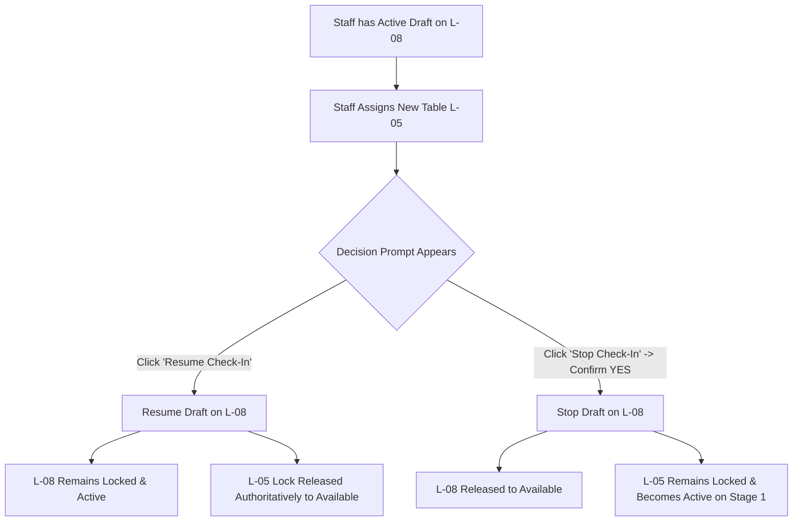
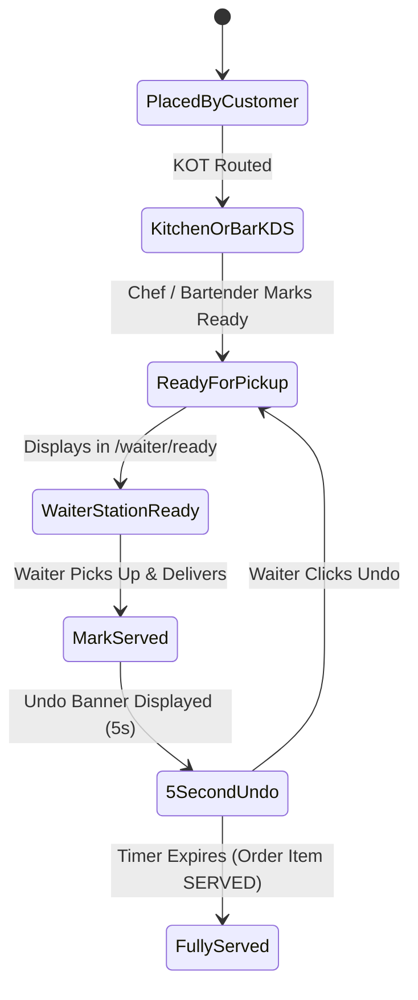
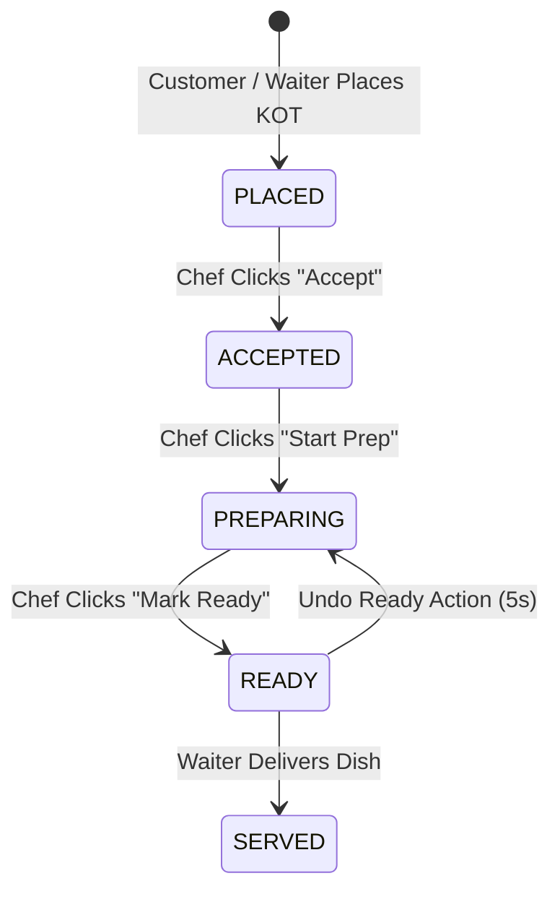
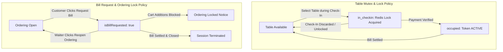

# F&B Registration + TableFlow Ordering — Complete End-to-End User Manual
**System Name:** Pegs N Bottles (F&B Registration + TableFlow Ordering Operations Suite)  
**Platform Scope:** Omnichannel Web Frontend, Kitchen & Bar KDS, Waiter Station, Reception Check-In, Customer Self-Ordering Portal, and Back-Office Administration  
**Target Audience:** Restaurant Hosts, Receptionists, Waiters/Servers, Bartenders, Kitchen Chefs, Venue Managers, and System Administrators  
**Version:** 2.0.0 (Production Release)

---

## 1. Executive System Overview

### 1.1 Purpose of the Platform
The **Pegs N Bottles Management Platform** is a unified, enterprise-grade food, beverage, seating, and digital venue operations platform. Designed for high-volume restaurants, lounges, gastro-pubs, and nightlife venues, the platform integrates front-of-house guest registration, live table floor management, contactless customer self-ordering, automated station-specific Kitchen/Bar Order Ticket (KOT) routing, waitstaff floor coordination, drink entitlement tracking, real-time billing reconciliation, and back-office venue governance.

### 1.2 Core Operational Pillars
1. **Digital Reception & Seating Mutex:** 5-step registration wizard with duplicate phone/email detection, zone rate calculations, QR pass issuance, and atomic table-lock protection.
2. **Contactless Customer Self-Ordering:** Instant table onboarding via QR scan (`/t/:token`), rich visual food and beverage catalogs, dietary and allergen filtering, live product customizers (variants, spice levels, modifiers), and real-time order status tracking.
3. **Smart Station-Specific KDS Routing:** Food items route directly to the **Kitchen KDS** (`/kds/kitchen`), while beverage items route to the **Bar KDS** (`/bartender/kds`) with bump bar status tracking (`PLACED` $\rightarrow$ `ACCEPTED` $\rightarrow$ `PREPARING` $\rightarrow$ `READY` $\rightarrow$ `SERVED`) and instant 5-second Undo capabilities.
4. **Waiter Service Station:** Centralized floor coordination dashboard (`/waiter/overview`) displaying incoming service calls (Water, Cutlery, Cleanup, Assistance), ready-to-serve food/drink queues, assisted ordering terminals, session time extension controls, and cashier bill settlements.
5. **Bartender Operations & Entitlement Tracking:** Dedicated beverage fulfillment terminal with digital pass verification, live complimentary drink balance calculations, multi-drink stepper redemptions, instant reverts, and stock availability toggles.
6. **Live Tab & Precision Billing:** Dynamic tax engine calculating itemized subtotals, 5% GST, 5% Service Charge, and cash/UPI mathematical rounding with automated cart ordering locks upon bill request.
7. **Role-Based Back-Office Governance:** Granular administration covering physical table floor layouts, menu catalog hierarchies, staff directories, zone rate cards, facial attendance tracking, and real-time revenue analytics.

---

## 2. Prerequisites & System Requirements

### 2.1 Supported Devices & Viewports
| Device Category | Target Viewport / Screen Size | Recommended Hardware | Primary Operational Portal |
| :--- | :--- | :--- | :--- |
| **Mobile Smartphones** | 360 × 640 to 430 × 932 px | iOS (iPhone 11+) / Android (v10+) | Customer Self-Ordering Portal (`/customer/*`), Roaming Waiters (`/waiter/*`) |
| **Tablets & Handheld POS** | 768 × 1024 to 1280 × 800 px | iPad (10.2"+) / Samsung Galaxy Tab | Waiter Floor Station (`/waiter/*`), Mobile Host Stand (`/checkin`) |
| **Kitchen & Bar KDS Displays** | 1920 × 1080 px (1080p FHD) | Touchscreen Displays / Bump Bar Monitors | Kitchen KDS (`/kds/kitchen`), Bar KDS (`/bartender/kds`) |
| **Desktop Workstations & POS Terminals** | 1920 × 1080 px or higher | PC / Mac with Mouse & Keyboard | Reception Desk (`/checkin`, `/tables`), Back-Office Admin (`/admin/*`) |

### 2.2 Supported Web Browsers
- **Google Chrome** (v110+) — *Recommended for all POS and KDS stations*
- **Apple Safari** (v16+) — *Recommended for iOS guest self-ordering*
- **Mozilla Firefox** (v115+)
- **Microsoft Edge** (v110+)

### 2.3 Hardware Permissions & Connectivity
- **Camera Access:** Required on Reception, Waiter, and Bartender devices for physical QR pass scanning.
- **Audio Chimes & Sound:** Required on KDS, Waiter, and Reception stations for real-time audio alerts (New Orders, Ready Orders, Service Calls, Expiring Sessions).
- **Network Stability:** Continuous local Wi-Fi or broadband connectivity connected to the venue backend server (WebSocket / HTTP port).

---

## 3. Role-Based Access Control (RBAC) & Permissions Matrix

The platform enforces strict Role-Based Access Control across 7 operational roles:

### 3.1 Comprehensive Role Permission Matrix

| Feature / Module | Customer | Receptionist | Waiter / Server | Bartender | Chef / Kitchen | Manager | Administrator |
| :--- | :---: | :---: | :---: | :---: | :---: | :---: | :---: |
| **Scan QR & Join Table Session** | ✅ | ❌ | ✅ | ❌ | ❌ | ✅ | ✅ |
| **Browse Menu & Product Customizer** | ✅ | ❌ | ✅ | ❌ | ❌ | ✅ | ✅ |
| **Self-Order (Food, Drink, Merch)** | ✅ | ❌ | ❌ | ❌ | ❌ | ❌ | ❌ |
| **Call Waiter (Water, Cutlery, Help)** | ✅ | ❌ | ❌ | ❌ | ❌ | ❌ | ❌ |
| **Request Itemized Bill** | ✅ | ❌ | ✅ | ❌ | ❌ | ✅ | ✅ |
| **5-Step Reception Check-In Wizard** | ❌ | ✅ | ❌ | ❌ | ❌ | ✅ | ✅ |
| **Table Assignment & Quick Reserve** | ❌ | ✅ | ❌ | ❌ | ❌ | ✅ | ✅ |
| **Table Lock / Resume / Stop Decision**| ❌ | ✅ (Owner) | ❌ | ❌ | ❌ | ✅ (All) | ✅ (All) |
| **Seating Floor Plan (`/tables`)** | ❌ | ✅ | ✅ | ❌ | ❌ | ✅ | ✅ |
| **Service Requests Queue & Resolve** | ❌ | ❌ | ✅ | ❌ | ❌ | ✅ | ✅ |
| **Ready Orders Queue & Mark Served** | ❌ | ❌ | ✅ | ❌ | ❌ | ✅ | ✅ |
| **Assisted Ordering (Take Table Order)**| ❌ | ❌ | ✅ | ❌ | ❌ | ✅ | ✅ |
| **Session Duration Extension (+15/30m)**| ❌ | ❌ | ✅ | ✅ | ❌ | ✅ | ✅ |
| **Reopen Locked Ordering for Table** | ❌ | ❌ | ✅ | ❌ | ❌ | ✅ | ✅ |
| **Settle Bill & Cashiering (Cash/UPI)** | ❌ | ❌ | ✅ | ❌ | ❌ | ✅ | ✅ |
| **Kitchen KDS Queue & Bump Bar** | ❌ | ❌ | ❌ | ❌ | ✅ | ✅ | ✅ |
| **Kitchen Stock-Out / Stock-In Toggle** | ❌ | ❌ | ❌ | ❌ | ✅ | ✅ | ✅ |
| **Bar KDS Queue & Bump Bar** | ❌ | ❌ | ❌ | ✅ | ❌ | ✅ | ✅ |
| **Bar Stock-Out / Stock-In Toggle** | ❌ | ❌ | ❌ | ✅ | ❌ | ✅ | ✅ |
| **Bartender Pass Scan & Redemptions** | ❌ | ❌ | ❌ | ✅ | ❌ | ✅ | ✅ |
| **Attendance Kiosk (Clock In / Out)** | ❌ | ✅ | ✅ | ✅ | ✅ | ✅ | ✅ |
| **Executive Management Dashboard** | ❌ | ❌ | ❌ | ❌ | ❌ | ✅ | ✅ |
| **Supervisory Force Release Table** | ❌ | ❌ | ❌ | ❌ | ❌ | ✅ | ✅ |
| **Menu Catalog & Pricing CRUD** | ❌ | ❌ | ❌ | ❌ | ❌ | ❌ | ✅ |
| **Staff Directory & PIN Management** | ❌ | ❌ | ❌ | ❌ | ❌ | ❌ | ✅ |
| **Rate Card & Zone Pricing Config** | ❌ | ❌ | ❌ | ❌ | ❌ | ❌ | ✅ |
| **Physical Table Layout CRUD** | ❌ | ❌ | ❌ | ❌ | ❌ | ❌ | ✅ |

---

## 4. Authentication, Session Management & Attendance Kiosk

### 4.1 Staff Login Procedure
1. Open the application URL in a web browser (e.g., `https://venue.pegsonbottles.com/login` or `http://localhost:5173/login`).
2. Enter your assigned **Username** (e.g., `ADM-01`, `REC-01`, `WAI-01`, `BAR-01`, `CHF-01`, `MGR-01`).
3. Enter your secret **4-Digit PIN** or password.
4. Click **Sign In** (or press `Enter`).

#### Automatic Role-Based Landing Redirection:
Upon successful authentication, the system securely generates a 24-hour JSON Web Token (JWT) and automatically routes you to your primary operational workspace:
- **Receptionist:** Automatically routed to `/checkin` (Customer Check-In).
- **Waiter / Server:** Automatically routed to `/waiter/overview` (Waiter Floor Station).
- **Bartender:** Automatically routed to `/bartender/kds` (Bar KDS & Check-Ins).
- **Chef / Kitchen:** Automatically routed to `/kds/kitchen` (Kitchen KDS).
- **Manager / Administrator:** Automatically routed to `/dashboard` (Executive Management Dashboard).

### 4.2 Quick Facial Attendance Kiosk (`/quick_attendance`)
Every staff member can log attendance shifts via the centralized camera kiosk:
1. Navigate to **Attendance** from the navigation sidebar.
2. Select your staff account or scan your face in front of the camera terminal.
3. Confirm **Clock In** at shift start, or **Clock Out** at shift end.
4. The system logs shift duration and updates the live management roster.

### 4.3 Secure Staff Logout
1. Click the **Profile / Logout** button located at the bottom of the navigation sidebar.
2. An on-screen confirmation prompt appears: *"Are you sure you want to sign out?"*.
3. **Keyboard Shortcuts:** Press `Enter` to confirm logout immediately, or press `Escape` to cancel and return to work.
4. Clicking outside the confirmation bubble automatically closes the prompt without logging out.

---

## 5. Web Application Navigation & Layout

### 5.1 Main Layout Structure
- **Left Navigation Sidebar:** Role-aware collapsible sidebar displaying permitted modules. Collapses automatically on mobile/tablet viewports and expands with full labels on desktop screens.
- **Top Sticky Header:**
  - **Dynamic Workspace Title:** Displays active module name (e.g., *Reception Check-In & Customer Registration*, *Kitchen KDS Food Preparation*, *Waiter Floor Service Station*).
  - **Global Refresh Button:** One-tap synchronization button that flushes frontend stale caches and syncs all tables, orders, bills, and tokens in the background with zero full-page reload.
  - **Theme Toggle:** Switch between Dark and Light mode.
  - **Live Shift User Badge:** Displays staff full name, role badge, and profile menu.
- **Real-Time Global Notification Stack:** Floating top-right notification banner providing audio chimes and selectable, copyable toasts for incoming orders, ready dishes, service calls, and table unlocks.

---

## 6. Role Manual: Customer (Guest Self-Ordering Portal)

### 6.1 Role Overview
The **Customer Portal** (`/customer/*` or `/t/:token`) is a high-speed, mobile-optimized self-service web application. Guests can scan the QR code physically affixed to their dining table to view menus, customize dishes, place KOT orders, call waitstaff, track live preparation progress, and inspect their itemized bill.

### 6.2 Table Onboarding & Joining (`/t/:token`)
1. Open your smartphone camera and scan the QR code located on your table (e.g. Table L-05).
2. The browser automatically navigates to `https://venue.pegsonbottles.com/t/TOKEN_ID`.
3. The application validates the active table session:
   - If an active dining pass exists, the guest is instantly connected to Table L-05.
   - The top navigation bar confirms: **"Table L-05 • Pegs N Bottles"**.
4. The guest lands directly on the **Home** tab.

### 6.3 Customer Navigation Tabs
The bottom navigation bar provides 5 primary sections:
- 🏠 **Home (`/customer/home`):** Hero promotional banners, trending specials, category quick-filters, and instant shortcuts (Call Waiter, Repeat Last Order, View Bill).
- 🍽️ **Eat (`/customer/eat`):** Food menu catalog categorized into Starters, Main Courses, Biryanis, Pizzas, Burgers, Sides, and Desserts.
- 🍸 **Drink (`/customer/drink`):** Beverage menu categorized into Signature Cocktails, Shooters, Draught Beers, Spirits, Wines, and Mocktails.
- 🛍️ **Merch (`/customer/merch`):** Venue merchandise, apparel, and glassware.
- 🛒 **Cart (`/customer/cart`):** Itemized order staging list with live subtotal, GST, Service Charge, and special cooking instructions.
- 🧾 **Bill (`/customer/bill`):** Itemized live dining tab, discount summaries, taxes, and Request Bill action.
- 📋 **Orders (`/customer/orders`):** Real-time KOT preparation tracker.

### 6.4 Menu Browsing & Dietary Filtering
- **Dietary Badges:** Every dish features official visual indicators:
  - 🟢 **VEG:** Pure Vegetarian.
  - 🔴 **NON-VEG:** Non-Vegetarian (Meat / Poultry / Seafood).
  - 🟡 **EGG:** Contains Egg.
  - 🌿 **VEGAN:** 100% Plant-Based.
- **Search Bar:** Real-time character-by-character search across all dish titles, descriptions, and tags.
- **Category Chips:** Tap horizontal filter pills (e.g., *Starters*, *Mains*, *Cocktails*) to jump directly to menu sections.

### 6.5 Product Customization
When a guest taps an item with options (e.g. *Classic Cheeseburger* or *Single Malt Whisky*):
1. The **Product Customizer Sheet** opens from the bottom.
2. **Select Variant:** Choose portion size or pour volume (e.g., *Half vs Full*, *30ml vs 60ml vs Bottle*). The price difference updates dynamically.
3. **Select Modifiers:** Choose required or optional modifier options (e.g., *Spice Level: Mild / Medium / Fiery*, *Ice Option: Neat / On the Rocks / With Water*).
4. **Special Instructions:** Type custom kitchen instructions (e.g., *"Extra crispy", "No mayo", "Less ice"*).
5. Tap **Add to Cart — ₹XXX.XX**.

### 6.6 Placing an Order (KOT Generation)
1. Tap the **Cart** icon in the bottom navigation bar.
2. Review selected items, quantities, and customizer notes.
3. Adjust quantities using the `+` and `-` stepper buttons, or remove items with the trash icon.
4. Tap the green **Place Order** button.
5. The system submits the order to the backend, assigns an incremental order sequence (e.g., `Order #03`), and automatically routes each item to the appropriate station display (Kitchen KDS vs Bar KDS).
6. The cart clears, and the screen automatically opens the **Orders Tracker**.

### 6.7 Real-Time Order Tracking Lifecycle
Guests can monitor the live preparation progress of every placed KOT item:
- 🔵 **PLACED:** Order received by the server.
- 🟡 **ACCEPTED:** Kitchen/Bar station acknowledged the ticket.
- 🟠 **PREPARING:** Chef/Bartender is actively cooking or crafting the beverage.
- 🟢 **READY:** Dish is plated/poured and waiting for waitstaff pickup.
- ⚪ **SERVED:** Waiter has delivered the dish to Table L-05.

### 6.8 Calling the Waiter (Service Requests)
Guests can summon floor staff with one tap without having to wave or leave their table:
1. Tap the **Call Waiter (Bell)** icon in the top header or Home tab.
2. Select the specific service assistance needed:
   - 💧 **Water Refill**
   - 🍴 **Extra Cutlery**
   - 🧻 **Napkins & Tissues**
   - 🧹 **Table Clean Up**
   - 🙋‍♂️ **Order Assistance**
   - 💳 **Bill Assistance**
3. Optional: Add a brief custom note.
4. Tap **Send Request**.
5. An audible chime and high-priority banner immediately alert floor staff on the **Waiter Station** (`/waiter/requests`).

### 6.9 Requesting the Bill & Ordering Lock Behavior
When guests finish their meal:
1. Navigate to the **Bill (`/customer/bill`)** tab.
2. Review the complete itemized tab showing all food, beverage, and merchandise orders placed across the session.
3. Tap **Request Bill**.
4. **Ordering Lock Enforcement:**
   - The table status immediately transitions to `isBillRequested = true`.
   - Further cart additions and order placement are temporarily locked for the table.
   - If a guest attempts to add items, the cart displays the notice:  
     > *"Ordering is currently locked for this table because a bill has been requested. Please ask your waiter to reopen ordering if you wish to add more items."*
5. A high-priority notification with an audio chime is routed to the Waiter Station for payment collection.

### 6.10 Dining Session Countdown Timer
- The top header displays a live countdown timer showing the remaining duration of the table's dining session.
- **15-Minute Warning:** When remaining time drops to $\le 15$ minutes, the timer pulses amber/red to notify guests that their session is nearing completion.
- If guests require additional time, they can ask their waiter for a **Session Extension**.

---

## 7. Role Manual: Receptionist (Front Desk & Seating Floor)

### 7.1 Role Overview
The **Receptionist** oversees the front desk, guest welcoming, physical table seating allocation, reservation bookings, and the 5-step digital check-in intake wizard.

### 7.2 Table Assignment vs. Explicit Reservation
The system strictly differentiates between two front-desk operations:
1. **Assign Table (Direct Intake):** Used for immediate walk-in guests. Opens the Assign modal, enters guest details, and transitions directly into **Check-In Stage 1** with pre-filled details. It does **not** create a preliminary reservation record.
2. **Reserve Table (Advance Booking):** Used for telephone or future bookings. Clicking **Reserve** on an available table records an explicit `PENDING` reservation in PostgreSQL and sets the table status to `reserved`.

### 7.3 5-Step Customer Check-In Wizard (`/checkin`)

#### Stage 1: Customer Details & Conflict Validation
1. Enter the guest's **Full Name**, **10-Digit Phone Number**, **Email Address**, and **Guest Headcount**.
2. **Duplicate Conflict Engine:** As you type, the system debounces (400ms) and checks live database records:
   - If the phone or email is currently active in another incomplete check-in or occupied table, a clear conflict warning appears identifying the owner.
   - If no conflict exists, the input glows green and enables the **Next** button.
3. Click **Next** to proceed to Seating.

#### Stage 2: Seating Zone & Physical Table Selection
1. Select the designated venue zone (e.g. *Main Lounge*, *VIP Zone*, *Balcony Terrace*).
2. The system dynamically presents all tables matching the selected zone and headcount capacity.
3. Click to select an available table (e.g. Table L-08).
4. **Table Lock Acquisition:** Selecting the table immediately acquires a Redis table lock and marks the table status as `in_checkin` across all staff screens to prevent competing staff from claiming the same table.
5. Click **Proceed to QR**.

#### Stage 3: QR Pass Generation & Verification
1. The backend generates a secure digital token pass (e.g. `TK-108`) and automatically emails the pass to the customer's registered email address.
2. The receptionist can scan the customer's email QR pass using the on-screen webcam/camera scanner, or enter the pass number manually.
3. Upon verified scan, the screen advances to the Payment Gateway.

#### Stage 4: Authoritative Pre-Payment Gate & Payment
1. **Pre-Payment Verification:** Before taking money, the system authoritatively verifies that the table is still vacant, customer details remain unique, and the token is valid.
2. Select the customer's chosen payment method: **Cash**, **UPI QR**, or **Card**.
3. Confirm payment receipt.
4. The backend marks the token `ACTIVE`, updates the PostgreSQL table status to `occupied`, and releases the temporary lock.

#### Stage 5: Active Pass Output
1. The screen renders the active Digital Dining Pass containing:
   - Token Pass Number (e.g. `#TK-108`)
   - Table Number (e.g. `L-08`)
   - Headcount & Total Paid
   - Session Expiry Countdown
   - Complimentary Drink Entitlement Balance (e.g. *4 Drinks Available*)
2. The receptionist hands over the seating pass and escorts the guest to their table.

---

### 7.4 Active Check-In Table-Lock Switching (`Resume` vs `Stop`)
When a receptionist has an in-progress check-in draft (e.g. on Table `L-08`) and subsequently navigates to the Tables floor plan to assign a different table (e.g. Table `L-05`):

#### Case 1: Staff Chooses `Resume Check-In`
- **Result:** The previous check-in for Table `L-08` is resumed with all entered details intact.
- Table `L-08` remains locked (`in_checkin`).
- The temporary lock on Table `L-05` is automatically and authoritatively released via `POST /api/tables/:id/unlock?forceAvailable=true`.
- Table `L-05` immediately becomes `available` for other staff across the floor.

#### Case 2: Staff Chooses `Stop Check-In` $\rightarrow$ Confirms `YES`
- **Result:** The prior check-in for Table `L-08` is completely cancelled and stopped via `POST /api/check-in/stop`.
- Table `L-08` is released and immediately reverts to `available`.
- The newly assigned Table `L-05` remains locked (`in_checkin`) and becomes the active check-in session on Stage 1 with its details pre-filled.

---

### 7.5 Seating Floor Management (`/tables/layout` & `/tables/reservations`)

#### Table Status Definitions:
- 🟢 **`available`:** Table is clean, vacant, and open for walk-ins or reservations.
- 🟡 **`in_checkin`:** Table is actively locked by a receptionist during check-in.
- 🟣 **`reserved`:** Table has an active, confirmed customer reservation.
- 🔴 **`occupied`:** Guests are actively dining with an active token pass.
- ⚫ **`maintenance`:** Table is out of service for repairs or VIP hold.

#### Table Card Attribution & Lock Ownership Display:
When a table is locked in the `in_checkin` state, the table card displays the staff member's full name and short role:
- **Format:** `Locked by: {Staff Full Name} · {ShortRole}` (e.g. `Locked by: Sanjay K · Rep`, `Locked by: Admin User · Admin`).
- **Role Abbreviations:** `Receptionist` $\rightarrow$ `Rep`, `Administrator`/`Admin` $\rightarrow$ `Admin`, `Manager` $\rightarrow$ `Mgr`, `Waiter` $\rightarrow$ `Waiter`, `Bartender` $\rightarrow$ `Bar`, `Chef`/`Kitchen` $\rightarrow$ `Chef`.

#### Action Button Rules on Table Cards:
1. **Lock Owner Staff:**
   - **Resume Check-In:** Navigates directly back to `/checkin` restoring the active check-in session.
   - **Release:** Opens a confirmation dialog (*"Are you sure you want to release this table lock?"*). Confirming releases the lock to `available`.
2. **Non-Owner Staff:**
   - Table card renders a disabled **In Check-In** badge. Non-owners cannot unlock or overwrite another receptionist's active lock.
3. **Administrator & Manager:**
   - Always displays the **Release** button to allow supervisory overrides of abandoned or stuck table locks.

---

## 8. Role Manual: Waiter / Floor Server (Service Station)

### 8.1 Role Overview
The **Waiter / Server** is responsible for floor service, delivering ready dishes from Kitchen and Bar KDS stations, responding to customer service calls, taking assisted table orders, extending dining sessions, and settling final bills.

### 8.2 Waiter Station Workspaces (`/waiter/*`)
The Waiter Station provides 5 dedicated tabs:
- 📊 **Overview (`/waiter/overview`):** High-level summary displaying active occupied tables, pending service requests, ready food/drink items, and unpaid bills.
- 🛎️ **Service Requests (`/waiter/requests`):** Live queue of guest service calls.
- 🍽️ **Ready Orders (`/waiter/ready`):** Plated and poured items waiting for table delivery.
- 🪑 **Tables (`/waiter/tables`):** Seating layout showing occupancy durations and active tabs.
- 🧾 **Bills & Settlement (`/waiter/bills`):** Requested tabs awaiting payment collection.

### 8.3 Handling Service Requests (`/waiter/requests`)
1. When a guest taps Call Waiter on their mobile portal, a card appears in `/waiter/requests` with a chime.
2. The card displays: Table Number (e.g. `Table L-05`), Request Type (e.g. *Water Refill*, *Extra Cutlery*), Time Elapsed, and any custom guest note.
3. **Step 1 — Acknowledge:** Tap **Acknowledge** to inform the team that you are attending to the table.
4. **Step 2 — Resolve:** After fulfilling the request at the table, tap **Mark Completed** to dismiss the request.

### 8.4 Delivering Ready Orders (`/waiter/ready`)
1. When a Chef or Bartender completes an item on their KDS screen, the item instantly appears in `/waiter/ready`.
2. The card displays: Table Number, Dish/Drink Name, Variant, Modifiers, and elapsed time since readiness.
3. Pick up the order from the kitchen pass or bar counter and deliver it to the guest's table.
4. Tap **Mark Served**.
5. **5-Second Undo Protection:** A floating undo banner appears for 5 seconds. If you accidentally tapped the button, tap **Undo** within 5 seconds to restore the item back to the Ready queue.

### 8.5 Assisted Ordering (Taking Orders at the Table)
If a customer prefers to order through a waiter rather than their smartphone:
1. Navigate to `/waiter/tables` and tap on the guest's occupied table.
2. Tap **Take Order / Assisted Order**.
3. Browse the visual food and beverage catalog, apply filters, and select items.
4. Configure variants, spice levels, and special instructions using the Product Customizer.
5. Tap **Submit Order**.
6. The KOT is generated with `orderSource: SERVER` and immediately routed to the Kitchen and Bar KDS displays.

### 8.6 Extending Dining Sessions
If guests wish to extend their stay:
1. In `/waiter/tables`, tap on the occupied table and select **Extend Session**.
2. Choose the extension duration: **+15 Minutes**, **+30 Minutes**, or **+45 Minutes**.
3. The system calculates any additional extension fee based on the zone rate card.
4. Tap **Confirm Extension**. The table token updates its `endTime`, and the customer's countdown timer refreshes automatically.

### 8.7 Unlocking Ordering ("Reopen Ordering")
If a table requested the bill but later decides to order more food or drinks:
1. In `/waiter/tables` or `/waiter/bills`, locate the table card marked with the amber **Bill Requested / Ordering Locked** badge.
2. Tap the **Reopen Ordering** button.
3. Confirm the prompt: *"Reopen ordering for this table?"*.
4. **Result:** The bill request is reset, the customer's cart unlocks immediately, and guests can continue ordering from their mobile portal.

### 8.8 Settle Bill & Cashiering (`/waiter/bills`)
1. Open `/waiter/bills` to view all tables with active bill requests.
2. Tap **View Bill & Settle**.
3. Inspect the itemized breakdown:
   - Food Subtotal
   - Drink Subtotal
   - Merchandise Subtotal
   - Venue Discounts
   - 5% GST & 5% Service Charge
   - Rounding Adjustment
   - **Grand Total**
4. Select the customer's payment method:
   - 💵 **CASH:** Enter cash tendered; the system calculates exact change.
   - 📱 **UPI / QR:** Present venue static/dynamic UPI QR code and enter UPI Transaction Reference ID.
   - 💳 **CARD:** Swipe/tap customer card on physical EDC machine and enter Approval Reference.
5. Tap **Settle & Close Bill**.
6. **Automatic Table Vacation:** The bill status transitions to `PAID`, the active token closes, and the table status automatically resets to `available` for the next guest intake.

---

## 9. Role Manual: Kitchen Chef (Kitchen Display System)

### 9.1 Role Overview
The **Kitchen Chef** operates the **Kitchen KDS** (`/kds/kitchen`), managing live food preparation queues, order acknowledgment, bump bar timers, 5-second undo reverts, and inventory stock-out controls.

### 9.2 Kitchen KDS Live Queue (`/kds/kitchen`)
Each placed food order renders as an interactive KOT ticket card containing:
- Order Number (e.g. `#04`)
- Table Number (e.g. `Table L-08`)
- Elapsed Timer with color-coded urgency:
  - 🟢 **Green ($\le 5$ min):** Freshly placed.
  - 🟡 **Amber (5–12 min):** Standard preparation time.
  - 🔴 **Red ($> 12$ min):** Delayed / High Priority.
- Itemized food items with selected portion variants, spice level badges, and special cooking instructions.

### 9.3 5-Stage Order Lifecycle Actions
- **Accept Ticket:** Acknowledges receipt of the ticket.
- **Start Prep:** Transitions ticket items from `ACCEPTED` to `PREPARING`. The customer's mobile tracker updates to *Preparing*.
- **Mark Ready (Per Item or Entire Ticket):** When a dish is cooked and plated, tap **Mark Ready**.
  - The item moves from the Kitchen KDS to the Waiter Station Ready queue.
  - An audible chime alerts floor waitstaff that Table L-08's food is ready for pickup.
- **5-Second Undo:** If you accidentally tapped Ready, tap **Undo** on the top notification bar within 5 seconds to revert the item back to `PREPARING`.

### 9.4 Kitchen Stock & Inventory Tab (`/kds_stock`)
If the kitchen runs out of an ingredient or dish:
1. Tap the **Stock** tab in the Kitchen KDS header.
2. Search for the menu item (e.g. *Paneer Tikka* or *Mutton Biryani*).
3. Toggle the switch to **Stock-Out**.
4. Confirm the prompt: *"Mark this item Out of Stock?"*.
5. **Instant Customer Sync:** The item is immediately greyed out and badged as **Sold Out** across all customer mobile menus and waiter ordering terminals, preventing any new orders.
6. When restocked, toggle the switch back to **In Stock** to re-enable ordering instantly.

### 9.5 Discarding Closed-Session Tickets
If a customer session is closed or cancelled while tickets were pending:
- The ticket card renders a prominent grey banner: **"Session Closed / Table Vacated"**.
- Tap the **Discard / Trash** icon to clear stale tickets from the active KDS screen.

---

## 10. Role Manual: Bartender (Beverage Station & Drink Redemptions)

### 10.1 Role Overview
The **Bartender** manages beverage preparation via the **Bar KDS** (`/bartender/kds`), tracks complimentary drink entitlements via **Active Check-Ins** (`/bartender/checkins`), verifies digital passes using the **Pass Scanner** (`/bartender/scan`), and controls beverage stock availability.

### 10.2 Bar KDS Beverage Queue (`/bartender/kds`)
- Live drink ticket queue showing beverage KOTs (Cocktails, Beers, Mocktails, Spirits).
- Same bump bar capabilities as Kitchen KDS: **Accept** $\rightarrow$ **Start Prep** $\rightarrow$ **Mark Ready** (alerts waiters for table delivery) with 5-second Undo protection.
- Beverage Stock tab to mark alcoholic and non-alcoholic drinks **Stock-Out** or **In Stock**.

### 10.3 Active Check-Ins Workspace (`/bartender/checkins`)
For venues offering complimentary drink entitlements per guest pass:
1. Open `/bartender/checkins` to view all active guest tables with entitlement balances.
2. Each card displays: Table Number, Guest Name, Headcount, Remaining Dining Time, and Drink Entitlement Progress (e.g. *3 of 4 Redeemed*).
3. **Redeem Drink:** Tap the `+` stepper button to redeem a drink. The system logs the redemption timestamp, deducts 1 drink from the balance, and plays a success chime.
4. **Revert Redemption:** If tapped by mistake, tap the `-` stepper button to immediately revert the redemption and restore the balance.
5. **Quick Checkout:** Tap **Checkout** when guests finish their bar entitlements.

### 10.4 Pass Verification Terminal (`/bartender/scan`)
1. Tap **QR Scan** in the Bartender menu.
2. Point the device camera at the customer's mobile or printed QR pass.
3. The system scans the token and instantly displays:
   - Customer Name & Table Number
   - Total Entitlement Allowance & Remaining Unclaimed Drinks
   - Session Expiry Countdown
4. Tap **Redeem Drink** to authorize beverage dispensing.

---

## 11. Role Manual: Venue Manager (Operational Oversight)

### 11.1 Role Overview
The **Venue Manager** maintains high-level operational supervision over dining floor occupancy, KDS kitchen throughput, waiter service responsiveness, session time extensions, supervisory table unlocks, and daily revenue metrics.

### 11.2 Executive Dashboard (`/dashboard`)
The Manager Dashboard provides real-time operational KPI tiles:
- 💰 **Total Revenue Today:** Gross sales collected across check-in passes and settled table bills.
- 🪑 **Live Seating Occupancy:** Active table count and floor occupancy percentage.
- 🍸 **Total Drinks Redeemed:** Entitlements dispensed across bar stations.
- ⏱️ **KDS Ticket Velocity:** Average preparation and delivery times for food and drink orders.
- 🛎️ **Pending Service Requests:** Real-time count of unanswered waiter calls.

### 11.3 Supervisory Table Release (Force Unlock)
If a table lock becomes stuck or an inactive staff member leaves a table in the `in_checkin` state:
1. Navigate to `/tables/layout` or `/admin/tables`.
2. Locate the locked table card.
3. Managers and Administrators possess a global **Release** button.
4. Tap **Release** and confirm the modal dialog.
5. The system authoritatively clears the Redis lock and resets the table status back to `available`.

### 11.4 Real-Time Session Alerts
- High-priority session warning banners appear at the top of the screen when any dining session is within 15 minutes of expiry.
- Managers can review table numbers and instruct waitstaff to offer session extensions or prepare final tabs.

---

## 12. Role Manual: Administrator (System Administration & Governance)

### 12.1 Role Overview
The **System Administrator** has unrestricted administrative access to system configurations, menu hierarchies, GST tax rules, staff accounts, rate cards, table definitions, and revenue analytics.

### 12.2 Administration Navigation (`/admin/*`)
The Administration portal contains 6 modular sub-tabs:
1. 🪑 **Table Floor (`/admin/tables`):** Physical table creation, zone mapping, capacity edits, maintenance holds, and table deletion.
2. 🍽️ **Menu & Catalog (`/admin/menu`):** Complete menu hierarchy management (Sections, Categories, Subcategories, Items, Variants, Modifiers, GST tags).
3. 👥 **Staff Directory (`/admin/staff`):** Staff account creation, role assignments, PIN resets, and shift status toggles.
4. 📈 **Revenue Analytics (`/admin/chart`):** Hourly revenue breakdown, peak dining hours, top-selling dishes, and turnover metrics.
5. 🏷️ **Rate Cards (`/admin/rates`):** Seating zone pricing, base dining minutes, rate per head, and complimentary drink allocations.
6. 📋 **Customer Sessions (`/admin/customers`):** Comprehensive search and audit log of active and historical dining tokens.

### 12.3 Menu Catalog & Product Management (`/admin/menu`)
- **Sections:** Configure top-level sections (`Eat`, `Drink`, `Merch`).
- **Categories & Subcategories:** Create categories (e.g. *Starters*, *Cocktails*) and nested subcategories (e.g. *Veg Starters*, *Single Malts*).
- **Menu Item Creation & Editing:**
  - Name, Description, Base Price, Discount Mode (Amount / Percentage).
  - Station Routing: Assign item to **Kitchen KDS** or **Bar KDS**.
  - Dietary Badges: Assign `VEG`, `NON_VEG`, `EGG`, or `VEGAN`.
  - GST Tax Tag: Select applicable tax rate (e.g. *5% GST*, *No GST*).
  - Preparation Time: Expected cooking time in minutes.
  - Variants: Add portion pricing (e.g. *Half / Full*, *30ml / 60ml / Bottle*).
  - Modifier Groups: Add single-select or multi-select modifier groups (e.g. *Spice Level*, *Ice Option*).
  - Image Upload: Set high-resolution dish image URLs.

### 12.4 Staff Directory & PIN Management (`/admin/staff`)
1. Click **Add Staff Member**.
2. Enter **Full Name**, **Unique Username** (e.g. `WAI-05`), and initial **4-Digit PIN**.
3. Select Role: `Admin`, `Manager`, `Receptionist`, `Waiter`, `Bartender`, or `Chef`.
4. Toggle **Active Status** to grant or revoke system login permissions.

### 12.5 Zone Rate Card Configuration (`/admin/rates`)
- Define pricing models per seating zone (e.g. *VIP Lounge*, *Standard Dining*, *Balcony*):
  - **Rate Per Person:** Base charge per guest headcount.
  - **Base Time (Minutes):** Default dining session duration (e.g., 120 minutes).
  - **Redemptions Per Person:** Complimentary drinks allowed per guest.

---

## 13. Comprehensive Business Rules & Operational Policies

### 13.1 Table Seating Mutex & Single-Token Protection
- A table cannot be mapped to more than one active dining token at any time (`Token.status = 'ACTIVE' | 'EXTENDED'`).
- A table status cannot reside in `in_checkin` without an active Redis lock key (`table:lock:${tableId}`).
- When a check-in is completed or payment is confirmed, the Redis lock is automatically purged and the table transitions atomically to `occupied`.

### 13.2 Duplicate Phone & Email Conflict Resolution
- When entering customer details during Check-In, the system queries active database records for existing `PENDING` reservations and `ACTIVE` dining sessions.
- Inactive, completed, or cancelled historical sessions never trigger false conflict warnings.
- Conflict validation occurs reactively in real time with debounced background calls, without requiring manual browser page refreshes.

### 13.3 Bill Request Ordering Lock Policy
- Requesting the bill via `/customer/bill` locks the dining session (`isBillRequested = true`).
- Ordering remains strictly blocked until:
  1. A floor waiter explicitly clicks **Reopen Ordering** on the Waiter Station, OR
  2. The bill is fully paid and settled at checkout.

### 13.4 Final Bill Settlement & Automatic Table Vacation
- When a bill is settled via Cash, UPI, or Card, the backend executes an atomic transaction:
  1. Marks `Bill.status = 'PAID'` and records payment method and transaction reference.
  2. Marks `Token.status = 'CLOSED'`.
  3. Resets `Table.status = 'available'`, clears `Table.currentTokenId`, and unsets `isBillRequested`.
  4. Emits a real-time WebSocket broadcast (`table:updated`) to refresh all seating floor layouts instantly.

### 13.5 Drink Entitlements & Redemption Calculation
- Total entitlement allowance = $\text{Headcount} \times \text{RedemptionsPerPerson}$ (configured in Zone Rate Cards).
- Bartenders can dispense beverages up to the maximum entitlement limit.
- Any additional drinks ordered beyond the entitlement allowance are placed via the digital ordering menu and billed to the customer's itemized tab.

---

## 14. System Notifications, Audio Chimes & Alert Reference

| Alert / Event | Visual Representation | Target Workspaces | Audio Trigger | Action Required |
| :--- | :--- | :--- | :--- | :--- |
| **New Customer Service Request** | Amber pulsing banner & badge in top header | Waiter Station (`/waiter/requests`) | 🔔 Chime | Waiter acknowledges and attends table |
| **New Food / Beverage Order (KOT)** | New card in KDS queue with flashing border | Kitchen KDS (`/kds/kitchen`), Bar KDS (`/bartender/kds`) | 🔔 KOT Beep | Chef / Bartender accepts ticket and starts prep |
| **Order Ready for Table Pickup** | Green card in Ready tab with table number | Waiter Station (`/waiter/ready`) | 🔔 Ready Ding | Waiter picks up dish and delivers to table |
| **15-Minute Session Expiry Warning** | Amber/Red countdown timer & sticky banner | Customer Portal, Reception, Manager Dashboard | ⚠️ Warning Chime | Offer session extension or prepare final tab |
| **Table Lock Conflict / Block** | Red alert toast: *"Table is already locked"* | Reception Check-In (`/checkin`) | Error Tone | Select an alternative available table |
| **Bill Requested by Customer** | Amber badge on table card: *"Bill Requested"* | Waiter Station (`/waiter/bills`) | 🔔 Bill Ring | Waiter presents bill and collects payment |
| **Successful Drink Redemption** | Green banner with remaining drink balance | Bartender Station (`/bartender/checkins`) | Success Chime | Dispense beverage to guest |

---

## 15. Troubleshooting & Frequently Asked Questions (FAQ)

### Q1: The customer says their mobile portal says "Ordering Locked". How do I allow them to order more items?
**Solution:**
1. Open **Waiter Station** (`/waiter/tables` or `/waiter/bills`).
2. Locate the customer's table card.
3. Tap **Reopen Ordering** and confirm.
4. The customer's mobile cart unlocks immediately, and they can continue placing orders.

---

### Q2: A receptionist started a check-in on Table L-08, but the guest decided to sit at Table L-05 instead. How do we switch tables cleanly?
**Solution:**
1. In the seating floor plan, click **Assign** on Table `L-05` and enter details.
2. When the **Resume / Stop Check-In** prompt appears, click **Stop Check-In** and confirm **YES**.
3. Table `L-08` is immediately released back to `available`, and Table `L-05` becomes the active check-in table.

---

### Q3: A table shows "Locked in Check-In" with "Locked by: Sanjay K · Rep", but Sanjay's shift ended. How do we unlock the table?
**Solution:**
1. A **Venue Manager** or **System Administrator** can navigate to `/tables/layout` or `/admin/tables`.
2. Locate the locked table card and click the **Release** button.
3. Confirm the release prompt. The supervisor override immediately clears the lock and returns the table to `available`.

---

### Q4: The kitchen has run out of an item (e.g. Chicken Wings). How do we stop customers from ordering it?
**Solution:**
1. Open **Kitchen KDS** (`/kds/kitchen`) and switch to the **Stock** sub-tab.
2. Search for *Chicken Wings* and toggle the switch to **Stock-Out**.
3. The item is instantly marked **Sold Out** across all customer mobile menus and waiter ordering screens.

---

### Q5: A waiter tapped "Mark Served" by mistake on an order that wasn't picked up yet. Can this be undone?
**Solution:**
1. Yes! A floating notification banner appears for **5 seconds** immediately after tapping Mark Served.
2. Tap **Undo** within the 5-second window to instantly return the item back to the Ready queue.

---

### Q6: My screen seems out of sync with other staff members. How do I refresh without losing my place?
**Solution:**
1. Tap the **Global Refresh** icon located in the top sticky header.
2. The system executes a seamless background data sync across all tables, tokens, orders, and bills without reloading the entire web page.

---

**End of User Manual**  
*Pegs N Bottles (F&B Registration + TableFlow Ordering) — Document Version 2.0.0*
