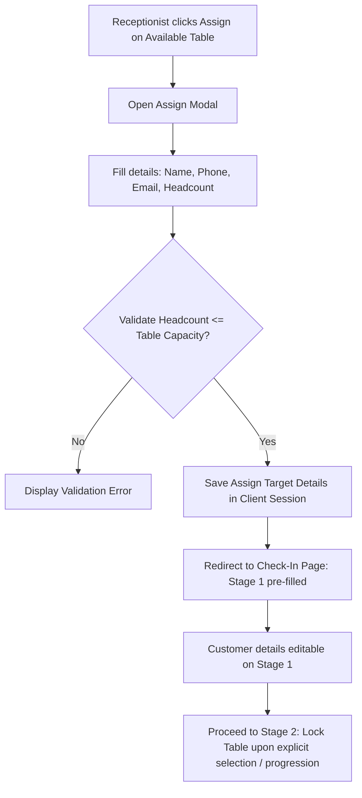
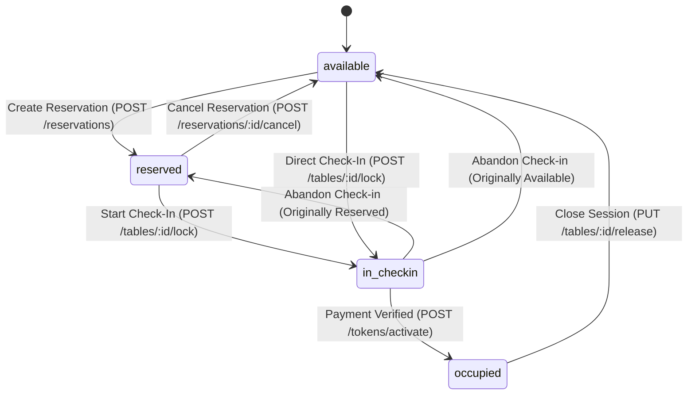
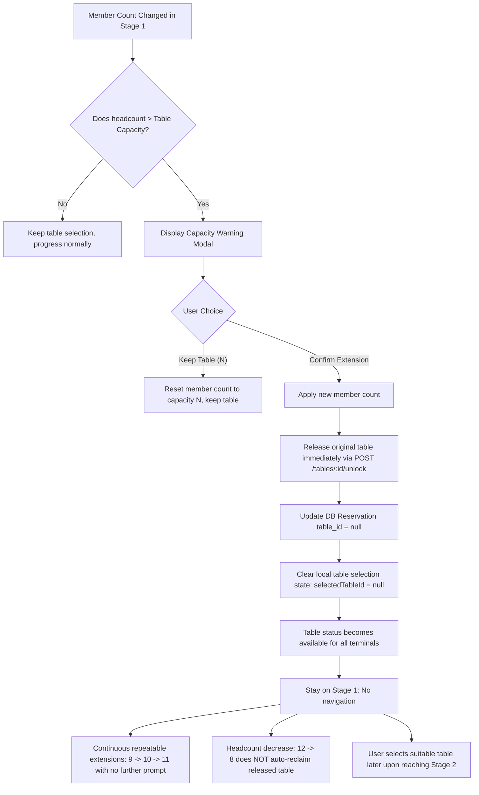
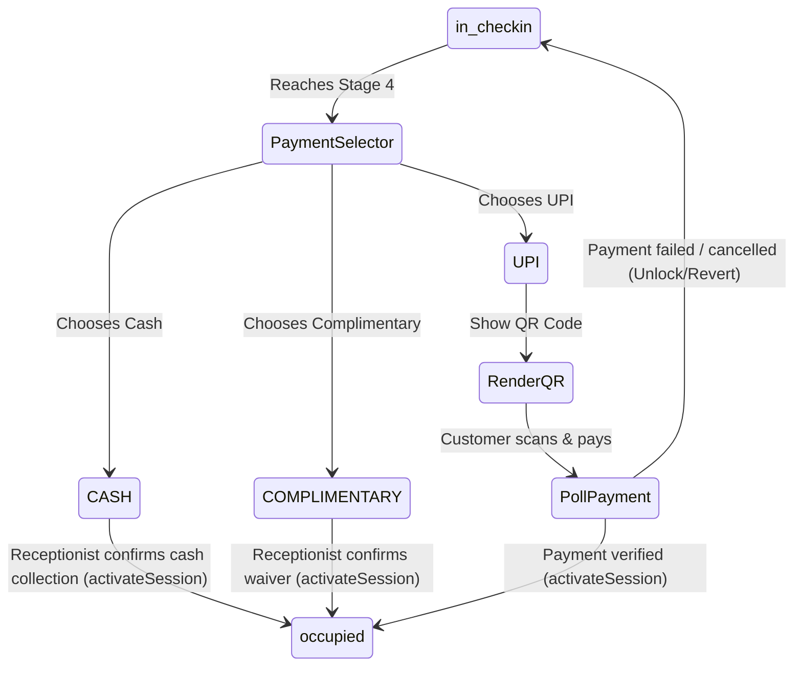
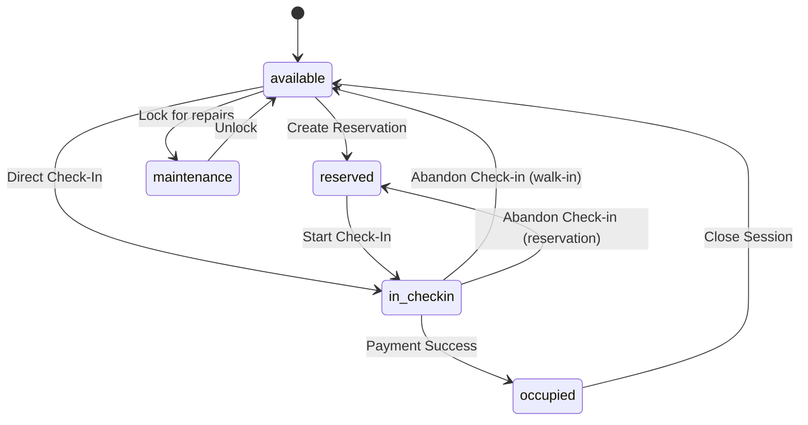
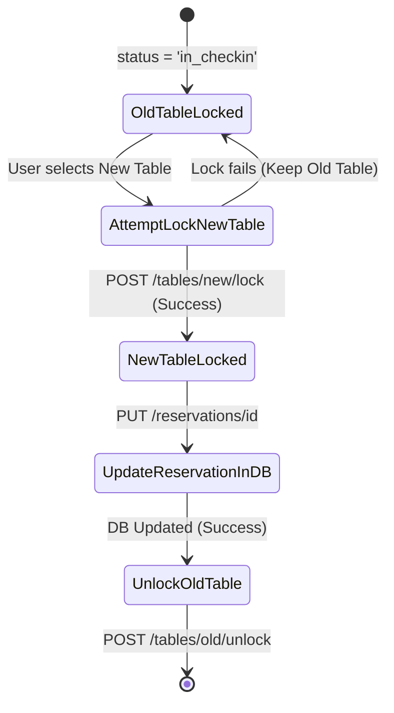

# Table Reservation, Assignment & Check-In Lock Specification
**Version:** 1.0.0  
**Status:** Approved Specification  
**Scope:** Web Frontend, Backend API & Database

---

## 1. Core Table States

The system defines five primary operational states for table resources. Every table must reside in exactly one of these states at all times:

| State | Definition | Transition Initiators | Allowed Actions | Blocked Actions |
| :--- | :--- | :--- | :--- | :--- |
| **`available`** | The table is vacant, clean, and open for walk-ins or reservations. | - Session closed (Occupied → Available)<br>- Check-in abandoned (In Check-in → Available)<br>- Reservation cancelled (Reserved → Available)<br>- Maintenance ends (Maintenance → Available) | - Reserve (create reservation)<br>- Assign (create reservation + redirect to Check-in)<br>- Check-In (immediate check-in)<br>- Lock for Maintenance | - Extend Session<br>- Close Session<br>- Release Lock (already unlocked) |
| **`reserved`** | The table has an active, pending customer reservation. | - Reservation created (Available → Reserved)<br>- Check-in abandoned (In Check-in → Reserved) | - Check-In (by reservation owner)<br>- Cancel Reservation (by owner/admin)<br>- Reassign Table (capacity change) | - Reserve again<br>- Assign to new walk-in<br>- Extend Session<br>- Close Session |
| **`in_checkin`** | The table is locked by a receptionist who is actively conducting the check-in wizard. | - Receptionist starts Check-in (Available/Reserved → In Check-in) | - Abandon Check-in (revert)<br>- Select alternative table (switch)<br>- Submit details / QR Scan<br>- Confirm Payment | - Reserve<br>- Assign<br>- Cancel Reservation<br>- Extend Session<br>- Close Session<br>- Maintenance Lock |
| **`occupied`** | The table is actively seated with guests who have a verified session token. | - Payment confirmed (In Check-in → Occupied) | - Extend Session (+20m, +25m, +30m)<br>- Close Session (Vacate table)<br>- Inspect session details | - Check-In<br>- Reserve<br>- Assign<br>- Cancel Reservation<br>- Lock for Maintenance |
| **`maintenance`** | The table is out of service (cleaning, repairs, configuration). | - Administrator lock (Available → Maintenance) | - Unlock to Available (admin only)<br>- Inspect details | - Reserve<br>- Assign<br>- Check-In<br>- Extend Session<br>- Close Session |

---

## 2. Table Assignment vs. Explicit Reservation Workflow

The system strictly differentiates between **Assigning a Table** (initiating a direct check-in session for a customer) and **Explicit Table Reservation** (booking a table in advance).



### Business Rules for Table Assignment:
1. **No Implicit Reservations**: Entering Assign details does **NOT** automatically create a reservation record in PostgreSQL. The Reservations page must **never** be used as temporary storage for uncompleted Assign actions.
2. **Explicit Reservation Only**: A table/customer appears on the Reservations page **only** after the user explicitly performs the dedicated **Reservation** action (e.g. clicking the "Reserve" action and confirming).
3. **No Premature Table Locking**: Starting an Assign flow does not prematurely lock the table in Redis/PostgreSQL. A table is marked **LOCKED (`in_checkin`)** only when a genuine active/pending Check-In process selects/protects that table during the Check-In workflow.
4. **Direct Navigation to Check-In Stage 1**: Confirming the Assign modal immediately opens **Check-In Page → Guest Check-In Details / Stage 1** pre-loaded with customer details and table selection.
5. **Stage 1 Editability**: In Stage 1, customer name, phone number, email, and headcount remain fully editable.
6. **Resume / Stop Decision Isolation**:
   - **Resume Check-In**: Previous Check-In continues exactly where it was left. The new Assign attempt is completely discarded with zero leftover reservation or table lock.
   - **Stop Check-In**: Previous Check-In is completely terminated and cleaned up. New Assign details are preserved and pre-filled on Stage 1.

---

## 3. Reservation Lifecycle

The state chart below details the valid pathways, transitions, and rollbacks for tables under reservation control:



### Valid Rollback Paths
* **`reserved` → `available`**: Occurs if the customer cancels their reservation or the system auto-expires it due to a no-show.
* **`in_checkin` → `reserved`**: Occurs if a check-in that originated from a reservation is abandoned, fails payment, or is closed early. The table must revert to `reserved` to preserve the original reservation.
* **`in_checkin` → `available`**: Occurs if a check-in that started from a vacant walk-in is abandoned. The table must return to `available`.

---

## 4. Reservation + Customer Detail Updates

If a receptionist edits customer details or guest counts during the check-in wizard, these updates must remain fully synchronized with the database to maintain audit trail consistency.

### Required Database Updates:
1. **Stage 1 Modifications**: If details (Name, Phone, Email, Guest Count) are edited:
   * **Reservation Present**: Call `PUT /reservations/:id` to update the name, phone, email, and guest count on the `Reservation` record in PostgreSQL.
   * **Pending Token Present**: Call `POST /check-in/pending` to update customer details on the `Customer` and `Token` tables.
2. **Synchronization Window**: The frontend state must trigger these updates immediately during the step transitions (e.g., clicking "Next" in Stage 1/2) to prevent local storage cache from drifting from the authoritative DB.

---

## 5. Capacity Change & Extension Workflow

When a customer is assigned to a table during Check-In (Stage 1) and the entered member count exceeds that table's original capacity, the system does NOT automatically navigate away or automatically reassign another table. Instead, an interactive capacity warning modal is presented allowing the receptionist to explicitly choose between keeping the current table capacity or extending the member count.



### Business Rules for Capacity Warning & Extension:
1. **Interactive Warning Modal**:
   * Message: `"This table has a capacity of {capacity}. You are assigning {newCount} members. Do you want to keep the current table with {capacity} members or extend the member count?"`
   * Buttons:
     * **"Keep Table ({capacity})"**: Caps the entered count back to `{capacity}`, keeps the table locked/assigned, and closes the modal.
     * **"Confirm Extension"**: Confirms the headcount extension and executes the table release sequence.
2. **Confirm Extension Execution**:
   * **Apply Member Count**: Sets `personsCount` to the new extended value.
   * **Immediate Table Release**: Unlocks the original table (`POST /api/tables/:id/unlock`), returning it to `available` status in PostgreSQL and deleting the Redis lock.
   * **Database Reservation Update**: If a `reservationId` exists, updates the record in PostgreSQL with `tableId = null` and the new `personsCount`.
   * **Clear Client Selection State**: Clears `selectedTableId = ''`, `originalTableStatus = ''`, and `preselectedTable = null`.
   * **No Automatic Navigation**: The user remains on the exact same page/stage (**Stage 1**). The system does not navigate to Stage 2 or the Tables floor plan.
3. **Repeatable Extensions & Continuous Scaling**:
   * Once extended and the table is released, subsequent member increases (e.g., `9 → 10 → 11 → 12`) proceed immediately without showing further warnings (since no table is currently held).
4. **Member Count Decreases & Non-Reclamation**:
   * Decreasing the member count (e.g., `12 → 10 → 8 → 6`) never automatically re-assigns or reclaims the previously released table.
5. **Subsequent Seating (Stage 2)**:
   * When the receptionist clicks **Next** to proceed to Stage 2, they can choose any available table that matches the new headcount.
* **`destination table occupied`**: Blocked; cannot select.
* **`destination table reserved`**: Only selectable if the reservation belongs to the same customer/session.
* **`destination table in_checkin`**: Blocked; locked by another receptionist.
* **`destination capacity insufficient`**: Blocked; validation error displays.
* **`destination table becomes unavailable during click`**: The lock request `POST /tables/:id/lock` will fail. The frontend catches the error, displays an alert, and keeps the old table locked.
* **`check-in abandonment after reassignment`**: If check-in is abandoned *after* reassigning to a new table, the rollback must release the *new* table to `available` (or `reserved` if it inherited a reservation) and the old table must remain `available`.

---

## 6. Check-In Lock Workflow

The `in_checkin` status is an authoritative database-level lock that guards the seating layouts throughout the check-in process.

```
Check-In Wizard Stages:
[Stage 1: Customer Details] ──► [Stage 2: Table Seating] ──► [Stage 3: QR Code Verification] ──► [Stage 4: Payment Selector] ──► [Stage 5: Seated]
└──────────────────────────────────── ACTIVE Lock (in_checkin) ────────────────────────────────────┘
```

1. **Lock Duration**: The table status remains `in_checkin` continuously from Stage 2 through the final payment validation in Stage 4.
2. **Intermediate Protection**: Action steps (e.g., clicking "Verify QR", generating the email, or toggling between Cash and UPI payment modes) must **never** toggle the table status back to `available` or `reserved`.
3. **Double Selection Block**: Any concurrent queries to the tables API from other receptionist dashboards must return this table with `status: 'in_checkin'`, blocking any click handlers.

---

## 7. Original Table State Preservation

When a receptionist locks a table for check-in, the system must remember what its status was prior to locking so that rollback functions can restore it correctly on failure.

1. **Storage of State**:
   * **Database Layer**: The Redis lock key metadata `table:lock:${tableId}` must contain the `originalStatus` string (`"available"` or `"reserved"`).
   * **Client Layer**: The string must be stored in the frontend context and cached in `localStorage` under `bar_checkin_original_status` to survive browser refreshes.
2. **Restoration Logic**:
   * If check-in is aborted or cancelled:
     * The client calls `POST /tables/:id/unlock`.
     * The backend retrieves the `originalStatus` from the Redis lock.
     * If the lock is missing or expired, the backend falls back to checking PostgreSQL: if a `PENDING` reservation exists for this table, it reverts to `reserved`; otherwise, it reverts to `available`.

---

## 8. Table Switching During Check-In

Table switching must be executed as an atomic sequence of API operations to prevent race conditions:

```
[Start Switch] 
   └──► 1. POST /tables/new-id/lock (Acquire lock on new table)
             ├── SUCCESS ──► 2. PUT /reservations/id (Update reservation table_id in DB)
             │                    └──► 3. POST /tables/old-id/unlock (Release lock on old table)
             │                              └──► [Complete Switch]
             └── FAILURE ──► [Abort Reassignment] (Keep lock on old table, show error toast)
```

1. **Old Table Protection**: If locking the new table fails, the old table's status must remain untouched (`in_checkin`) and the receptionist must not lose their session draft.
2. **Redis Lock Cleanup**: When the old table is unlocked, its corresponding Redis key `table:lock:${oldId}` must be deleted immediately.
3. **UI Synchronization**: A background refresh must trigger on the client to update the floor layout instantly.

---

## 9. Concurrency

The backend must resolve concurrent conflicts using strict transactional isolation and database locks:

* **PostgreSQL Row Locking**: Any operation modifying table statuses or reservation links must run inside a transaction block with explicit row locking (`SELECT ... FOR UPDATE` or Prisma `$transaction` API).
* **Redis Lock Expirations**: Redis keys for table locks (`table:lock:${tableId}`) must have a strict Time-to-Live (TTL) of **3600 seconds** (1 hour). This prevents orphaned table locks if a receptionist's computer crashes or loses network connectivity.
* **Race Condition Resolutions**:
  * *Two receptionists assign the same table*: The first request creates the reservation and locks the row. The second request fails with `409 Conflict` (table already locked/reserved).
  * *Cancelling a reservation while check-in starts*: If receptionist A attempts to cancel a reservation while receptionist B is locking it for check-in:
    * The lock API (`POST /tables/:id/lock`) checks if status is `reserved`. If the cancellation completes first, status is `available` (not `reserved`), and the lock succeeds as a walk-in, or if the lock completes first, the cancellation request fails because the status is `in_checkin` (cancellations are blocked in this state).

---

## 10. Multi-Receptionist Live Synchronization

Receptionists must work with real-time (or near real-time) information to prevent duplicate attempts:

1. **State Polling**: The frontend context must poll `refreshTokens()`, `refreshTables()`, and `refreshReservations()` concurrently.
2. **Synchronization Interval**: Polling must occur at a strict interval of **10 seconds**.
3. **Maximum Stale Period**: Receptionists must not view stale table data for more than 10 seconds.
4. **Action Triggers**: Any successful mutations (Reserving, Assigning, Locking, Activating, Closing, Cancelling) must immediately call `refreshAll()` locally, bypassing the interval timer.

---

## 11. Payment Gate

Payment verification is the final gateway that transitions the table from `in_checkin` to `occupied` status.



* **Failure Recovery**: If a digital payment fails or is cancelled, the table must remain in `in_checkin` status. The receptionist can choose a different payment method or safely abandon the check-in to trigger rollbacks.
* **Duplicate Submissions**: The activation button must be disabled immediately upon click, displaying a loading spinner. The backend route must execute inside a Prisma transaction to prevent duplicate session activations.

---

## 12. Rollback Matrix

The following matrix defines the outcomes for major system operations:

| Current State | Action | Success State | Failure State | Rollback Action |
| :--- | :--- | :--- | :--- | :--- |
| **`available`** | Reserve Table | `reserved` | `available` | Delete reservation record; table reverts to `available`. |
| **`available`** | Assign Table | `in_checkin` | `available` | Delete reservation record; release Redis lock; table reverts to `available`. |
| **`reserved`** | Start Check-In | `in_checkin` | `reserved` | Release Redis lock; table reverts to `reserved` (reservation status stays `PENDING`). |
| **`in_checkin`** | Switch Table | `in_checkin` (new table) | `in_checkin` (old table) | Keep lock on old table; release new table lock (if acquired); show error toast. |
| **`in_checkin`** | Abandon Check-In | `available` or `reserved` | `in_checkin` | Revert table status to its `originalTableStatus` stored in cache/Redis lock. |
| **`in_checkin`** | Confirm Payment | `occupied` | `in_checkin` | Table remains `in_checkin`. Receptionist can retry payment or abandon check-in. |
| **`occupied`** | Close Session | `available` | `occupied` | Keep table status as `occupied`; session remains active; log the database error. |

---

## 13. QR / Token Lifecycle

The session token and its authorized QR code must progress through distinct, non-overlapping statuses:

1. **`PENDING_PAYMENT`**: Customer details are recorded, and the QR code is generated. The token is locked to the table.
2. **`ACTIVE`**: Payment is verified. The session timer begins. The QR code is active for drink redemptions.
3. **`EXTENDED`**: Additional duration is purchased. The `endTime` is pushed forward in PostgreSQL.
4. **`EXPIRED`**: The session duration has run out. The token is marked expired, but remains occupied until vacated.
5. **`CANCELLED` / `CLOSED`**: The customer has vacated the table. The token status is updated, and the QR code is **permanently invalidated**.
6. **QR Invalidation on Transfer**: If a table session is transferred to another table, the old token number is deleted, and a new token number/QR code is generated. The old QR code is marked as `CLOSED` and can never be scanned for drink redemptions.

---

## 14. Browser Refresh / Back / Close & Global Resume Rules

### Core Rule: Resume Must Restore The Exact Last State (Global & Mandatory)

> **Resume Check-In always restores the exact last saved Check-In state — exact page/stage and exact entered data — regardless of whether the user returns from Tables, Reservations, Assign, another browser tab, or any other valid workflow path.**

1. **Exact Stage Restoration (No Inferencing)**:
   - If the user left Check-In on **Guest Check-In Details page (Stage 1)** → Resume opens **Guest Check-In Details page (Stage 1)** with all entered fields intact.
   - If the user left Check-In on **Table Selection page (Stage 2)** → Resume opens **Table Selection page (Stage 2)** with the selected table intact.
   - If the user left Check-In on **QR / Token page (Stage 3)** → Resume opens **QR / Token page (Stage 3)** with the active pending token intact.
   - If the user left Check-In on **Payment page (Stage 4)** → Resume opens **Payment page (Stage 4)** with verified payment readiness intact.
   - The system **never** makes assumptions (such as "if details exist go to table selection" or "if table exists go to payment"). The actual saved stage is restored directly.

2. **Process Isolation (Assign vs. Resume vs. Stop Check-In)**:
   - If an earlier draft `bar_incomplete_checkin` exists when navigating to Check-In from an Assign operation:
     - The user is presented with the **Resume / Stop Check-In** decision.
     - **If user selects "Resume Check-In"**:
       - The previous incomplete Check-In is restored to its exact last state without merging any new Assign details.
       - The newly created Assign reservation remains an independent, authoritative `PENDING` reservation in PostgreSQL that is manageable from the Reservations page.
     - **If user selects "Stop Check-In"**:
       - **Stop Check-In completely terminates only the selected previous incomplete Check-In process. Its customer details, phone, email, temporary reservation/check-in state, table ownership, table lock, token/session state, and related temporary state must no longer remain active. The phone, email, and table become reusable when no other valid process owns them.**
       - **Stopping the previous Check-In must never delete or modify the new Assign process. The new Assign details must remain preserved and must be pre-filled on the Guest Check-In Details page.**
       - Process B's assigned table remains protected/reserved, and customer details (Name, Phone, Email, Headcount, Table, Reservation ID) are automatically loaded and editable on Stage 1.
       - No "already used" conflicts (phone, email, table) are produced by the stopped process.

3. **Tab Closure / Reload**:
   - If the browser tab is closed or refreshed, the table lock (`in_checkin`) is preserved in PostgreSQL and Redis (TTL 3600s). On return, the receptionist is prompted to Resume (restoring the exact last step) or Stop (releasing locks and terminating incomplete state).

---

## 15. API Contract Expectations

### A. Lock Table
* **Endpoint**: `POST /api/tables/:id/lock`
* **Request Body**: None (inferred from JWT authenticated user)
* **Validations**:
  * Table `id` must be a valid UUID.
  * Table status must be `available` or `reserved`.
* **Database Updates**: Table status set to `in_checkin`.
* **Redis Updates**: Set `table:lock:${id}` with TTL of 3600s.
* **Success Response**: `{ success: true, table: Table }` (Status `200`)
* **Error Response**: `{ success: false, error: { message: "Table cannot be locked..." } }` (Status `400`)

### B. Unlock Table
* **Endpoint**: `POST /api/tables/:id/unlock`
* **Request Body**: `{"forceAvailable": boolean}` (optional)
* **Validations**: Table status must be `in_checkin`.
* **Database Updates**: Reverts table status to `reserved` (if pending reservation exists) or `available`.
* **Redis Updates**: Deletes `table:lock:${id}` key.
* **Success Response**: `{ success: true, table: Table }` (Status `200`)

### C. Stop / Terminate Check-In
* **Endpoint**: `POST /api/check-in/stop`
* **Request Body**: `{"reservationId"?: string, "tokenNumber"?: string, "tableId"?: string, "phoneNumber"?: string, "email"?: string}`
* **Validations**: Authenticated receptionist, manager, or admin.
* **Database Updates (Prisma Transaction)**:
  * Cancels specific pending reservation (`status = 'CANCELLED'`).
  * Cancels pending session token (`status = 'CANCELLED'`, `cancelReason = 'USER_CANCELLED'`).
  * Releases associated table (`status = 'available'`) if no other active pending reservation exists.
* **Redis Updates**: Deletes `table:lock:${tableId}`, `token:${tokenNumber}`, and active cache keys.
* **Success Response**: `{ success: true, message: "Previous incomplete check-in completely terminated and resources released." }` (Status `200`)

### C. Update Reservation (Table Switch)
* **Endpoint**: `PUT /api/reservations/:id`
* **Request Body**: `{"tableId": "new-uuid"}`
* **Validations**:
  * New table must be `available` or `in_checkin`.
  * Receptionist must own the reservation (or be admin/manager).
* **Database Updates (Transaction)**:
  * Updates `tableId` on `Reservation` record.
  * Updates old table status to `available`.
  * Updates new table status to `in_checkin`.
* **Redis Updates**:
  * Deletes lock for old table.
  * Creates lock for new table with `originalStatus = 'reserved'`.
* **Success Response**: `{ success: true, reservation: Reservation }` (Status `200`)

---

## 16. Database Consistency Rules

To prevent database corruption, the following integrity constraints must be maintained:

1. **Table Seating Mutex**: A table cannot map to more than one active token (`Token.status = 'ACTIVE' | 'EXTENDED'`).
2. **Lock-Status Sync**: A table status cannot be `in_checkin` unless a corresponding Redis key `table:lock:${id}` exists (or was created by the active receptionist).
3. **No Orphaned Reservations**: If a reservation status is `ASSIGNED`, the associated table's status must be `occupied` or `available` (if they have checked out). It must never remain `reserved`.
4. **Active Token Check**: A token cannot remain `ACTIVE` if the table status has reverted to `available` or `maintenance`.

---

## 17. UI State / Button Rules

Depending on the table status, the action buttons in the seating layout and inspect drawers must update dynamically:

| Table Status | Assign Button | Reserve Button | Check-In Button | Cancel Button | Change Table | Close Session | Extend |
| :--- | :--- | :--- | :--- | :--- | :--- | :--- | :--- |
| **`available`** | Enabled | Enabled | Enabled | Hidden | Hidden | Hidden | Hidden |
| **`reserved`** | Disabled | Disabled | Enabled (Owner) | Enabled (Owner)| Hidden | Hidden | Hidden |
| **`in_checkin`**| Disabled | Disabled | Disabled | Hidden | Enabled | Hidden | Hidden |
| **`occupied`** | Disabled | Disabled | Disabled | Hidden | Hidden | Enabled | Enabled |
| **`maintenance`**| Disabled | Disabled | Disabled | Hidden | Hidden | Hidden | Hidden |

---

## 18. Complete End-to-End Scenarios

### Scenario A: Normal Reservation → Check-In
1. Guest calls; receptionist reserves Table S-02. Table status becomes `reserved`.
2. Guest arrives; receptionist clicks **Check-In** on S-02.
3. Table status becomes `in_checkin`. Detail fields are pre-filled.
4. Receptionist completes verification and UPI payment.
5. Table status becomes `occupied`. Session token starts.

### Scenario B: Capacity Increase Requiring Table Reassignment
1. Guest reserves Table S-12 (capacity: 4) for 4 members. Table is `reserved`.
2. Guest arrives with 6 members. Receptionist edits guest count to 6 in Stage 1.
3. System shows warning: `"Guest count exceeds table capacity."` Next button is disabled.
4. In Stage 2, receptionist selects Table L-01 (Premium Zone, capacity: 6).
5. Frontend locks L-01, updates the database reservation record, and unlocks S-12.
6. Check-in proceeds on L-01. Upon payment, L-01 becomes `occupied`, and S-12 reverts to `available`.

### Scenario C: Two Receptionists Compete for Same Table
1. Table S-05 is `available`. Receptionist A clicks **Assign** and opens the reservation modal.
2. Receptionist B simultaneously clicks **Assign** on S-05.
3. Receptionist A submits the reservation first. Table S-05 is locked to `in_checkin`.
4. Receptionist B submits their reservation. The API rejects the request with `400 Lock Error: Table is already locked for check-in`. The frontend shows an alert, closes the modal, and refreshes the floor layout.

### Scenario D: Resume Previous Phone-Only Check-In After Assigning a New Table
1. Receptionist opens **Check-In**, enters only a phone number, and navigates away without completing check-in. Process A draft is saved in `bar_incomplete_checkin`.
2. Receptionist navigates to **Tables**, clicks **Assign** on an available table, enters complete customer details, and assigns the table. Process B is created in PostgreSQL with `status: 'PENDING'` and the table is locked to `in_checkin`.
3. Upon returning to Check-In, the system detects the earlier incomplete check-in and presents the **Resume / Stop** prompt.
4. Receptionist selects **Resume**.
5. Process A resumes with the previously entered phone number on Stage 1 (Customer Details). Process B's reservation details are not merged into Process A.
6. Process B remains an authoritative, distinct reservation in PostgreSQL. On the **Reservations** page, Process B's card displays both **Assign** and **Cancel** enabled for the reservation owner (not disabled by the `in_checkin` status).
7. If receptionist clicks **Cancel** on Process B, only Process B is cancelled in PostgreSQL and its table is safely released to `available`, leaving Process A draft completely intact.
8. If receptionist clicks **Assign** on Process B, Check-In opens with Process B's authoritative customer and table details, keeping Process A isolated.

---

## 19. State Transition Diagrams

### Table State Transitions


### Table Switching Lifecycle (Atomic)


---

## 20. Authoritative Workflow & State Transition Rules

1. **Resume Path**: Previous Check-In continues exactly where it was left (exact stage, exact entered data, valid table/token state). The new Assign attempt disappears completely with zero leftover state, no temporary reservation created, and no locked tables.
2. **Stop Path**: Previous Check-In is completely terminated and cleaned up in database/Redis (customer details removed from active state, phone/email reusable, table released to `available`). The new Assign details are preserved and pre-filled on **Guest Check-In Details (Stage 1)** as editable fields.
3. **Explicit Reservation Only**: A table/customer appears on the Reservations page **only** after the user explicitly performs the dedicated **Reservation** action. Entering Assign details or encountering Resume/Stop prompts does **never** create a reservation record.
4. **Explicit Cancellation Only**: A valid reservation is cancelled **only** through the explicit **Cancel Reservation** operation and confirmation. Unrelated navigation, check-in starts, or stops do not affect independent valid reservations.
5. **Table Lock Authoritativeness**: A table is marked **LOCKED (`in_checkin`)** only when a genuine, active pending Check-In process currently owns/protects that table in the backend/Redis state.
6. **Authoritative Table State Priority**:
   - **Active customer/session exists** → `occupied`
   - **Valid pending Check-In owns/protects table** → `in_checkin` (LOCKED)
   - **Valid explicit reservation owns table** → `reserved`
   - **No valid owner/protection** → `available`
7. **Process Identity & Isolation**: Process A (incomplete checkin), Process B (new assign), and Process C (independent valid reservation) remain strictly isolated. Operations affect only their intended process identity.
8. **No Stale Conflicts**: When a process is stopped or discarded, its phone number, email, and table become immediately reusable with zero false conflict alerts.

---

## 21. Authoritative New Check-In Process (Detailed Test Cases 01–10)

The New Check-In Process is defined by 10 comprehensive, end-to-end scenarios covering every state, branch, and edge case across the system:

---

### Test Case 01: Complete Direct Check-In Lifecycle (Walk-In / Fast-Track)

#### A. Objective
Execute and verify the full direct check-in flow from Stage 1 customer data entry to Stage 5 active digital pass generation with automatic table occupancy and WebSocket floor synchronization.

#### B. Pre-Conditions
- Table `S-01` is in `available` state in PostgreSQL (`status = 'available'`).
- No active session exists for Phone `"9876543210"` or Email `"rahul@gmail.com"`.
- Receptionist is logged in.

#### C. Step-by-Step Flow
1. **Stage 1 (Customer Details)**:
   - Receptionist opens `/check-in`.
   - Inputs: Name = `"Rahul Sharma"`, Phone = `"9876543210"`, Email = `"rahul@gmail.com"`, Headcount = `2`.
   - Client debounces (400ms) and calls `POST /api/check-in/validate-duplicate`.
   - Backend checks `tokens` and `reservations`; returns `{ success: true, conflicts: { phone: false, email: false } }`.
   - Stage 1 validation passes (`isStep1Valid = true`); receptionist clicks **Next**.
2. **Stage 2 (Table Seating)**:
   - System displays available tables matching the selected zone.
   - Receptionist selects **Table S-01**.
   - Client calls `POST /api/tables/S-01-uuid/lock`.
   - Backend updates PostgreSQL table `status = 'in_checkin'`, writes Redis key `table:lock:S-01-uuid` (TTL 3600s), and emits WebSocket `table:updated`.
   - Receptionist clicks **Proceed to QR / Send QR**.
3. **Stage 3 (QR Code Generation & Verification)**:
   - Client calls `POST /api/check-in/pending`.
   - Backend creates `Customer` and `Token` record (`status = 'PENDING'`, `tokenNumber = 'TK-101'`) and sends QR pass to customer email.
   - Receptionist scans QR code with camera scanner.
   - Client calls `POST /api/check-in/verify-qr` with code.
   - Backend validates token; client sets `qrVerificationSuccess = true` and advances directly to Stage 4.
4. **Stage 4 (Payment Gateway)**:
   - Authoritative Pre-Payment Gate executes `POST /api/check-in/pre-payment-validate`.
   - Backend validates phone/email uniqueness, table vacancy, and token validity; returns `{ valid: true }`.
   - Receptionist selects Payment Mode = `CASH` and clicks **Confirm Payment**.
   - Client calls `POST /api/check-in/activate` with `tokenNumber = 'TK-101'`.
   - Backend transaction marks `Token.paymentVerified = true`, `Token.status = 'ACTIVE'`, updates PostgreSQL table `status = 'occupied'`, assigns `Table.currentTokenId`, and deletes the Redis lock.
5. **Stage 5 (Active Pass Output)**:
   - Client renders active Pass Ticket with countdown timer and drink entitlement badge.
   - LocalStorage draft `bar_incomplete_checkin` is automatically cleared.

#### D. Assertions & State Checks
- PostgreSQL `Table.status` = `'occupied'`.
- PostgreSQL `Token.status` = `'ACTIVE'` and `paymentVerified` = `true`.
- Redis lock `table:lock:S-01-uuid` is removed.

---

### Test Case 02: Table Concurrency Lock & Abandonment Cleanup

#### A. Objective
Ensure that locked tables display real-time lock status across all terminals, prevent double-booking, and revert cleanly to `available` upon abandonment.

#### B. Pre-Conditions
- Table `S-03` is `available`.
- Terminals A and B are active.

#### C. Step-by-Step Flow
1. **Locking**:
   - Receptionist A starts check-in on Terminal A and selects Table `S-03` in Stage 2.
   - `POST /api/tables/S-03-uuid/lock` executes. Table `S-03` becomes `in_checkin` in PostgreSQL and Redis.
2. **Multi-Terminal Protection**:
   - Terminal B receives the WebSocket broadcast (or polls within 10s).
   - Table `S-03` card on Terminal B shows `in_checkin` badge; clicking is disabled.
   - If Terminal B sends a lock request, backend rejects with `409 Conflict: Table is already locked for check-in`.
3. **Abandonment & Cleanup**:
   - Receptionist A clicks **Stop Check-In**.
   - Stop Confirmation Modal appears: *"Are you sure you want to stop this Check-In?"*.
   - Receptionist A clicks **YES — Stop Check-In**.
   - `handleAbandonCheckIn` runs:
     1. Calls `POST /api/check-in/cancel-session` for pending token.
     2. Calls `POST /api/tables/S-03-uuid/unlock`.
     3. Removes `bar_incomplete_checkin` from `localStorage`.
   - Backend sets Table `S-03` `status = 'available'` and removes Redis lock.
   - Terminal B instantly receives WebSocket update showing Table `S-03` as `available`.

---

### Test Case 03: Stop Check-In vs. New Table Assignment (Complete Termination & Assign Detail Preservation)

#### A. Objective
Verify that choosing "Stop Check-In" completely terminates only the selected previous incomplete Check-In process (Process A) — ensuring its customer details, phone number, email, temporary reservation/check-in state, table ownership, table lock, and token/session state no longer remain active and immediately become reusable without conflict errors — while preserving the newly entered customer details and table protection from the new Assign flow (Process B), automatically pre-filling them on Stage 1 (Guest Check-In Details) where they remain fully editable.

#### B. Pre-Conditions
- Incomplete Check-In exists in system / `bar_incomplete_checkin` (Process A: Customer A, Phone A = `"9876543210"`, Email A = `"customera@gmail.com"`, Table A = `S-03`).
- Table `S-05` is `available`.

#### C. Step-by-Step Flow
1. Receptionist navigates to `/tables`, selects Table `S-05`, clicks **Assign**, enters customer details for Customer B (*"Priya"*, Phone B = `"9888811111"`, Email B = `"priya@gmail.com"`, Guests = `3`), and confirms Assign (Process B).
2. System creates `PENDING` reservation in PostgreSQL for Process B, locks Table `S-05` to `in_checkin`, and routes to `/check-in`.
3. Due to the earlier incomplete draft (Process A), the system displays the **Resume / Stop Check-In** prompt:
   - *"An incomplete check-in session for a customer is currently saved. Would you like to resume it?"*
4. Receptionist clicks **STOP CHECK-IN**.
5. Stop Confirmation Modal opens: *"Are you sure you want to stop this Check-In?"* with buttons:
   - **"YES — Stop Check-In"** vs **"NO — Continue Check-In"**.
6. Receptionist clicks **YES — Stop Check-In**.
7. System executes `POST /api/check-in/stop` targeting Process A's identity:
   - **Process A is completely terminated**:
     - Customer A details removed from active/in-progress state.
     - Phone A (`"9876543210"`) and Email A (`"customera@gmail.com"`) immediately become reusable for new check-ins/reservations with zero "already used" conflict errors.
     - Table A (`S-03`) is released and immediately reverts to `available` in PostgreSQL and Redis.
     - Process A's temporary reservation / pending token is cancelled in PostgreSQL (`status = 'CANCELLED'`).
     - Process A no longer appears as an active reservation on the Reservations page.
     - `bar_incomplete_checkin` is permanently purged.
8. **Process B is completely preserved**:
   - Customer B details are retained and automatically pre-filled on **Stage 1 (Guest Check-In Details)**:
     - Customer Name: `"Priya"`
     - Phone Number: `"9888811111"`
     - Email: `"priya@gmail.com"`
     - Number of Persons: `3`
     - Pre-selected Table: `S-05`
     - Reservation ID: authoritative `PENDING` reservation ID for Process B
   - Table B (`S-05`) remains locked and protected for Process B.
   - All pre-filled fields remain fully editable by the receptionist.
   - Receptionist can modify fields and click **Next** to proceed smoothly through Stage 2, 3, 4, 5 without any conflict or stale state from Process A.

---

### Test Case 04: Resume Previous Phone-Only Check-In vs. New Table Assignment

#### A. Objective
Verify that choosing "Resume" on a phone-only incomplete draft preserves the phone number on Stage 1, does not merge data from a newly assigned table, and leaves the new assignment fully actionable.

#### B. Pre-Conditions
- Incomplete draft (Process A) has Phone = `"9123456780"` only (Name/Email blank).
- Table `S-08` assigned to *"Amit Kumar"* (Process B, `reservationId = 'res-08'`).

#### C. Step-by-Step Flow
1. Receptionist navigates to `/check-in`. System displays Resume/Stop prompt.
2. Receptionist clicks **Resume**.
3. `handleContinueCheckIn` inspects draft: since name and email are missing, wizard stays on **Stage 1 (Customer Details)**.
4. Phone field is populated with `"9123456780"`.
5. Process B's details (*"Amit Kumar"*, Table S-08) are **not merged** into Process A.
6. Receptionist navigates to `/reservations`. Process B card shows:
   - **Assign**: Enabled for reservation owner.
   - **Cancel**: Enabled for reservation owner.
7. Cancelling or completing Process B operates strictly on `reservationId = 'res-08'` and does not alter Process A's draft.

---

### Test Case 05: Duplicate Customer Details (Phone / Email) Validation

#### A. Objective
Prevent duplicate check-ins or reservations when an active session or pending reservation already uses the phone or email.

#### B. Pre-Conditions
- Active token `TK-50` exists for Phone `"9876543210"` and Email `"active@gmail.com"` (`paymentVerified = true`).
- Pending reservation exists for Phone `"9111222333"`.

#### C. Step-by-Step Flow
1. Receptionist enters Phone = `"9876543210"` in Stage 1.
2. Debounced validation calls `POST /api/check-in/validate-duplicate`.
3. Backend returns `{ success: false, conflicts: { phone: true, email: false } }`.
4. UI displays red error badge: *"That phone number is already being used by another active session."*
5. Next button is disabled (`isStep1Valid = false`).
6. Receptionist enters Phone = `"9111222333"`. Backend detects pending reservation conflict. Next button remains disabled.
7. Receptionist enters unique phone `"9000011111"` and unique email `"unique@gmail.com"`. Conflict indicators disappear and Next button is enabled.

---

### Test Case 06: Live Table Switching & Mutex Handoff

#### A. Objective
Verify atomic 3-step table reassignment in Stage 2 with zero lock drop or race conditions.

#### B. Pre-Conditions
- Check-in in progress with Table `S-02` locked (`in_checkin`).
- Candidate Table `S-04` is `available`.

#### C. Step-by-Step Flow
1. In Stage 2, receptionist clicks **Table S-04**.
2. Client executes atomic 3-step switch:
   - **Step 1 (Acquire New Lock)**: Calls `POST /api/tables/S-04-uuid/lock`. Backend sets Table `S-04` `status = 'in_checkin'` and creates Redis lock.
   - **Step 2 (Update DB Reservation)**: If `reservationId` exists, calls `PUT /api/reservations/:id` to point to `S-04-uuid`.
   - **Step 3 (Release Old Lock)**: Calls `POST /api/tables/S-02-uuid/unlock`. Backend sets Table `S-02` `status = 'available'` and deletes old Redis lock.
3. If Step 1 fails (e.g. Table `S-04` was grabbed simultaneously):
   - Catch block retains Table `S-02` locked (`in_checkin`).
   - UI shows error toast: *"Table S-04 is no longer available."*
   - Old table remains safely locked.

---

### Test Case 07: Dynamic Over-Capacity Warning & Extension Workflow

#### A. Objective
Verify that when entered member count exceeds the assigned table capacity, the system prompts the user to either keep the table or confirm extension; and upon confirming extension, the system immediately releases the table, keeps the user on Stage 1 without navigating away, allows continuous repeatable increments, and does not automatically re-assign the released table on count decrease.

#### B. Pre-Conditions
- Table `T-08` assigned/preselected (Capacity: 8, status = `in_checkin` or `reserved`).
- Reservation / Check-In draft exists.
- Wizard is on Stage 1.

#### C. Step-by-Step Flow
1. Receptionist increases headcount from `8` to `9` (exceeding Table `T-08` capacity of 8).
2. System intercepts and displays `renderCapacityWarningModal`:
   - *"This table has a capacity of 8. You are assigning 9 members. Do you want to keep the current table with 8 members or extend the member count?"*
   - Buttons: **Keep Table (8)** and **Confirm Extension**.
3. **Choice 1: "Keep Table (8)"**:
   - Receptionist clicks **Keep Table (8)**.
   - Headcount is reset to `8`. Modal closes.
   - Table `T-08` remains assigned/locked. Check-in proceeds with 8 members.
4. **Choice 2: "Confirm Extension"**:
   - Receptionist clicks **Confirm Extension**.
   - Member count becomes `9`.
   - Table `T-08` is released immediately via `POST /api/tables/:id/unlock` (status becomes `available` in PostgreSQL, Redis lock deleted).
   - DB Reservation record updated (`tableId = null`, `personsCount = 9`).
   - Local table selection is cleared (`selectedTableId = ''`, `preselectedTable = null`).
   - **No Navigation**: Receptionist remains on **Stage 1 (Customer Details)**.
5. **Continuous Repeatable Extensions**:
   - Receptionist increases headcount further: `9 → 10 → 11 → 12`.
   - No modal prompt is displayed because no table is currently attached. Count increases immediately.
6. **Headcount Reduction**:
   - Receptionist reduces headcount: `12 → 10 → 8 → 6`.
   - System updates headcount without automatically reclaiming or re-locking Table `T-08`.
7. **Proceed to Seating (Stage 2)**:
   - Receptionist clicks **Next** to move to Stage 2 and explicitly selects a suitable table for the group.

---

### Test Case 08: Existing Reservation Protection + Customer Uniqueness Enforced

#### A. Objective
Ensure transactional protection against duplicate active reservations and prevent walk-ins from hijacking reserved tables.

#### B. Pre-Conditions
- Table `S-10` is `reserved` under `Reservation.id = 'res-100'` for customer Phone `"9888877777"`.

#### C. Step-by-Step Flow
1. Receptionist attempts to create a new reservation with Phone `"9888877777"`.
2. `POST /api/reservations` runs inside a Prisma transaction with `SELECT ... FOR UPDATE`.
3. Backend detects active `PENDING` reservation matching the phone number.
4. Request is rejected with `409 Conflict: That phone number is already being used by another active reservation.`
5. Walk-in guest attempts to check in on Table `S-10` directly.
6. `POST /api/tables/S-10-uuid/lock` checks reservation ownership. Non-owners are rejected with `403 Forbidden: RESERVATION_NOT_OWNED`.
7. Only the reservation owner (or admin/manager) can check in, transitioning the reservation to `ASSIGNED` upon payment.

---

### Test Case 09: Unpaid Inactivity + Exact Payment Stage Resume + Stop/Expiry Detail Reuse

#### A. Objective
Verify that uncompleted check-ins at Stage 4 resume directly at Stage 4, and that cancelling a pending session immediately releases customer phone and email for reuse.

#### B. Pre-Conditions
- Check-in reached Stage 4 with pending token `TK-200` generated for Phone `"9555544444"`, Email `"guest@gmail.com"`.
- Receptionist refreshed browser or navigated away.

#### C. Step-by-Step Flow
1. **Exact Stage 4 Resume**:
   - Receptionist returns to `/check-in` and clicks **Resume**.
   - `handleContinueCheckIn` reads `bar_incomplete_checkin`. Because `stage = 4`, `activePendingToken` is present, and `qrVerificationSuccess = true`, system sets `stage = 4` directly.
   - Payment options, token number, and verified table details are fully restored without forcing the user to re-scan QR or re-enter details.
2. **Stop / Cancellation Detail Reuse**:
   - Receptionist clicks **Stop Check-In** and confirms.
   - System calls `api.cancelSession('TK-200', 'USER_CANCELLED')`.
   - Backend transitions Token to `CANCELLED` and unlocks table.
   - Receptionist starts a new check-in with Phone `"9555544444"` and Email `"guest@gmail.com"`.
   - Duplicate validation query checks `status IN ('ACTIVE', 'EXTENDED')`. Because previous token is `CANCELLED`, validation succeeds with **zero conflicts**, allowing immediate reuse.

---

### Test Case 10: Reservation vs. Direct Check-In Race Condition + Final Pre-Payment Authoritative Gate

#### A. Objective
Verify that the Authoritative Pre-Payment Gate (`POST /api/check-in/pre-payment-validate`) catches any race conditions or table changes that occurred between Stage 1 and Stage 4 immediately before payment capture.

#### B. Pre-Conditions
- Receptionist A has guest *"Kiran"* at Stage 4 (Payment) for Table `S-07`.
- During payment preparation, Table `S-07` lock expired or was altered.

#### C. Step-by-Step Flow
1. Receptionist A clicks **Confirm Payment** in Stage 4.
2. `handleFinalCheckInSubmit` executes `POST /api/check-in/pre-payment-validate`.
3. Backend inspects live database state:
   - **Check 1**: Phone/email uniqueness against other active sessions.
   - **Check 2**: Table `S-07` status and lock ownership.
   - **Check 3**: Pending token validity (`not CANCELLED` or `EXPIRED`).
4. **Outcome (Table Conflict)**:
   - If Table `S-07` is no longer available or lock expired, backend returns:
     `{ valid: false, conflictType: 'TABLE', redirectStage: 2, message: 'Selected table is no longer available.' }`
   - Client displays error toast, clears `selectedTableId`, refreshes table layouts, and redirects Receptionist A to **Stage 2 (Table Seating)** to pick a new table.
5. **Outcome (Success)**:
   - If all checks pass, backend returns `{ valid: true }`. Payment modal opens and session is activated to `occupied`.

---

### Test Case 11: Customer Phone + Email Concurrency Protection Across Concurrent Sessions

#### A. Objective
Verify that when User A (e.g. Admin in Browser A) enters Phone X and Email Y in an in-progress Check-In, User B (e.g. Receptionist in Browser B) entering the same Phone X or Email Y is immediately detected, blocked, and presented with exact field-level error messages. When User A stops, cancels, or completes the Check-In, Phone X and Email Y become immediately reusable for User B.

#### B. Pre-Conditions
- User A is logged into Browser A on `/check-in`.
- User B is logged into Browser B on `/check-in`.

#### C. Step-by-Step Flow
1. User A enters:
   - Phone: `9876543210`
   - Email: `customer@gmail.com`
   - Backend registers in-progress claims in Redis: `checkin:active:phone:+919876543210` and `checkin:active:email:customer@gmail.com`.
2. Simultaneously, User B enters `9876543210` or `customer@gmail.com` in Browser B.
3. Browser B triggers debounced `POST /api/check-in/validate-duplicate`.
4. Backend checks Redis in-progress claims and detects that the claim is held by User A.
5. Backend returns `{ success: true, conflicts: { phone: true, email: true } }`.
6. User B UI immediately displays field-level warning banners:
   - Below Phone: `"This phone number is currently being used in another Check-In process."`
   - Below Email: `"This email address is currently being used in another Check-In process."`
7. In Browser B, `isPhoneOk` and `isEmailOk` evaluate to `false`, causing `isStep1Valid = false`.
8. The **"Proceed to Seating Plan"** button is strictly disabled with a red border on the inputs. Pressing the Enter key does not advance the stage.
9. User A clicks **STOP CHECK-IN** in Browser A and confirms.
10. Backend `POST /api/check-in/stop` purges `checkin:active:phone:+919876543210` and `checkin:active:email:customer@gmail.com` from Redis.
11. Browser B debounced validation re-executes, detects zero conflicts (`conflicts: { phone: false, email: false }`), clears the error banners, and immediately enables the **"Proceed to Seating Plan"** button for User B.

---

### Test Case 12: Table Concurrency — Live Selection, Switching & Real-Time WebSocket Sync

#### A. Objective
Verify that when User A selects Table S3 in Stage 2, Table S3 becomes locked and unavailable immediately across all browsers via WebSocket broadcast. When User A switches from S3 to S4, S4 is locked first, S3 is released atomically, and User B sees S4 disappear and S3 reappear in real time without refreshing the browser.

#### B. Pre-Conditions
- User A is on Stage 2 (Seating Plan) in Browser A.
- User B is on Stage 2 (Seating Plan) in Browser B.
- Tables `S-03` and `S-04` are both `available`.

#### C. Step-by-Step Flow
1. User A clicks Table `S-03` in Browser A.
2. Browser A calls `POST /api/tables/:id/lock`. Backend updates table status to `in_checkin` and emits `broadcastTableUpdated({ tableNumber: 'S-03', status: 'in_checkin' })`.
3. In Browser B, WebSocket listener receives `table:updated` event and updates `DataContext` tables state in memory.
4. In Browser B's Stage 2 Seating Plan, Table `S-03` is filtered out from `compatibleAvailableTables` in real-time without requiring a page refresh.
5. User A switches selection from `S-03` to `S-04`:
   - `handleTableSelect` acquires lock on `S-04` first via `POST /api/tables/:id/lock`.
   - If reservation exists, updates reservation `tableId` to `S-04`.
   - After acquiring lock on `S-04`, unlocks previous table `S-03` via `POST /api/tables/:id/unlock`.
   - Backend broadcasts `table:updated` for both `S-04` (`in_checkin`) and `S-03` (`available`).
6. In Browser B, Table `S-04` disappears from the available list and Table `S-03` immediately reappears as available.
7. If User B attempts to click a locked table due to UI latency (stale UI), backend rejects the request with `409 Conflict: Table cannot be locked because it is already locked by another session.` User B is alerted via toast and the table list is refreshed.

---

### Test Case 13: Dynamic Character-by-Character Re-Evaluation, Active User Priority & Reservation Cross-Validation

#### A. Objective
Verify that phone number and email validation happens continuously on every keystroke, dynamically releasing previous claims and re-evaluating priority without permanent lock-in. Additionally verify bidirectional cross-validation between Check-In sessions and Reservations with privacy-preserving personalized conflict banners disclosing only customer/staff names.

#### B. Pre-Conditions
- User A (e.g. Admin) is in Browser A on Check-In Stage 1.
- User B (e.g. Receptionist) is in Browser B on Check-In Stage 1.
- A pending reservation exists for customer *"Priya Sharma"* with Phone `9999911111` and Email `priya@gmail.com`.

#### C. Step-by-Step Flow
1. **Active In-Progress Claim & Personalization**:
   - User A enters Phone `9876543210` in Browser A.
   - User A claims `checkin:active:phone:+919876543210` in Redis under User A's name.
   - User B enters Phone `9876543210` in Browser B.
   - Browser B displays personalized conflict banner:
     `"This phone number is currently being used by User A."`
2. **Dynamic Character-by-Character Claim Release**:
   - User A deletes a single digit from `9876543210` (becoming `987654321`).
   - Backend dynamically releases User A's claim on `+919876543210`.
   - Browser B validates `9876543210` with zero conflict, claims it for User B, and enables the **Proceed** button for User B.
   - When User A types back `9876543210`, User A is now detected as conflicting with User B (`"This phone number is currently being used by User B."`).
3. **Check-In vs. Reservation Cross-Validation**:
   - User A enters Phone `9999911111` (reserved by Priya Sharma).
   - Backend detects pending reservation conflict and returns `conflictDetails.phone = { type: 'RESERVATION', name: 'Priya Sharma' }`.
   - Browser A displays:
     `"This phone number is already reserved by Priya Sharma."`
4. **Reservation Creation vs. Active Check-In Cross-Validation**:
   - While User B holds active check-in with Phone `9876543210`, a staff member attempts to create a new reservation (`POST /reservations`) with Phone `9876543210`.
   - Backend rejects reservation creation with `409 Conflict: "This phone number is currently being used by User B."`
5. **Privacy Safeguard**:
   - Only the conflicting user's/customer's name is rendered in error messages. No phone numbers, emails, or internal IDs are ever leaked.
