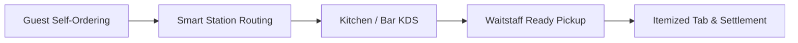
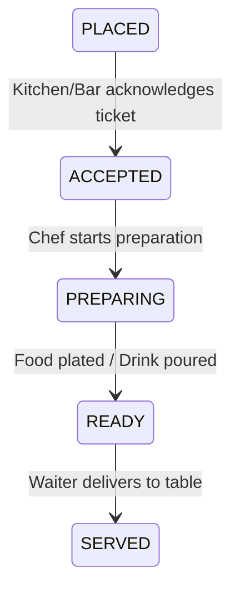
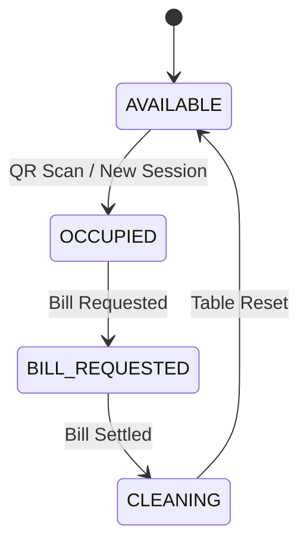

# TableFlow Ordering — Complete End-to-End User Manual

---

## 1. System Overview

### 1.1 Platform Mission & Objective
**TableFlow Ordering (Pegs N Bottles)** is an enterprise-grade, omnichannel food and beverage digital ordering and venue operations platform. Designed for high-energy restaurants, bars, gastro-pubs, and dining lounges, TableFlow eliminates wait times, optimizes kitchen throughput, streamlines floor staff workflows, and delivers a frictionless self-ordering experience for guests.

### 1.2 Core Operational Pillars


- **Contactless Table Intake:** Guests scan scannable table QR codes (`/t/:token`) to instantly launch an active dining session.
- **Station-Specific KOT Routing:** Food tickets are automatically routed to the **Kitchen KDS** (`/kds/kitchen`), while alcoholic and non-alcoholic drinks route to the **Bar KDS** (`/kds/bar`).
- **Real-Time Waiter Assistance:** One-tap service requests for water, cutlery, napkins, cleanup, or urgent assistance with floor staff acknowledgment.
- **Live Tab & Precision Billing:** Dynamic calculation of Eat/Drink subtotals, 5% GST, 5% Service Charge, and mathematical cash/UPI rounding.
- **Multi-Role Operations Suite:** Dedicated portals for Guests, Waitstaff, Kitchen Chefs, Bartenders, and Back-Office Venue Managers.

---

## 2. Prerequisites & System Requirements

### 2.1 Supported Devices & Viewports
| Device Type | Viewport / Resolution | Primary Portal |
| :--- | :--- | :--- |
| **Mobile Smartphones** | 360 × 640 to 430 × 932 (iOS Safari / Android Chrome) | Customer Guest Self-Ordering Portal (`/customer/*`) |
| **Handheld POS Terminals & Tablets** | 768 × 1024 to 1280 × 800 (Landscape & Portrait) | Waitstaff Service Center (`/staff/*`) |
| **Kitchen & Bar Display Screens** | 1920 × 1080 (1080p Touch / Bump Bar Screens) | Kitchen KDS (`/kds/kitchen`) & Bar KDS (`/kds/bar`) |
| **Desktop Workstations** | 1920 × 1080 or higher (Chrome, Edge, Firefox, Safari) | Back-Office Admin Management (`/admin/*`) |

### 2.2 Browser & Network Requirements
- **Web Browsers:** Google Chrome v110+, Safari v16+, Firefox v115+, Microsoft Edge v110+.
- **Network:** Standard broadband or venue Wi-Fi connected to the Vite / Nitro web server (Default Port: `8080` or `5173`).
- **Storage:** Browser `localStorage` enabled for local state persistence (`pnb.*` keys).

---

## 3. User Roles & Permission Matrix

| Feature / Module | Guest / Customer | Waiter / Floor Staff | Kitchen Chef | Bartender | Venue Admin / Manager |
| :--- | :---: | :---: | :---: | :---: | :---: |
| **QR Scan & Table Entry** | ✅ Full Access | ✅ Access | ❌ | ❌ | ✅ Access |
| **Browse Menu & Customizer** | ✅ Full Access | ✅ Access | ❌ | ❌ | ✅ Access |
| **Add to Cart & Place KOT** | ✅ Full Access | ✅ Access | ❌ | ❌ | ❌ |
| **Call Waiter (Water/Cutlery)** | ✅ Full Access | ❌ | ❌ | ❌ | ❌ |
| **Request Itemized Bill** | ✅ Full Access | ✅ Access | ❌ | ❌ | ✅ Access |
| **Table Status Floor Plan** | ❌ Restricted | ✅ Full Access | ❌ | ❌ | ✅ Full Access |
| **Acknowledge / Resolve Requests**| ❌ Restricted | ✅ Full Access | ❌ | ❌ | ✅ Full Access |
| **Collect & Settle Bill (Cash/UPI)**| ❌ Restricted | ✅ Full Access | ❌ | ❌ | ✅ Full Access |
| **Kitchen KDS Queue & Bump** | ❌ Restricted | ❌ | ✅ Full Access | ❌ | ✅ View Only |
| **Bar KDS Queue & Bump** | ❌ Restricted | ❌ | ❌ | ✅ Full Access | ✅ View Only |
| **Menu Item CRUD & Availability**| ❌ Restricted | ❌ | ❌ | ❌ | ✅ Full Access |
| **Table Layout & QR Generator** | ❌ Restricted | ❌ | ❌ | ❌ | ✅ Full Access |
| **Promotions & Campaign Banners**| ❌ Restricted | ❌ | ❌ | ❌ | ✅ Full Access |
| **Tax & Service Charge Settings**| ❌ Restricted | ❌ | ❌ | ❌ | ✅ Full Access |
| **Sales Reports & Velocity** | ❌ Restricted | ❌ | ❌ | ❌ | ✅ Full Access |

---

## 4. Demo Hub & System Initialization (`/demo`)

### 4.1 Purpose
The **Demo Hub** (`http://localhost:8080/demo`) provides a centralized launcher for testing and role-switching across all system portals without needing physical QR stickers.

```
+-------------------------------------------------------------+
|                      PEGS N BOTTLES                         |
|                         DEMO HUB                            |
+-------------------------------------------------------------+
| [Customer: Scan QR]            [Customer: Skip to Home]     |
| [Waiter / Staff App]           [Kitchen Display (KDS)]      |
| [Bar Display (KDS)]            [Admin Dashboard]            |
|                                                             |
| [ (Re)Seed Demo Scenario ]     [ Clear All Local Storage ]  |
+-------------------------------------------------------------+
```

### 4.2 Step-by-Step Instructions:
1. Navigate to `http://localhost:8080/demo` in your browser.
2. Click **(Re)Seed demo scenario** to load default tables (C1–C8), Table C5 active session (`PNB-SESSION-001`), sample menu items, and seeded orders.
3. Click any role card to instantly switch views.
4. Use **Clear all local data** to wipe `localStorage` and reset the venue back to a clean slate.

---

## 5. Guest QR Onboarding & Table Joining (`/t/:token`)

### 5.1 Flow Description
When a guest scans the QR code physically affixed to their dining table (e.g. Table C5 with token `PNB-C5-DEMO`), the system executes dynamic token resolution.

### 5.2 Step-by-Step Guest Walkthrough:
1. Open camera on mobile device and scan the table QR code.
2. The browser navigates to `http://localhost:8080/t/PNB-C5-DEMO`.
3. The application validates the token against the active table directory:
   - If an active session exists on Table C5, the guest is automatically connected and redirected to `/customer/home`.
   - If no active session exists, a new session is created with default status `ORDERING`, marking Table C5 as `OCCUPIED`.
4. The top navigation bar confirms: **"Table C5 • Pegs N Bottles Indiranagar"**.

---

## 6. Customer Portal Layout & Navigation

### 6.1 Screen Structure
The customer portal is optimized for mobile touch interaction:
- **Top Sticky Header:** Venue Brand logo, Table Number badge, Call Waiter bell trigger, and active Search button.
- **Main Scrollable Content:** Menu catalogs, customizer sheets, order trackers, and bill tabs.
- **Bottom Navigation Bar:**
  - 🍽️ **Eat:** Food catalog (Bar Snacks, Burgers, Mains, Sides, Desserts).
  - 🍸 **Drink:** Beverage catalog (Cocktails, Beers, Spirits, Mocktails).
  - 🛍️ **Merch:** Venue take-home items.
  - 🛒 **Cart:** Live table cart with item count badge.
  - 🧾 **Bill:** Live itemized tab and payment request.

---

## 7. Eat (Food) Catalog (`/customer/eat`)

### 7.1 Features & Controls
- **Category Filter Tabs:** Horizontally scrollable category pills (*Bar Snacks, Burgers & Sandwiches, Mains, Accompaniments, Desserts*).
- **Dietary Filter Badges:** One-tap toggles for **Veg Only**, **Non-Veg**, and **Egg**.
- **Item Cards:** Display item photo, title, dietary indicator badge (`VegBadge`), description, preparation time (e.g., `12 mins`), base price, and an **Add +** button.
- **Popular / Featured Tags:** Highlights chef recommendations and signature items.

### 7.2 Adding an Item:
1. Tap on any food item card or tap the **Add +** button.
2. If the item has variants or modifiers, the **Product Customizer Sheet** opens automatically (see Section 11).
3. If the item has no modifiers, it is immediately added to the table cart with a confirmation toast.

---

## 8. Drink Catalog & Entitlements (`/customer/drink`)

### 8.1 Features & Controls
- **Categories:** Beer, Whisky, Cocktails, Mocktails, Wine, Soft Drinks & Mineral Water.
- **Drink Customization:** Allows specifying ice preference (*With Ice / No Ice*) and pour sizes (*Single / Double / 30ml / 60ml / Pitcher*).
- **Preparation Routing:** All drink orders are tagged with `station: "BAR"` and routed exclusively to the **Bar KDS**.

---

## 9. Venue Merchandise (`/customer/merchandise`)

### 9.1 Features & Controls
- Offers venue-branded lifestyle apparel, barware, craft bottle openers, and collectible merchandise.
- Tagged with `sectionSlug: "merchandise"` and `station: "CASHIER"` for separate subtotal calculation on the final bill.

---

## 10. Instant Menu Search (`/customer/search`)

### 10.1 Features & Controls
- Real-time debounced search bar querying item names, descriptions, tags, and categories.
- Instant dietary quick-filters (*Veg, Non-Veg, Vegan*).
- Shows live item availability indicators.

---

## 11. Product Customization Sheet (`ProductCustomizer`)

### 11.1 Features & Controls
When customizing complex items (e.g. *Chicken Wings* or *Burgers*):

```
+-------------------------------------------------------------+
| [Veg/Non-Veg]  Chicken Wings                                |
| Slow-cooked wings in smoky BBQ glaze                        |
+-------------------------------------------------------------+
| CHOOSE A SIZE:                                              |
| (•) Half                              ₹220                  |
| ( ) Full                            + ₹170                  |
+-------------------------------------------------------------+
| SPICE LEVEL:                                                |
| ( ) Mild    (•) Medium    ( ) Hot                           |
+-------------------------------------------------------------+
| SPECIAL COOKING INSTRUCTIONS:                               |
| [ Extra crispy, sauce on the side...                      ] |
+-------------------------------------------------------------+
| Quantity: [-]  2  [+]                    Total: ₹440        |
| [ ADD 2 TO CART — ₹440 ]                                    |
+-------------------------------------------------------------+
```

1. **Size / Variant Selection:** Choose portion sizes (e.g. *Half* vs *Full*). Price deltas are calculated in real-time.
2. **Modifier Groups:** Single-select or multi-select modifier options (e.g. *Spice Level, Extra Cheese, Ice Option*).
3. **Special Instructions:** Text field for chef/bartender notes.
4. **Quantity Stepper:** Increment or decrement item count before adding.
5. Tap **Add to Cart** to update the store.

---

## 12. Live Table Cart (`/customer/cart`)

### 12.1 Features & Controls
- **Itemized Cart List:** Displays item names, selected variants, modifier tags, cooking instructions, unit prices, and line totals.
- **Quantity Adjusters:** Inline `+` and `-` buttons to modify quantities or remove items.
- **Subtotal Breakdown:** Live calculation of cart items before taxes.
- **"Add More Items" Button:** Returns guest directly to the menu catalog.
- **"Place Order" Button:** Submits the order to the kitchen and bar.

---

## 13. Order Placement & KOT Dispatch

### 13.1 Step-by-Step Procedure:
1. Open `/customer/cart`.
2. Review all selected items and special instructions.
3. Tap **Place Order (₹XXX)**.
4. The system executes `store.placeOrder()`:
   - Increments table order counter (e.g. `Order #03`).
   - Assigns unique item IDs and status `PLACED`.
   - Routes kitchen items to `/kds/kitchen` and drink items to `/kds/bar`.
   - Clears the table cart.
   - Triggers Sonner toast alert: **"Order #03 placed successfully!"**.
5. Automatically redirects the guest to the **Live Orders Tracking Screen** (`/customer/orders`).

---

## 14. Live Order Status Tracking (`/customer/orders`)

### 14.1 Status Lifecycle
Guests can watch their orders progress through 4 distinct visual stages:



### 14.2 Screen Elements:
- **Order Header:** Displays Order Number (`#01`, `#02`, `#03`) and timestamp.
- **Progress Bar:** Real-time visual progress fill with estimated remaining preparation time.
- **Item Level Status:** Badges indicate `Preparing`, `Ready`, or `Served`.

---

## 15. One-Click Reorder System (`/customer/repeat`)

### 15.1 Features:
- Displays history of all previously ordered items for the current session.
- **"Order Again" Button:** One-tap re-addition of identical items, sizes, and modifier combinations directly to the active cart without re-browsing menus.

---

## 16. "Call Waiter" Service Request System

### 16.1 Available Request Types:
Guests can tap the **Bell Icon** on any screen to open the service sheet:
- 💧 **Water:** Refill drinking water.
- 🍴 **Cutlery:** Extra forks, spoons, or steak knives.
- 🧻 **Napkins:** Tissue refills.
- 🧹 **Clean Up:** Table wiping or spill cleaning.
- 🙋 **Order Assistance:** Request waiter to take a manual order.
- 💵 **Bill Assistance:** Inquire about discounts or split payments.
- 💬 **Other:** Custom free-text note for the floor team.

### 16.2 Dispatch & Resolution:
- Tapping **Submit Request** dispatches a `ServiceRequest` object to `/staff/requests`.
- Floor staff tablets play an alert sound and display the table number.
- Once staff arrives, they tap **Acknowledge** and **Resolve** on their terminal.

---

## 17. Live Table Tab & Bill Engine (`/customer/bill`)

### 17.1 Real-Time Bill Computation Formula

$$\text{Subtotal} = \text{Food Subtotal} + \text{Drink Subtotal} + \text{Merchandise Subtotal}$$
$$\text{Service Charge (5\%)} = \text{round}\left(\frac{\text{Subtotal} \times 5}{100}\right)$$
$$\text{Taxable Base} = \text{Subtotal} + \text{Service Charge}$$
$$\text{GST (5\%)} = \text{round}\left(\frac{\text{Taxable Base} \times 5}{100}\right)$$
$$\text{Grand Total} = \text{round}(\text{Taxable Base} + \text{GST} + \text{Surcharge})$$
$$\text{Rounding} = \text{Grand Total} - (\text{Taxable Base} + \text{GST} + \text{Surcharge})$$

### 17.2 Screen Layout:
- **Itemized Summary:** Every ordered item across all session tickets with line totals.
- **Taxes & Charges Breakdown:** Explicit line items for Food, Drinks, 5% Service Charge, 5% GST, and mathematical cash rounding.
- **"Request Bill" Button:** Tapping this alerts the cashier and transitions table status to `BILL_REQUESTED`.

---

## 18. Bill Settlement & Payment Collection

### 18.1 Procedure for Waitstaff / Cashier:
1. Floor waiter navigates to `/staff/bills` or opens the active table on `/staff/tables/$tableId`.
2. Inspects final calculated grand total.
3. Selects payment method:
   - 💵 **Cash**
   - 💳 **Credit / Debit Card**
   - 📱 **UPI / QR Digital Payment**
4. Taps **Settle Bill (₹XXXX)**.
5. The system marks the bill `PAID`, archives the session to `CLOSED`, and sets table status to `CLEANING`.

---

## 19. Waitstaff & Floor Staff Station (`/staff`)

```
+-------------------------------------------------------------+
|  TABLES FLOOR PLAN (8 Tables)          [Filter: All / Occupied]
+-------------------------------------------------------------+
| [ Table C1 ]  | [ Table C2 ]  | [ Table C3 ]  | [ Table C4 ]|
| AVAILABLE     | OCCUPIED      | BILL REQUESTED| CLEANING    |
| Cap: 4        | Cap: 4 (2 ord)| Cap: 2        | Cap: 6      |
+---------------+---------------+---------------+-------------+
| [ Table C5 ]  | [ Table C6 ]  | [ Table C7 ]  | [ Table C8 ]|
| OCCUPIED      | AVAILABLE     | RESERVED      | AVAILABLE   |
| Cap: 4 (Tab)  | Cap: 4        | Cap: 8        | Cap: 2      |
+-------------------------------------------------------------+
```

### 19.1 Key Sub-Modules:
1. **Floor Plan Grid (`/staff/tables`):** Visual color-coded table cards indicating capacity, current session status, order counts, and active timers.
2. **Table Detail Inspector (`/staff/tables/$tableId`):** Deep inspect active guest sessions, placed orders, guest PIN, and live subtotals.
3. **Service Requests Queue (`/staff/requests`):** Triage incoming guest calls (*Water, Cutlery, Clean Up*). Tap **Acknowledge** ➔ **Mark Done**.
4. **Ready for Pickup Alerts (`/staff/ready`):** Shows plated food and poured drinks ready to be dispatched from Kitchen/Bar counters to specific tables.

---

## 20. Kitchen Display System — Food Station (`/kds/kitchen`)

### 20.1 Screen Layout & Bump Bar
- **Station Filter:** Only displays items where `station === "KITCHEN"`.
- **Ticket Cards:** Displays Table #, Order #, Elapsed Timer (with color warning thresholds for tickets > 15 mins), and item list with size/modifiers.
- **Action Buttons:**
  - **Start Preparing:** Transitions status from `PLACED` ➔ `PREPARING`.
  - **Mark Ready:** Transitions status from `PREPARING` ➔ `READY` and immediately alerts waitstaff.
  - **Strike-Through:** Chefs can tap individual items to mark them done line-by-line.

---

## 21. Bar Display System — Drink Station (`/kds/bar`)

### 21.1 Features:
- **Station Filter:** Exclusively filters beverage items (`station === "BAR"`).
- **Speed-Pour Display:** Groups cocktail and spirit tickets with ice specifications (*With Ice / No Ice*) and pour sizes.
- **Bump Bar:** Rapid one-tap completion of high-volume drink orders.

---

## 22. Admin Menu Catalog & Live Availability (`/admin/menu`)

### 22.1 Features:
- **Menu Directory:** Full list of food, drink, and merchandise items with pricing, category tags, and preparation times.
- **Live 86 / Availability Toggle:** Single-click switch to immediately mark items as **In Stock** or **Sold Out** across all customer mobile menus without restarting the server.
- **Modifier & Variant Inspector:** Review attached modifier groups (Spice Levels, Ice Options, Sizes).

---

## 23. Admin Table Layout & QR Generator (`/admin/tables`)

### 23.1 Features:
- **Table Registry:** View all floor tables, tokens, capacity, and current assignment status.
- **Dynamic QR Code Generator:** Generates high-resolution scannable QR matrices on-screen with print shortcuts for tabletop standee deployment.

---

## 24. Admin Promotions & Banner Marketing (`/admin/promotions`)

### 24.1 Features:
- Configure promotional banners displayed on `/customer/home`.
- Customize titles, subtitles, call-to-action buttons (e.g. *"Order Craft Pitchers"*), and luxury accent color palettes (*Amber, Bottle Green, Copper*).

---

## 25. Admin Billing & Tax Configuration (`/admin/billing`)

### 25.1 Configurable Settings:
- **GST Rate:** Toggle enable/disable, set percentage (Default: `5%`).
- **Service Charge:** Toggle enable/disable, set percentage (Default: `5%`).
- **Weekend / Event Surcharge:** Set optional percentage with custom receipt label.
- **Cash Rounding:** Toggle mathematical rounding to nearest whole rupee.

---

## 26. Admin Revenue, Velocity & Analytics Reports (`/admin/reports`)

### 26.1 Analytics Visualizations:
- **Gross Revenue Breakdown:** Split by Food (Eat), Drinks, and Merchandise.
- **Item Velocity Charts:** Top 10 selling food dishes and cocktails by volume and revenue.
- **Average Order Value (AOV):** Dynamic calculation of spend-per-table and dining session durations.

---

## 27. Troubleshooting, State Lifecycles & FAQ

### 27.1 State Machine Reference



### 27.2 Frequently Asked Questions (FAQ)

**Q1: How do multiple guests at the same table order together?**
> **A:** All guests scanning Table C5's QR code (`/t/PNB-C5-DEMO`) or entering Table C5's PIN (`2019`) join the same shared `DiningSession`. Any guest can add items, and all placed orders merge into a single itemized table tab.

**Q2: What happens if a customer accidentally orders the wrong item?**
> **A:** Before clicking "Place Order", items can be edited or deleted in `/customer/cart`. Once placed, waitstaff or kitchen staff can cancel or modify the order ticket via `/staff/tables/$tableId`.

**Q3: Can an item be disabled if ingredients run out during service?**
> **A:** Yes. The venue manager opens `/admin/menu` and toggles the availability switch off. The item is immediately marked "Sold Out" on all guest mobile devices.

**Q4: How do I test the entire system on a single computer?**
> **A:** Open `http://localhost:8080/demo` in one browser tab, and open separate tabs for `/kds/kitchen`, `/kds/bar`, and `/staff/tables`. Actions taken in the customer portal will update all other screens in real time.
