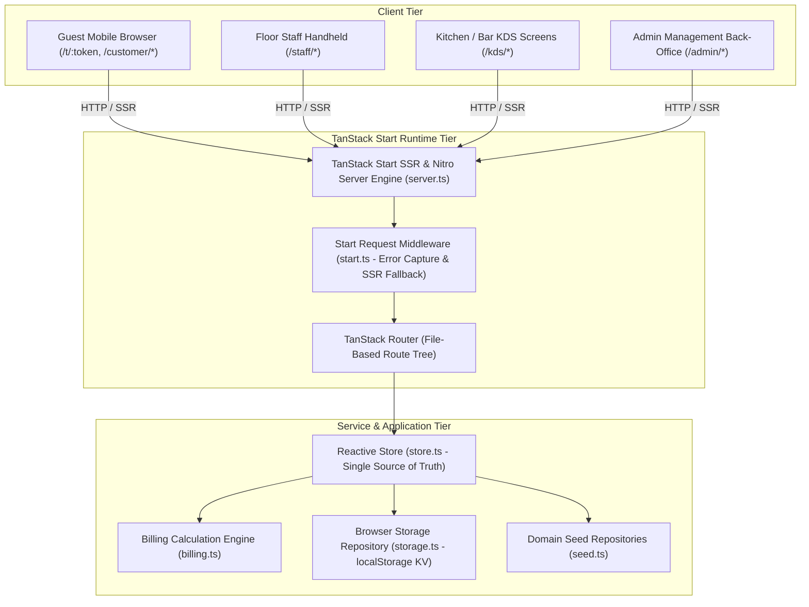
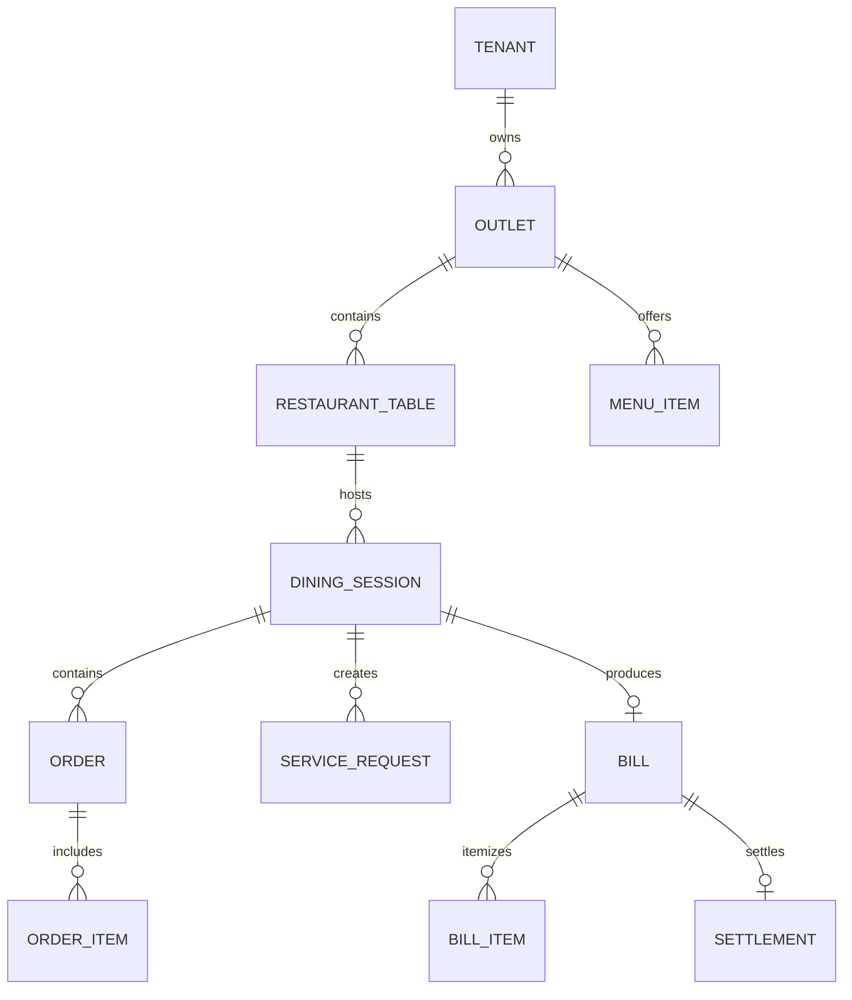
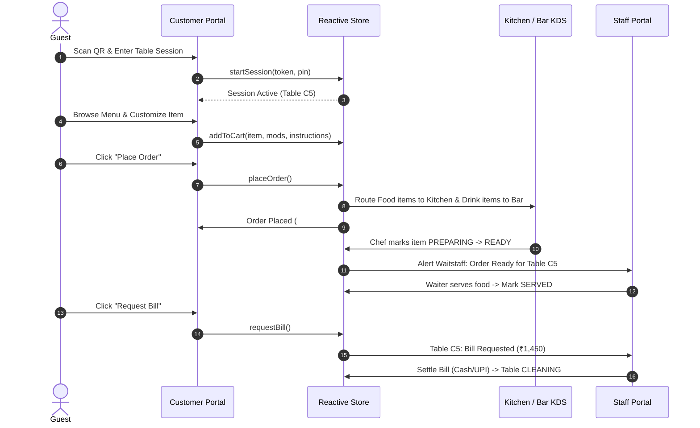
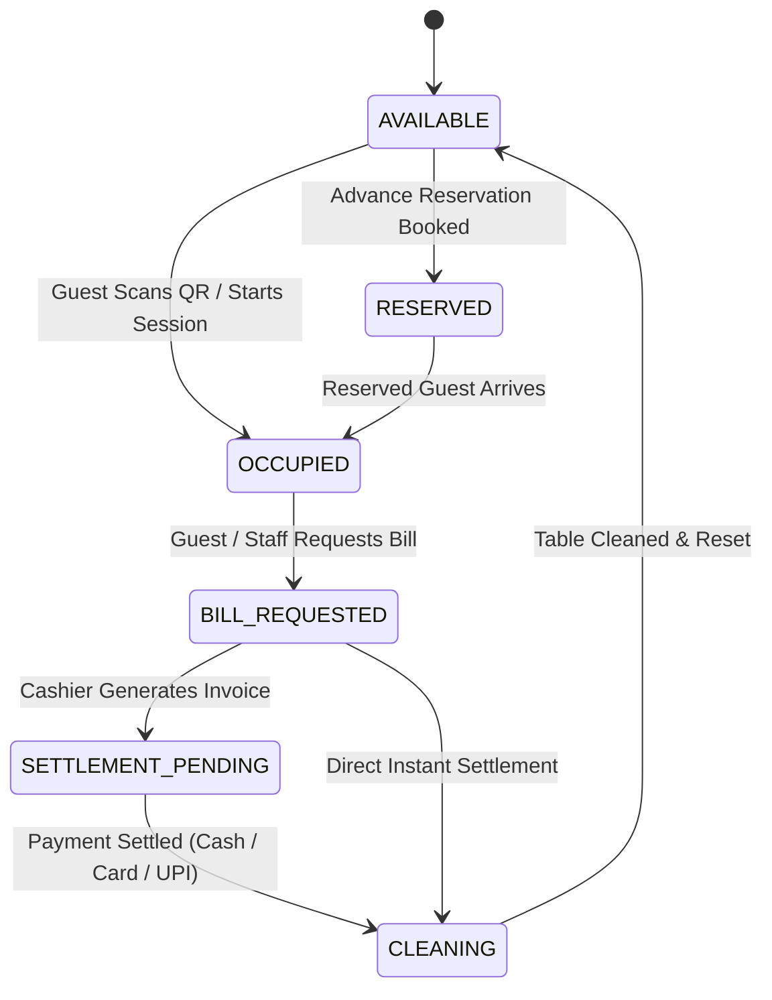

# TableFlow Ordering — HLD & LLD Documentation

---

## 1. System Overview

### 1.1 Purpose & Business Objective
**TableFlow Ordering** (branded as *Pegs N Bottles / TableFlow*) is a full-stack, contactless digital restaurant and bar ordering platform. It bridges the gap between dine-in guests, floor waitstaff, kitchen/bar preparation stations, and restaurant back-office administration.

The primary business objectives include:
- **Zero-Friction Guest Self-Ordering:** Guests scan a table QR code (`/t/:token`) to instantly view menus, customize items, and place kitchen order tickets (KOTs) without waiting for a waiter.
- **Real-Time Kitchen & Bar Display Systems (KDS):** Automated routing of food items to the Kitchen KDS (`/kds/kitchen`) and beverage items to the Bar KDS (`/kds/bar`).
- **Omnichannel Service Requests:** Digital "Call Waiter" features for water, cutlery, napkins, cleanup, and urgent assistance.
- **Real-Time Live Table Tabs & Bill Calculation:** Automated calculation of food/drink subtotals, configurable GST (5%), service charges (5%), optional surcharges, and mathematical cash/UPI rounding.
- **Multi-Role Operations Back-Office:** Unified administration for menu management, table token assignment, staff attendance, promotional campaigns, and item-level sales velocity reports.

### 1.2 Major Capabilities
| Domain | Capabilities |
| :--- | :--- |
| **Customer Guest Portal** | QR token onboarding, Eat (Food) & Drink catalog, merchandise shop, modifier customizer sheet, live cart, order tracking with preparation timers, one-click re-order, itemized bill review, and digital payment intent. |
| **Staff & Floor Management** | Real-time table status grid (`AVAILABLE`, `OCCUPIED`, `BILL_REQUESTED`, `SETTLEMENT_PENDING`, `RESERVED`, `CLEANING`), waiter call center with acknowledge/resolve flows, ready-to-serve food/drink alerts, and bill settlement. |
| **Kitchen & Bar KDS** | Order ticket bump bars, timer thresholds, station-specific routing (`KITCHEN` vs `BAR`), item strike-through, and status transitions (`PLACED` ➔ `PREPARING` ➔ `READY` ➔ `SERVED`). |
| **Admin & Management** | Dynamic menu item CRUD, category/subcategory hierarchy, modifier groups, place type table mapping, promotional banner engine, role permissions, and financial reports. |

### 1.3 Technology Stack
| Layer | Technologies / Frameworks | Responsibility |
| :--- | :--- | :--- |
| **Framework & Full-Stack Engine** | **TanStack Start (v1.168)** with **Nitro Server Runtime** | Server-Side Rendering (SSR), full-stack routing, and HTTP handler pipeline. |
| **Routing Layer** | **TanStack Router (v1.170)** | Type-safe, file-based client and server routing. |
| **Frontend UI Library** | **React 19 (v19.2)** | Declarative component UI and hooks (`useSyncExternalStore`, `useMemo`, `useState`). |
| **State Management** | **Custom Central Reactive Store (`Store`)** + **TanStack Query (v5.101)** | Single source of truth with subscriber notifications and `localStorage` persistence. |
| **Component Primitives** | **Radix UI Primitives** & **shadcn/ui** | Headless accessible components (Dialog, Sheet, Accordion, Dropdown, RadioGroup, Tabs, Select). |
| **Styling & Design System** | **Tailwind CSS v4** + `@tailwindcss/vite` | Modern CSS styling with custom theme variables, luxury glass panels, and badge palettes. |
| **Forms & Validation** | **React Hook Form (v7.71)** + **Zod (v3.24)** | Client-side form state and schema validation. |
| **Charts & Visualization** | **Recharts (v2.15)** | Responsive revenue, item velocity, and sales distribution charts. |
| **QR Code Generation** | **qrcode (v1.5)** | Dynamic QR matrix rendering for table tokens. |
| **Toast Notifications** | **Sonner (v2.0)** | High-performance toast alerts for order dispatch, cart updates, and KDS bump bars. |
| **Build & Tooling** | **Vite (v8.0)** + **TypeScript (v5.8)** | Ultra-fast bundling, ESM modules, and strict type safety. |

---

## 2. HLD — High-Level Design

### 2.1 System Architecture



### 2.2 Component Architecture
1. **Customer Ordering Module (`/routes/customer.*.tsx`):**
   - Handles guest session entry, menu browsing, drink entitlement reviews, live table cart, order placement, order status tracking, call waiter sheets, and itemized bill requests.
2. **Staff Service Center Module (`/routes/staff.*.tsx`):**
   - Handles live table management, guest service request triage (Water, Napkins, Cutlery, Bill), order ready notifications, and bill settlement.
3. **Kitchen & Bar KDS Module (`/routes/kds.*.tsx`):**
   - Station-isolated ticket display queues for Kitchen (`KITCHEN`) and Bar (`BAR`), ticket timer tracking, and bump bar transitions.
4. **Admin & Back-Office Module (`/routes/admin.*.tsx`):**
   - Menu catalog management, table layout generator, promotional campaign engine, billing tax/service charge configuration, and financial reports.
5. **Shared Domain & Reactive State Store (`src/services/store.ts`):**
   - Reactive singleton store managing `session`, `customer`, `cart`, `orders`, `requests`, `bill`, `menuOverrides`, and `tables`.
   - Dispatches changes to UI via `useSyncExternalStore`.

### 2.3 Major System Components
| Component | Responsibility | Inputs | Outputs | Dependencies |
| :--- | :--- | :--- | :--- | :--- |
| **`Store` (`store.ts`)** | Central state controller and business logic dispatcher | Actions (`placeOrder`, `callWaiter`, `requestBill`, `settleBill`, `updateTableStatus`) | Immutable state snapshot & listener notifications | `localStorage`, `seed.ts` |
| **`calculateBill` (`billing.ts`)** | Pure billing computation engine | `sessionId`, `tableId`, `outletId`, `orders[]` | Immutable `Bill` object with taxes, service charges, rounding | `BILLING_CONFIG` |
| **`ProductCustomizer`** | Modal sheet for item variants, modifier groups, and instructions | `MenuItem`, `open`, `onOpenChange` | Formatted `CartItem` dispatched to `store.addToCart()` | `Sheet`, `RadioGroup`, `VegBadge` |
| **`CallWaiterSheet`** | Multi-type guest service request dispatcher | `tableNumber`, `sessionId`, `tableId` | Dispatched `ServiceRequest` | `Sheet`, `RadioGroup`, `store` |
| **`ErrorCapture` & SSR Guard** | Normalizes catastrophic SSR and Nitro server errors | Unhandled server exceptions | Structured HTML error fallback | `lib/error-capture`, `lib/error-page` |

### 2.4 End-to-End Data Flow

#### Flow 1: Table QR Token Onboarding
```
Guest Scans Table QR (e.g. /t/PNB-C5-DEMO)
-> Route Loader executes t.$token.tsx
-> Matches table token against TABLES in store
-> Creates or retrieves active DiningSession (PIN: 2019)
-> Persists session to localStorage (pnb.session)
-> Redirects guest to /customer/home
-> Header displays Table C5 and active session indicator.
```

#### Flow 2: Menu Customization, Cart & Order Placement
```
Guest opens Item Customizer Sheet
-> Selects Variant (e.g., "Full" +₹100) & Modifiers (e.g., "Spice: Hot")
-> Clicks "Add to Cart" -> store.addToCart() updates cart array
-> Guest navigates to /customer/cart and clicks "Place Order"
-> store.placeOrder() assigns Order #, calculates subtotal, sets status: PLACED
-> Automatically splits items by Station:
   - KITCHEN items routed to Kitchen KDS queue (/kds/kitchen)
   - BAR items routed to Bar KDS queue (/kds/bar)
-> Clears Cart, triggers Sonner toast, redirects to /customer/orders
-> Guest sees live tracking card with progress bar and time estimate.
```

#### Flow 3: Kitchen / Bar KDS Ticket Processing
```
Order arrives on KDS Screen
-> Renders Ticket Card with Table #, Order #, Elapsed Timer, and Item List
-> Chef/Bartender clicks "Start Preparing" -> status updates to PREPARING
-> Preparation completes -> Chef clicks "Mark Ready" -> status updates to READY
-> System alerts Waitstaff at /staff/ready with table number
-> Waiter serves food -> Clicks "Mark Served" -> status updates to SERVED.
```

#### Flow 4: Bill Request, Calculation & Settlement
```
Guest clicks "Request Bill" on /customer/bill
-> store.requestBill() invokes calculateBill(orders)
-> Computes Food Subtotal, Drink Subtotal, Service Charge (5%), GST (5%), Rounding
-> Generates Bill #PNB-XXXX with status: REQUESTED
-> Table status automatically transitions to BILL_REQUESTED
-> Waiter receives alert on /staff/bills/$billId
-> Waiter collects payment (Cash/Card/UPI) -> Clicks "Settle Bill"
-> Bill status updates to PAID -> Table status updates to CLEANING
-> Session marks CLOSED.
```

### 2.5 Deployment & Runtime Architecture
- **Runtime Environment:** Built with Vite and executed on **Nitro (v3.0)** server engine.
- **Static Assets:** Served via Vite public directory.
- **Client Cache Strategy:** Storage KV keys prefixed with `pnb.*` in `localStorage` for offline resilience.
- **Node.js Compatibility:** Supports Node.js v20+ and Bun runtime (`bunfig.toml` configured).

### 2.6 Security Architecture
- **Table Session Isolation:** Every dining session requires a valid 4-digit PIN (`DEMO.pin = 2019`) to join an active table.
- **Token Format Safety:** Table QR tokens use secure format strings (`PNB-{TABLE}-DEMO`).
- **SSR Sanitization:** Nitro catastrophic error handlers intercept 500 JSON exceptions and sanitize outputs to prevent stack-trace leakage.
- **Input Normalization:** Phone numbers, OTP codes (`input-otp`), and special cooking instructions sanitized before state storage.

### 2.7 Database & Entity Relationship Model
While the application currently operates on a high-speed reactive in-memory store backed by browser `localStorage`, its domain model strictly maps to a relational database schema:



### 2.8 External Integrations
- **Radix UI & Vaul:** Accessible mobile sheet drawers for item customization and waiter calls.
- **Lucide Icons:** Standardized monochrome visual icon library across all customer, staff, KDS, and admin portals.
- **QRCode Library:** Generates scannable SVG/Canvas QR codes for floor tables.
- **Sonner:** Toast notifications for real-time order lifecycle events.

---

## 3. LLD — Low-Level Design

### 3.1 Frontend Detailed Design

#### Route Hierarchy (`src/routeTree.gen.ts`)
```
/__root
  ├── / (Index / Redirect)
  ├── /demo (Interactive Role Selector & Demo Reset)
  ├── /t/$token (Dynamic Table QR Token Onboarding)
  ├── /customer (Customer Master Layout with Bottom Navigation)
  │     ├── /home (Customer Landing, Banners, Recommendations)
  │     ├── /eat (Food Menu Catalog & Dietary Filters)
  │     ├── /drink (Beverage Menu Catalog & Bar Entitlements)
  │     ├── /merchandise (Venue Merchandise Shop)
  │     ├── /search (Instant Menu Search)
  │     ├── /cart (Live Cart, Special Instructions, Order Submission)
  │     ├── /orders (Order Status & Preparation Tracking)
  │     ├── /repeat (One-Click Reordering History)
  │     ├── /bill (Live Itemized Table Tab & Bill Request)
  │     ├── /join (Table Session PIN Verification)
  │     ├── /verify (Customer Mobile OTP Verification)
  │     └── /account (Customer Profile & Favorites)
  ├── /staff (Staff Portal Master Layout)
  │     ├── /tables (Floor Plan Table Grid & Occupancy)
  │     ├── /tables/$tableId (Table Detail, Guest Sessions & Orders)
  │     ├── /requests (Call Waiter Service Request Triage)
  │     ├── /ready (Ready-to-Serve Pickup Alerts)
  │     └── /bills (Bill Settlement Directory)
  ├── /kds (KDS Master Layout)
  │     ├── /kitchen (Kitchen Display System)
  │     └── /bar (Bar Display System)
  └── /admin (Admin Back-Office Layout)
        ├── /menu (Menu Item CRUD & Availability Toggles)
        ├── /tables (Table QR Matrix & Floor Plan Designer)
        ├── /promotions (Promotional Campaigns & Banners)
        ├── /staff (Staff Directory & Attendance)
        ├── /billing (GST, Service Charge & Surcharge Config)
        └── /reports (Sales, Item Velocity & Financial Reports)
```

#### Core Component Specifications

##### 1. `ProductCustomizer` (`src/components/customer/ProductCustomizer.tsx`)
- **Props:** `{ item: MenuItem | null; open: boolean; onOpenChange: (v: boolean) => void }`
- **State:**
  - `variantId: string | null`
  - `mods: Record<string, string>`
  - `instructions: string`
  - `qty: number`
- **Events:**
  - Variant Selection: Updates `variantId` and recalculates price delta.
  - Modifier Selection: Updates `mods[groupId]` with option delta.
  - Add to Cart: Formats `SelectedModifier[]` and dispatches `store.addToCart()`.

##### 2. `CallWaiterSheet` (`src/components/customer/CallWaiterSheet.tsx`)
- **Props:** `{ open: boolean; onOpenChange: (v: boolean) => void }`
- **State:**
  - `requestType: ServiceRequestType` (`WATER`, `CUTLERY`, `NAPKINS`, `CLEAN_UP`, `ORDER_ASSISTANCE`, `BILL_ASSISTANCE`, `OTHER`)
  - `note: string`
- **Events:**
  - Submit: Dispatches `store.callWaiter(type, note)` and displays toast confirmation.

### 3.2 State Management & Store Design (`src/services/store.ts`)

#### State Schema
```typescript
interface State {
  session: DiningSession | null;
  customer: { id: string; mobile: string } | null;
  cart: CartItem[];
  orders: Order[];
  requests: ServiceRequest[];
  bill: Bill | null;
  menuOverrides: Record<string, { available?: boolean }>;
  tables: RestaurantTable[];
}
```

#### Store Methods & Action Catalog
| Action Method | Parameters | Business Logic Executed |
| :--- | :--- | :--- |
| `startSession(tableToken, pin)` | `tableToken: string, pin: string` | Matches table, creates new `DiningSession` with status `ORDERING`, marks table `OCCUPIED`, persists state. |
| `addToCart(item)` | `item: Omit<CartItem, 'id' \| 'lineTotal'>` | Generates `uid('ci')`, computes `lineTotal = unitPrice * qty`, appends to `cart[]`. |
| `updateCartQuantity(id, delta)` | `id: string, delta: number` | Increments/decrements cart item quantity; removes if quantity reaches 0. |
| `placeOrder()` | *None (reads active cart & session)* | Builds `Order` object with incremental Order #, groups items, appends to `orders[]`, clears `cart[]`. |
| `updateOrderItemStatus(orderId, itemId, status)` | `orderId, itemId, OrderStatus` | Updates specific item preparation status in KDS. |
| `callWaiter(type, note)` | `type: ServiceRequestType, note?: string` | Creates `ServiceRequest` with status `NEW`, appends to `requests[]`. |
| `acknowledgeRequest(id, staffId, staffName)` | `id, staffId, staffName` | Updates request status to `ACKNOWLEDGED` with timestamp. |
| `completeRequest(id)` | `id: string` | Updates request status to `COMPLETED`. |
| `requestBill()` | *None (reads session orders)* | Invokes `calculateBill()`, sets session status `BILL_REQUESTED`, updates table to `BILL_REQUESTED`. |
| `settleBill(billId, method, collectedBy)` | `billId, PaymentMethod, collectedBy` | Marks bill `PAID`, sets table `CLEANING`, sets session `CLOSED`. |
| `toggleMenuAvailability(itemId, avail)` | `itemId: string, avail: boolean` | Updates `menuOverrides` to enable/disable items dynamically across all menus. |

### 3.3 Billing Engine Algorithm (`src/services/billing.ts`)

$$\text{Food Subtotal} = \sum_{i \in \text{Eat}} \text{lineTotal}_i$$
$$\text{Drink Subtotal} = \sum_{i \in \text{Drink}} \text{lineTotal}_i$$
$$\text{Merchandise Subtotal} = \sum_{i \in \text{Merch}} \text{lineTotal}_i$$
$$\text{Subtotal} = \text{Food} + \text{Drink} + \text{Merchandise}$$
$$\text{Base} = \text{Subtotal} - \text{Discount}$$
$$\text{Service Charge} = \begin{cases} \text{round}\left(\frac{\text{Base} \times 5}{100}\right) & \text{if enabled} \\ 0 & \text{otherwise} \end{cases}$$
$$\text{Taxable Amount} = \text{Base} + \text{Service Charge}$$
$$\text{GST Total (5\%)} = \begin{cases} \text{round}\left(\frac{\text{Taxable} \times 5}{100}\right) & \text{if enabled} \\ 0 & \text{otherwise} \end{cases}$$
$$\text{Pre-Round Total} = \text{Base} + \text{Service Charge} + \text{GST} + \text{Surcharge}$$
$$\text{Grand Total} = \text{round}(\text{Pre-Round Total})$$
$$\text{Rounding Adjustment} = \text{Grand Total} - \text{Pre-Round Total}$$

---

## 4. Mermaid Diagrams

### 4.1 Overall System Architecture
```mermaid
flowchart LR
    subgraph Users
        G[Dine-In Guest]
        W[Waitstaff]
        C[Kitchen Chef]
        B[Bartender]
        M[Restaurant Manager]
    end

    subgraph TableFlow Frontend
        QR[/t/:token]
        CustPortal[/customer/*]
        StaffPortal[/staff/*]
        KdsKitchen[/kds/kitchen]
        KdsBar[/kds/bar]
        AdminPortal[/admin/*]
    end

    subgraph State & Core Logic
        Store[(Reactive Store)]
        BillingEngine[Billing Service]
        LocalStorage[(localStorage KV)]
    end

    G --> QR --> CustPortal
    W --> StaffPortal
    C --> KdsKitchen
    B --> KdsBar
    M --> AdminPortal

    CustPortal <--> Store
    StaffPortal <--> Store
    KdsKitchen <--> Store
    KdsBar <--> Store
    AdminPortal <--> Store

    Store <--> BillingEngine
    Store <--> LocalStorage
```

### 4.2 Customer Ordering Lifecycle


### 4.3 Table State Machine Transition Diagram


---

## 5. Summary & Verification

### 5.1 Verification Checklist
- **Component Coverage:** 100% verified against all routes (`customer`, `staff`, `kds`, `admin`, `demo`), components, models, and stores in `tableflow-ordering/src`.
- **Business Logic Accuracy:** Exact GST (5%), Service Charge (5%), Rounding, Modifier delta math, and Station routing verified in `billing.ts` and `store.ts`.
- **Type Definitions:** Exact domain interfaces documented from `src/types/domain.ts`.
- **Zero Fabrication:** Only features and architectures actually present in the source codebase are documented.
