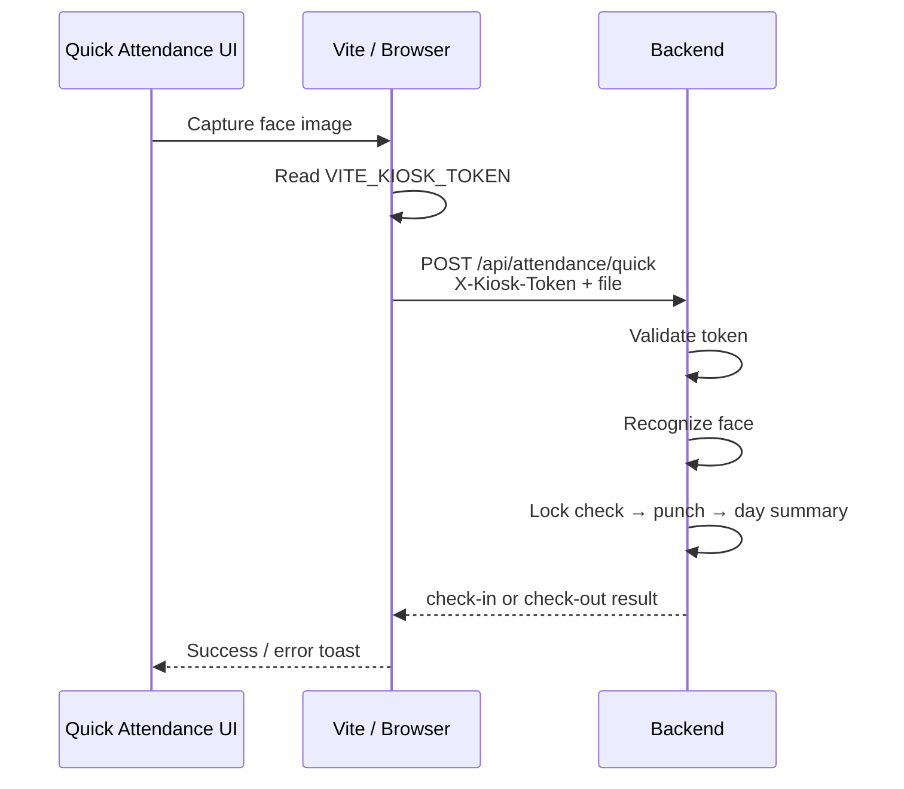

# Present Sir — API Integration Guide

**Audience:** Developers integrating UI, mobile clients, kiosks, or third-party tools with Present Sir  
**Date:** 2026-07-23  
**Source of truth:** Current backend routers + frontend services (`src/services/*`, `src/lib/api.ts`)

Related docs:

- End-user flows: `docs/PRESENT_SIR_USER_MANUAL.md`
- Raw endpoint list: `docs/CURRENT_API_INVENTORY.md`
- Deploy / env: `docs/DEPLOYMENT.md`

---

## Table of Contents

1. [Base URL & environments](#1-base-url--environments)
2. [Required configuration](#2-required-configuration)
3. [Authentication](#3-authentication)
4. [HTTP conventions](#4-http-conventions)
5. [UI → API map](#5-ui--api-map)
6. [Feature integration guides](#6-feature-integration-guides)
7. [Quick Attendance / Kiosk (detailed)](#7-quick-attendance--kiosk-detailed)
8. [Multipart & media](#8-multipart--media)
9. [Common status codes](#9-common-status-codes)
10. [Backend-only / unused-by-UI endpoints](#10-backend-only--unused-by-ui-endpoints)
11. [Integration checklist](#11-integration-checklist)

---

## 1. Base URL & environments

| Environment | Frontend | Backend API | Notes |
|---|---|---|---|
| Local Vite | `http://localhost:8080` | Proxied `/api` → `http://127.0.0.1:8001` | Set `VITE_API_URL=` (empty) |
| LAN / server | `http://192.168.1.150:8080` | Same proxy pattern | `VITE_PROXY_TARGET=http://127.0.0.1:8001` on host |
| Public HTTPS | `https://facemark.app.cloudshiftsolutions.in` | Same-origin `/api` via tunnel | Do **not** point browser at `http://192.168.1.150:8001` (mixed content) |

### Frontend API client

File: `src/lib/api.ts`

```text
API base = VITE_API_URL || ""
Request  = fetch(`${API_BASE}${path}`)
```

- With empty `VITE_API_URL`, the browser calls `/api/...` on the frontend origin.
- Vite (or reverse proxy) forwards `/api` and `/static` to the backend.

### Health check

```http
GET /api/health
```

No auth. Example: `{"status":"ok","storage":"minio","bucket":"presentsir"}`

Interactive docs (when backend is reachable): `http://127.0.0.1:8001/docs`

---

## 2. Required configuration

### 2.1 Backend — `backend/.env`

| Variable | Required | Purpose | Used by |
|---|---|---|---|
| `DATABASE_URL` | **Yes** | PostgreSQL connection | All APIs |
| `SECRET_KEY` | **Yes** | JWT signing | Login / auth |
| `ENVIRONMENT` | Recommended | `development` \| `production` | Weak-secret guard in production |
| `CORS_ORIGINS` | **Yes** (browser) | Allowed frontend origins (comma-separated) | Browser apps |
| `APP_TIMEZONE` | Recommended | Business calendar (default `Asia/Kolkata`) | Today / day status / leave dates |
| `KIOSK_API_TOKEN` | **Yes for kiosk** | Shared secret for Quick Attendance | `POST /api/attendance/quick` |
| `ALLOW_PUBLIC_EMPLOYEE_REGISTRATION` | Recommended | Default `false` | `POST /api/auth/register` |
| `STORAGE_BACKEND` | **Yes** for photos | e.g. `minio` | Uploads, face, attendance images |
| `MINIO_ENDPOINT` | If MinIO | Object storage endpoint | Storage |
| `MINIO_PUBLIC_URL` | If MinIO | Public/presigned base | Media URLs |
| `MINIO_ACCESS_KEY` / `MINIO_SECRET_KEY` | If MinIO | Credentials | Storage |
| `MINIO_BUCKET` | If MinIO | Bucket name | Storage |
| `FACE_MATCH_THRESHOLD` | Optional | Face match score (default `0.85`) | Face / kiosk |
| `FACE_MATCH_MARGIN` | Optional | Match margin (default `0.08`) | Face |
| `MIN_FACE_SAMPLES` / `MAX_FACE_SAMPLES` | Optional | Enrollment bounds (3 / 8) | Face enrollment |
| `ACCESS_TOKEN_EXPIRE_MINUTES` | Optional | JWT lifetime (default 1440) | Auth |
| `PF_PERCENTAGE` / `PT_AMOUNT` / etc. | Optional | Payroll defaults | Payroll calc |

Production **rejects** a weak/default `SECRET_KEY` when `ENVIRONMENT=production`.

### 2.2 Frontend — `.env.local` (repo root)

| Variable | Required | Purpose | Used by |
|---|---|---|---|
| `VITE_API_URL` | Usually empty | Absolute API base; leave blank for same-origin + proxy | `src/lib/api.ts` |
| `VITE_PROXY_TARGET` | Local/dev | Backend URL for Vite proxy (default `http://127.0.0.1:8001`) | `vite.config.ts` |
| `VITE_KIOSK_TOKEN` | **Yes for kiosk UI** | Must **exactly match** `KIOSK_API_TOKEN` | `quickAttendanceService.ts` → header `X-Kiosk-Token` |
| `VITE_MINIO_PUBLIC_URL` | Optional | Media display helpers | Some media resolution |
| `VITE_MINIO_BUCKET` | Optional | Bucket name for media | Frontend media helpers |

> **Critical:** Vite embeds `VITE_*` at **startup/build**. After changing `.env.local`, restart `npm run dev` or rebuild.

### 2.3 Paired secrets (must match)

| Backend | Frontend | Feature |
|---|---|---|
| `KIOSK_API_TOKEN` | `VITE_KIOSK_TOKEN` | Quick Attendance kiosk |
| — | `VITE_PROXY_TARGET` → backend port | Local/dev proxy |

Example (dev only — use a strong random value in production):

```env
# backend/.env
KIOSK_API_TOKEN=change-me-to-a-long-random-kiosk-token

# .env.local
VITE_KIOSK_TOKEN=change-me-to-a-long-random-kiosk-token
```

### 2.4 Browser tokens (runtime, not env)

| Storage key | Set after | Sent as |
|---|---|---|
| `localStorage.attendanceToken` | Employee login | `Authorization: Bearer …` |
| `localStorage.adminToken` | Admin login | `Authorization: Bearer …` |

Managed by `setUserToken` / `setAdminToken` in `src/lib/api.ts`.

---

## 3. Authentication

### Modes

| Mode | How | Frontend `apiRequest` auth arg |
|---|---|---|
| None | No Authorization header | `"none"` |
| Employee | Bearer employee JWT | `"user"` |
| Admin | Bearer admin JWT | `"admin"` |
| Kiosk | Header `X-Kiosk-Token` (no JWT) | `"none"` + custom header |

### Login endpoints

| Role | Method | Path | Body | Response |
|---|---|---|---|---|
| Employee | POST | `/api/auth/login` | `{ "email", "password" }` | `{ "access_token", "token_type" }` |
| Admin | POST | `/api/auth/admin/login` | `{ "email", "password" }` | `{ "access_token", "token_type" }` |

Then call:

- Employee: `GET /api/auth/me` with user token  
- Admin: `GET /api/auth/admin/me` with admin token  

### Registration

| Endpoint | Config gate | Normal use |
|---|---|---|
| `POST /api/auth/register` | `ALLOW_PUBLIC_EMPLOYEE_REGISTRATION=true` | **Disabled by default** — Admin creates employees |
| `POST /api/auth/admin/register` | Allowed only when **zero** admins exist | Bootstrap only |

### Role isolation

- Employee JWT cannot call admin-only routes (`403`).
- Employees may only access their own attendance / leave / payslip / user profile (IDOR protected on key routes).

---

## 4. HTTP conventions

### Headers

| Header | When |
|---|---|
| `Authorization: Bearer <token>` | Employee or Admin APIs |
| `Content-Type: application/json` | JSON bodies (omit for `FormData`) |
| `X-Kiosk-Token: <token>` | Quick Attendance only |

### JSON field naming

API responses commonly use **camelCase** aliases (e.g. `userId`, `userName`). Prefer the shapes returned by `/docs` and existing FE services.

### Error body

FastAPI style:

```json
{ "detail": "Human-readable message" }
```

Frontend surfaces `detail` via `ApiError`.

---

## 5. UI → API map

| UI route | Primary APIs | Auth |
|---|---|---|
| `/login` | `POST /api/auth/login`, `GET /api/auth/me` | none → user |
| `/register` | Closed in UI (no register call) | — |
| `/dashboard` | Face status, checkin/checkout, manual `POST /api/attendance`, list by email | user |
| `/face-enrollment` | `POST /api/face/register-multiple/{userId}` | user |
| `/history` | `GET /api/attendance/email/{email}` | user |
| `/profile` | `GET /api/hr/day-status/summary`, leave types/balance/apply | user |
| `/leave` | leaves types / balance / apply / requests | user |
| `/payslips` | `GET /api/payroll/my-payslips` | user |
| `/quick-attendance` | `POST /api/attendance/quick` | **kiosk token** |
| `/admin/login` | `POST /api/auth/admin/login`, `GET /api/auth/admin/me` | none → admin |
| `/admin/dashboard` | attendance month list, approve/reject PATCH | admin |
| `/admin/users` | employees CRUD, face enroll, document upload | admin |
| `/admin/attendance` | `GET /api/attendance` (+ filters client-side) | admin |
| `/admin/timesheet` | `GET /api/hr/day-status/timesheet` | admin |
| `/admin/roster` | `/api/rosters/*` | admin |
| `/admin/leaves` | leave requests, approve, carry-forward, day-status regenerate | admin |
| `/admin/hr-policies` | holidays, week-off policies, leave types | admin |
| `/admin/payroll` | payroll dashboard + run lifecycle + exports | admin |
| `/admin/overtime` | `/api/overtime` list/sync/review | admin |
| `/admin/settings` | departments, employment types, document types, attendance policies | admin |

---

## 6. Feature integration guides

### 6.1 Employee login + session

```http
POST /api/auth/login
Content-Type: application/json

{ "email": "employee@company.com", "password": "********" }
```

```http
GET /api/auth/me
Authorization: Bearer <access_token>
```

**UI:** `/login` → stores `attendanceToken` → `/dashboard`

**Config:** `SECRET_KEY`, `CORS_ORIGINS`, DB

---

### 6.2 Admin login + session

```http
POST /api/auth/admin/login
Content-Type: application/json

{ "email": "admin@company.com", "password": "********" }
```

```http
GET /api/auth/admin/me
Authorization: Bearer <access_token>
```

**UI:** `/admin/login` → `adminToken` → `/admin/dashboard`

---

### 6.3 Create employee (Admin)

```http
POST /api/users/employees
Authorization: Bearer <adminToken>
Content-Type: application/json
```

Body includes account, HRMS, bank, payroll fields (see Admin employee dialog / OpenAPI).

**UI:** `/admin/users` → **Add New Employee**

**Follow-up APIs:** face enroll, document upload, salary already in create payload when provided.

---

### 6.4 Face enrollment

```http
POST /api/face/register-multiple/{userId}
Authorization: Bearer <user|admin>
Content-Type: multipart/form-data

files=<image1>
files=<image2>
files=<image3>
```

**UI:** `/face-enrollment` (self) or Employees → **Face** (admin)

**Config:** `MIN_FACE_SAMPLES` (≥3), `MAX_FACE_SAMPLES`, MinIO/storage

**Status check:**

```http
GET /api/face/embedding-status/{userId}
Authorization: Bearer <user|admin>
```

---

### 6.5 Logged-in face check-in / check-out

```http
POST /api/attendance/checkin
Authorization: Bearer <userToken>
Content-Type: multipart/form-data

file=<jpeg>
```

```http
POST /api/attendance/checkout
Authorization: Bearer <userToken>
Content-Type: multipart/form-data

file=<jpeg>
```

**UI:** `/dashboard` → **Face Recognition** (+ location verification on client before submit)

**Config:** face thresholds, storage, `APP_TIMEZONE`  
**Side effects:** payroll lock check → write punch → refresh official day summary

**Locked month:** HTTP `409`

---

### 6.6 Manual attendance

```http
POST /api/attendance
Authorization: Bearer <userToken>
Content-Type: application/json

{
  "type": "check-in",
  "method": "manual",
  "status": "pending",
  "note": "Reason text",
  "imageUrl": "optional-uploaded-url"
}
```

**UI:** `/dashboard` → **Manual Check-in**

**Admin approve/reject:**

```http
PATCH /api/attendance/{recordId}
Authorization: Bearer <adminToken>
Content-Type: application/json

{ "status": "approved" }
```

**UI approve:** `/admin/dashboard` → **Pending Approvals** (not the Attendance browse page)

Pending punches are **not** treated as approved attendance for day summary / payroll until approved.

---

### 6.7 Attendance history

```http
GET /api/attendance/email/{email}
Authorization: Bearer <userToken>
```

Admin org list:

```http
GET /api/attendance
Authorization: Bearer <adminToken>
```

```http
GET /api/attendance/month
Authorization: Bearer <adminToken>
```

**UI:** `/history`, `/admin/attendance`, `/admin/dashboard`

---

### 6.8 Leave (employee)

| Step | Method | Path |
|---|---|---|
| Types | GET | `/api/leaves/types` |
| Balance | GET | `/api/leaves/balance/{userId}` |
| Apply | POST | `/api/leaves/apply` |
| List | GET | `/api/leaves/requests` |

Example apply body (camelCase as used by FE):

```json
{
  "leaveTypeId": "<uuid>",
  "startDate": "2026-07-24",
  "endDate": "2026-07-24",
  "duration": "full_day",
  "reason": "Personal",
  "attachmentUrl": null
}
```

`duration`: `full_day` | `first_half` | `second_half`

**UI:** `/leave`, also simplified form on `/profile`

Optional attachment: upload via `POST /api/upload` then pass URL.

---

### 6.9 Leave (admin)

```http
PUT /api/leaves/{requestId}/approve
Authorization: Bearer <adminToken>
Content-Type: application/json

{ "approved": true }
```

Reject: `{ "approved": false, "rejectionReason": "..." }`

Also:

- `POST /api/leaves/carry-forward?fromYear=&toYear=`
- `POST /api/hr/day-status/regenerate?month=&year=`

**UI:** `/admin/leaves`

Approval on a **locked** payroll month → `409`.

---

### 6.10 Profile monthly hours

```http
GET /api/hr/day-status/summary?month=7&year=2026
Authorization: Bearer <userToken>
```

Returns worked / expected / overtime minutes, week-offs, payable/LOP aggregates, and day rows.

**UI:** `/profile`

Admin may pass `userId` with admin token.

---

### 6.11 Timesheet (admin)

```http
GET /api/hr/day-status/timesheet?month=7&year=2026
Authorization: Bearer <adminToken>
```

**UI:** `/admin/timesheet`  
Same official day data used by payroll.

---

### 6.12 Holidays / week-off policies / leave types (admin)

Base: `/api/hr/...`

| Resource | List | Create | Update | Delete/other |
|---|---|---|---|---|
| Holidays | GET `/hr/holidays` | POST `/hr/holidays` | PATCH `/hr/holidays/{id}` | DELETE `/hr/holidays/{id}` |
| Week-off policies | GET `/hr/weekoff-policies` | POST `/hr/weekoff-policies` | PATCH `.../{id}` | POST `/hr/weekoff-policies/assign` |
| Leave types | GET `/hr/leave-types` | POST `/hr/leave-types` | PATCH `.../{id}` | — |

**UI:** `/admin/hr-policies`

Holiday create example fields: `name`, `holidayDate`, `holidayType`, `isPaid`, `workCompensation` (`normal` \| `ot` \| `1.5x` \| `2x` \| `comp_off`)

Mutations in locked payroll months → `409`. Official day summaries refresh after successful change.

---

### 6.13 Roster (admin)

| Action | Method | Path |
|---|---|---|
| List/create shifts | GET/POST | `/api/rosters/shifts` |
| Load week | GET | `/api/rosters/week?weekStart=&departmentId=` |
| Save cells | PUT | `/api/rosters/week/{rosterId}/assignments` |
| Apply week | POST | `/api/rosters/week/{rosterId}/apply-week` |
| Publish | POST | `/api/rosters/week/{rosterId}/publish` |
| Unpublish | POST | `/api/rosters/week/{rosterId}/unpublish` |
| Copy previous | POST | `/api/rosters/week/copy-previous?weekStart=` |

**UI:** `/admin/roster`

**Rule:** Only **published** roster affects official attendance. Draft saves do not.

---

### 6.14 Settings (admin)

| Area | Base path |
|---|---|
| Departments | `/api/settings/departments` |
| Employment types | `/api/settings/employment-types` |
| Document types | `/api/settings/document-types` |
| Attendance policies | `/api/settings/attendance-policies` (+ PUT by employment type id) |

**UI:** `/admin/settings`

Attendance policy fields include shift start/end, late grace, half-day hours, full-day hours, overtime-after hours.

---

### 6.15 Payroll (admin)

Typical cycle (UI: `/admin/payroll`):

| Step | Method | Path |
|---|---|---|
| Dashboard / ensure month | GET | `/api/payroll/dashboard?month=&year=` |
| Calculate | POST | `/api/payroll/runs/{runId}/calculate` |
| Submit review | POST | `/api/payroll/runs/{runId}/submit-review` |
| Approve | POST | `/api/payroll/runs/{runId}/approve` |
| Mark paid | POST | `/api/payroll/runs/{runId}/mark-paid` |
| Reopen | POST | `/api/payroll/runs/{runId}/reopen` |
| Settings (salary basis) | PUT | `/api/payroll/runs/{runId}/settings` |
| Employee detail | GET | `/api/payroll/records/{recordId}` |
| Recalculate one | POST | `/api/payroll/records/{recordId}/recalculate` |
| Adjustment | POST | `/api/payroll/records/{recordId}/adjustments` |
| Export CSV | GET | `/api/payroll/runs/{runId}/export.csv` |
| Export Excel | GET | `/api/payroll/runs/{runId}/export.xlsx` |

**Config:** DB, salary structures on employees, OT approvals, holidays/week-offs, `APP_TIMEZONE`

After **approve**, attendance-related mutations for that month return **409** until reopen.

---

### 6.16 Employee payslips

```http
GET /api/payroll/my-payslips
Authorization: Bearer <userToken>
```

Optional detail:

```http
GET /api/payroll/slip/{payrollId}
Authorization: Bearer <userToken>
```

**UI:** `/payslips`  
Employees cannot access another employee’s slip (`403`).

---

### 6.17 Overtime approvals (admin)

| Action | Method | Path |
|---|---|---|
| List | GET | `/api/overtime?month=&year=` |
| Sync from day status | POST | `/api/overtime/sync?month=&year=` |
| Review | PUT | `/api/overtime/{id}/review` |

Body example: `{ "approved": true, "approvedMinutes": 90 }`

**UI:** `/admin/overtime`  
Only **approved** OT minutes are paid.

---

### 6.18 File upload

```http
POST /api/upload
Authorization: Bearer <user|admin>
Content-Type: multipart/form-data

file=<file>
folder=attendance-photos
```

Admin documents:

```http
POST /api/upload/admin
Authorization: Bearer <adminToken>
```

Common folders: `user-photos`, `attendance-photos`, `leave-attachments`, `employee-documents`

**Config:** MinIO / storage env vars

---

## 7. Quick Attendance / Kiosk (detailed)

### Purpose

Shared device marks check-in or check-out by face **without employee login**.

**UI:** `/quick-attendance`

### Required config

| Where | Variable | Notes |
|---|---|---|
| Server `backend/.env` | `KIOSK_API_TOKEN` | Non-empty; strong random |
| Frontend `.env.local` | `VITE_KIOSK_TOKEN` | **Identical** string |
| Storage / face | MinIO + face thresholds | Same as face attendance |
| Timezone | `APP_TIMEZONE` | Business “today” |

If `KIOSK_API_TOKEN` is empty → API fail-closed (“kiosk not configured”).  
If `VITE_KIOSK_TOKEN` is empty → UI error: *Set VITE_KIOSK_TOKEN to match the server KIOSK_API_TOKEN.*

### Request

```http
POST /api/attendance/quick
X-Kiosk-Token: <same-as-KIOSK_API_TOKEN>
Content-Type: multipart/form-data

file=<jpeg-capture>
employee_code=<optional-employee-code>
```

| Part | Required | Description |
|---|---|---|
| `file` | Yes | Camera JPEG/PNG |
| `employee_code` | No | When set, face must match that employee |
| `X-Kiosk-Token` | Yes | Shared secret |

**No** `Authorization` bearer token.

### Frontend implementation

`src/services/quickAttendanceService.ts`:

1. Reads `import.meta.env.VITE_KIOSK_TOKEN`
2. Builds `FormData` with `file` (+ optional `employee_code`)
3. Calls `apiRequest(..., "none")` with header `X-Kiosk-Token`

### Success response (shape used by UI)

Includes action (`check-in` / `check-out`), user identity, confidence, message, and attendance record.

### Failure cases

| Condition | Typical result |
|---|---|
| Missing/invalid kiosk token | `401` / `403` |
| Token not configured on server | Error detailing kiosk not configured |
| Face not enrolled / no match | `4xx` with message |
| Already completed today | `400` with checkout hint |
| Payroll month locked | `409` |

### Server setup snippet

```bash
TOKEN="$(openssl rand -hex 32)"
# set KIOSK_API_TOKEN=$TOKEN in backend/.env
# set VITE_KIOSK_TOKEN=$TOKEN in .env.local
# restart backend + frontend (Vite must restart to pick up VITE_*)
```

See also `docs/DEPLOYMENT.md` kiosk section.

### Flow diagram



---

## 8. Multipart & media

| Endpoint | Form fields |
|---|---|
| `/api/attendance/checkin` | `file` |
| `/api/attendance/checkout` | `file` |
| `/api/attendance/quick` | `file`, optional `employee_code` |
| `/api/face/register-multiple/{id}` | `files` (repeat) |
| `/api/face/verify/{id}` | `file` |
| `/api/upload` | `file`, `folder` |
| `/api/upload/admin` | `file`, `folder` |

Media URLs may be absolute (MinIO) or relative; FE uses `resolveMediaUrl()`.

Proxy `/static` to backend for local static serving when used.

---

## 9. Common status codes

| Code | Meaning in Present Sir |
|---|---|
| 200 / 201 | Success |
| 204 | Empty success (rare) |
| 400 | Validation / business rule (e.g. already checked out) |
| 401 | Missing/invalid JWT or kiosk token |
| 403 | Forbidden (wrong role, IDOR, registration disabled) |
| 404 | Not found |
| 409 | **Payroll/attendance period locked** — mutation blocked |
| 422 | Request validation error |
| 500 | Server error |

Integrators should treat **409** as “month locked — reopen payroll or wait”.

---

## 10. Backend-only / unused-by-UI endpoints

These exist on the API but have little or no current UI wiring. Safe for custom clients; not required for stock UI:

| Endpoint | Notes |
|---|---|
| `POST /api/face/recognize` | Auth user; kiosk uses `/attendance/quick` instead |
| `POST /api/face/verify/{userId}` | Service exported; pages unused |
| `POST /api/face/regenerate-ensemble/{userId}` | Admin |
| `GET /api/rosters/my-week` | Employee roster view unused |
| `/api/weekoffs` CRUD | Service exists; Staff UI uses leave apply |
| Legacy payroll `process-monthly` / `report` | Deprecated in FE |
| Legacy `/api/settings/attendance-policy` | Prefer per-employment-type policies |
| `GET /api/dashboard/stats` | Exported; Admin Dashboard uses attendance APIs |

---

## 11. Integration checklist

### Deploy / environment

- [ ] `DATABASE_URL` works; migrations applied
- [ ] Strong `SECRET_KEY`; `ENVIRONMENT=production` only with strong secret
- [ ] `CORS_ORIGINS` includes every browser origin you use
- [ ] `APP_TIMEZONE` set (e.g. `Asia/Kolkata`)
- [ ] MinIO (or storage) credentials valid
- [ ] `ALLOW_PUBLIC_EMPLOYEE_REGISTRATION=false` unless intentionally open
- [ ] `KIOSK_API_TOKEN` set
- [ ] `VITE_KIOSK_TOKEN` **equals** `KIOSK_API_TOKEN`
- [ ] `VITE_API_URL` empty for same-origin proxy; `VITE_PROXY_TARGET` points at backend
- [ ] Frontend restarted/rebuilt after any `VITE_*` change

### Feature smoke (API + UI)

- [ ] Employee login + `/api/auth/me`
- [ ] Admin login + `/api/auth/admin/me`
- [ ] Create employee + face enroll
- [ ] Face check-in/out
- [ ] Manual attendance → admin approve
- [ ] Quick Attendance with valid `X-Kiosk-Token`
- [ ] Quick Attendance rejected with wrong/missing token
- [ ] Leave apply → admin approve
- [ ] Timesheet loads day-status
- [ ] Profile summary matches timesheet hours
- [ ] Payroll calculate → approve → payslip; lock returns `409` on punch

### Custom client tips

1. Prefer OpenAPI at `/docs` for exact schemas.
2. Mirror FE auth modes (`user` / `admin` / kiosk header).
3. Send multipart **without** forcing `Content-Type: application/json`.
4. After attendance/leave/holiday/roster mutations, rely on server day-summary refresh — do not invent a second attendance truth.
5. Never expose `SECRET_KEY` or `KIOSK_API_TOKEN` in client-side source control; only `VITE_KIOSK_TOKEN` is embedded for the kiosk page by design (treat kiosk devices as trusted).

---

## Quick reference — config by feature

| Feature | Backend env | Frontend env | Auth |
|---|---|---|---|
| Employee / Admin login | `SECRET_KEY`, DB, CORS | — | Bearer after login |
| Face enroll / punch | Storage, face thresholds, `APP_TIMEZONE` | — | Bearer |
| **Quick Attendance** | **`KIOSK_API_TOKEN`**, storage, face, TZ | **`VITE_KIOSK_TOKEN`** | **`X-Kiosk-Token`** |
| Leave / holidays / roster | DB, `APP_TIMEZONE` | — | Bearer |
| Timesheet / Profile hours | Day-status engine (server) | — | Bearer |
| Payroll / payslips | DB, salary, OT, policies | — | Bearer |
| Uploads / photos | MinIO vars | optional MinIO public URL | Bearer |
| Public register | `ALLOW_PUBLIC_EMPLOYEE_REGISTRATION` | — | none (usually blocked) |

---

*End of API Integration Guide*
