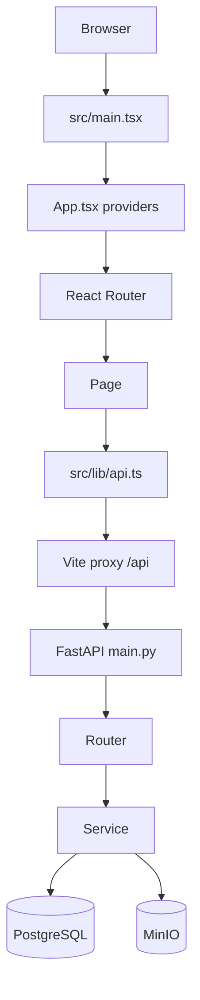
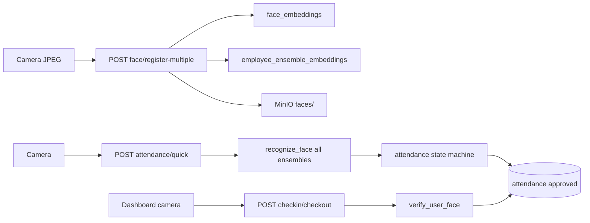
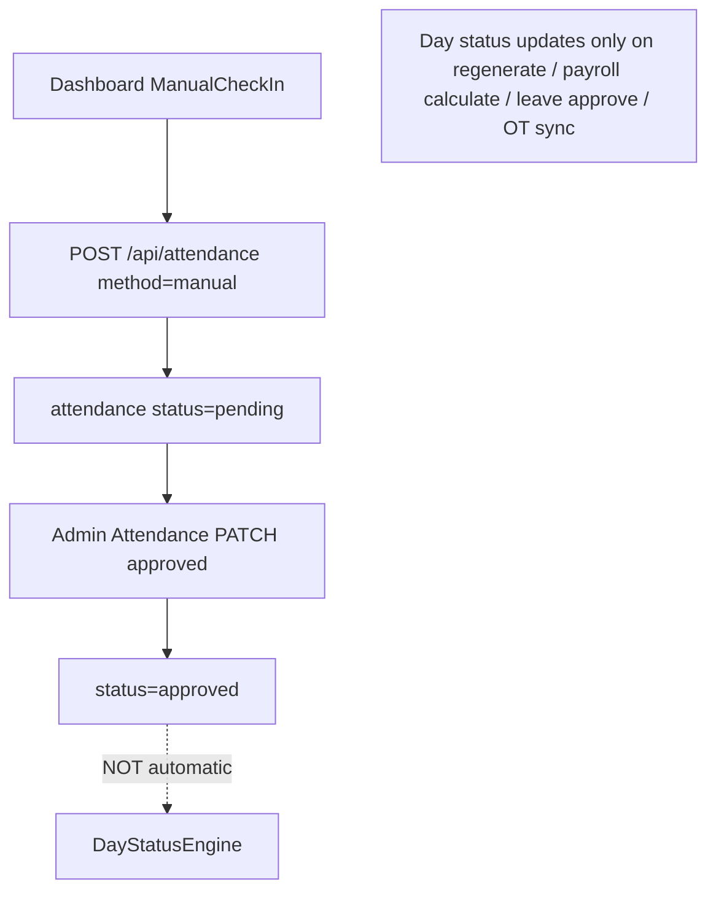
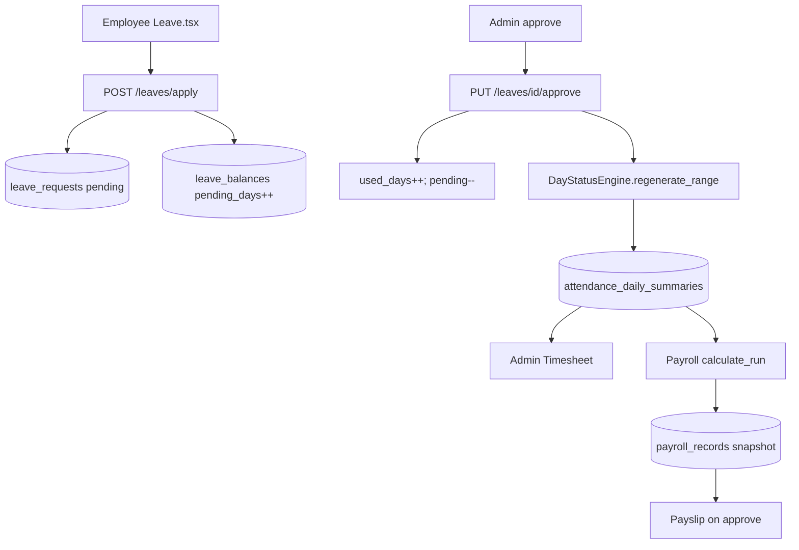
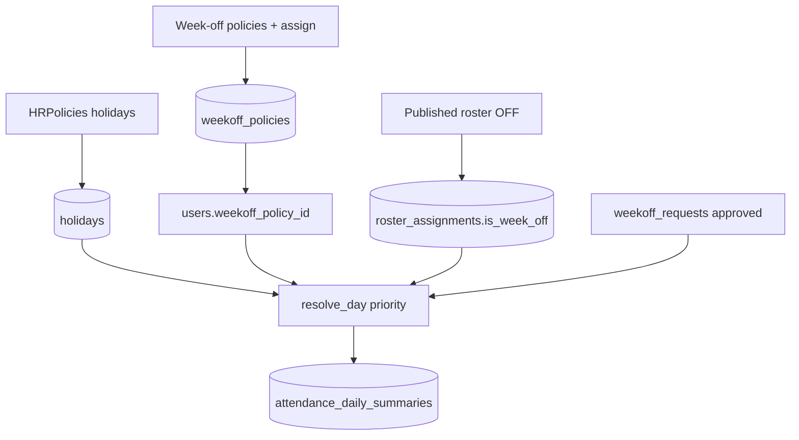
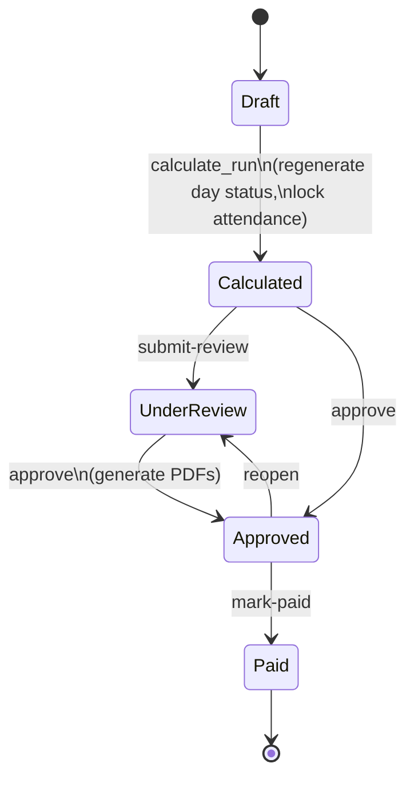
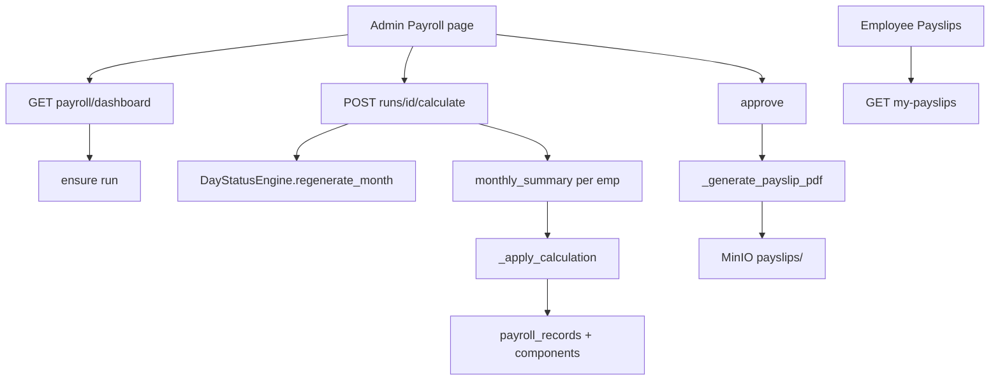
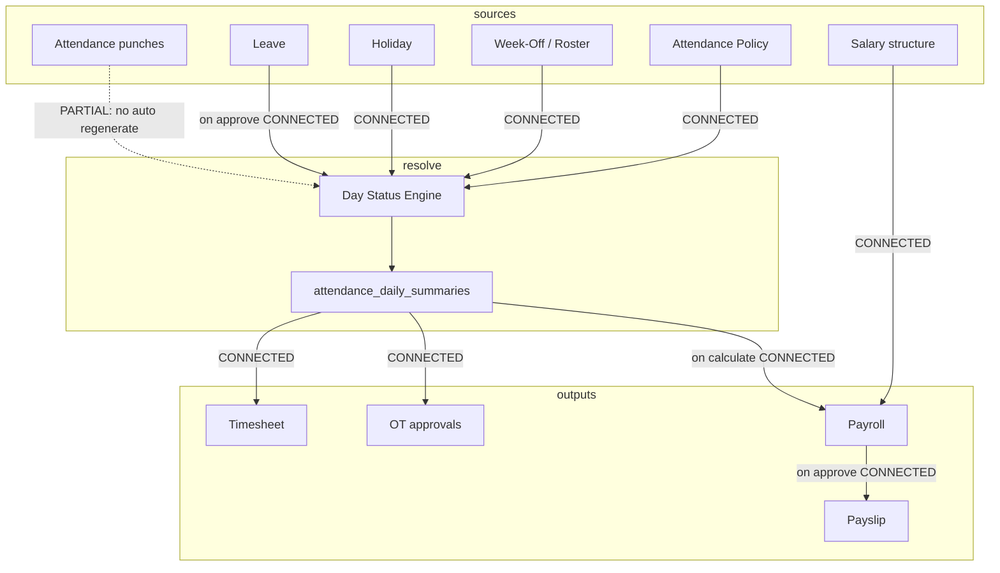
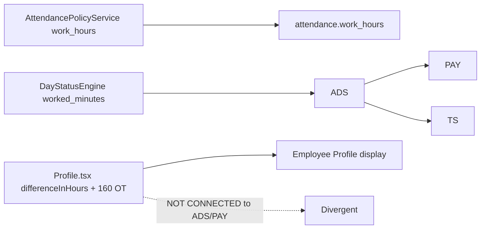

# Present Sir — Current Data Flow

**Audit date:** 2026-07-22  
**Based on actual code paths only**

---

## 1. Application startup



---

## 2. Employee authentication

```mermaid
sequenceDiagram
  participant FE as AuthContext
  participant API as POST /api/auth/login
  participant DB as users
  participant JWT as create_access_token
  FE->>API: email + password
  API->>DB: get_user_by_email
  API->>API: reject if admin; verify bcrypt
  API->>JWT: sub=id, role=user
  JWT-->>FE: access_token
  FE->>FE: localStorage attendanceToken
  FE->>API: GET /api/auth/me Bearer
```

Admin flow identical with `/api/auth/admin/login` and `adminToken`.

---

## 3. Face enrollment → recognition → attendance



---

## 4. Manual attendance → approval



---

## 5. Leave → day status → payroll



---

## 6. Holiday / week-off → day status



---

## 7. Payroll cycle





---

## 8. Cross-module connection matrix



| Arrow | Classification | Why |
|---|---|---|
| Employee → Face → Attendance | CONNECTED | Enroll + checkin/quick |
| Attendance → Day Status | PARTIALLY CONNECTED | No hook on punch; regenerate elsewhere |
| Leave → Day Status | CONNECTED | regenerate_range on approve |
| Holiday/Week-off → Day Status | CONNECTED | resolve_day reads config/roster |
| Day Status → Timesheet | CONNECTED | timesheet API |
| Day Status → Payroll | CONNECTED | calculate regenerates then reads |
| Compensation enum → Premium $ | PARTIALLY CONNECTED | comp_off yes; 1.5x/2x no |
| Salary → Payroll | CONNECTED | structures |
| Payroll → Payslip | CONNECTED | PDF on approve |

---

## 9. Duplicated calculation islands



**Single source of truth intent:** `attendance_daily_summaries` via DayStatusEngine.  
**Reality:** Profile and any raw attendance UIs can diverge until regenerate.
