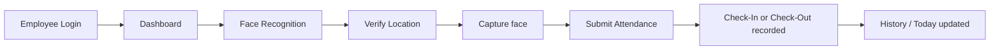
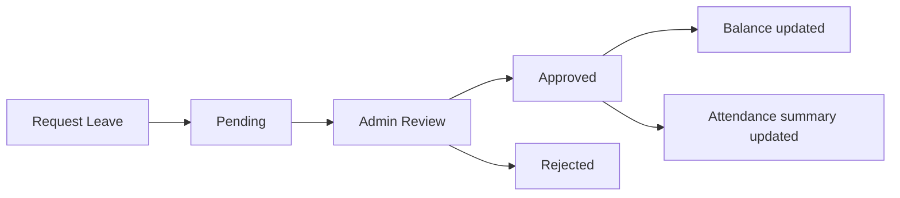
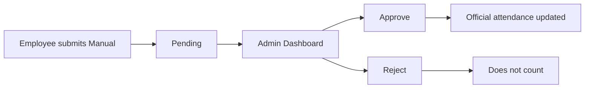
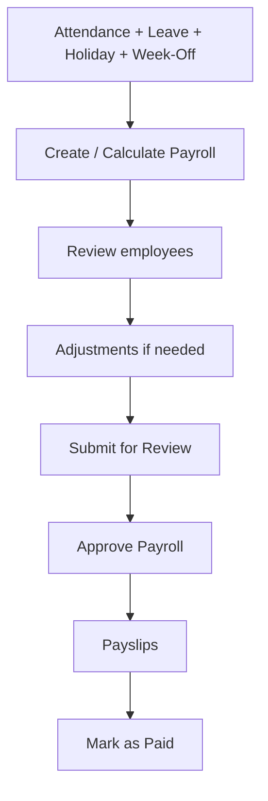

# Present Sir — User Manual

**Product:** Present Sir — employee attendance, face recognition, leave, timesheet, and payroll  
**Audience:** Staff / Employees and Admin / HR / Payroll users  
**Version:** July 2026  
**Based on:** Current Present Sir application screens and flows

Present Sir helps your organization mark attendance (including face recognition), manage leave and weekly schedules, review timesheets, and process monthly payroll.

---

## Table of Contents

- [Part 1 — Staff / Employee Manual](#part-1--staff--employee-manual)
  - [1. Getting Started](#1-getting-started)
  - [2. Employee Dashboard](#2-employee-dashboard)
  - [3. Face Enrollment](#3-face-enrollment)
  - [4. Face Attendance](#4-face-attendance)
  - [5. Manual Attendance](#5-manual-attendance)
  - [6. Today’s Attendance Statuses](#6-todays-attendance-statuses)
  - [7. Attendance History](#7-attendance-history)
  - [8. Profile](#8-profile)
  - [9. Leave](#9-leave)
  - [10. Half-Day Leave](#10-half-day-leave)
  - [11. Week-Off (Employee View)](#11-week-off-employee-view)
  - [12. Monthly Hours](#12-monthly-hours)
  - [13. Employee Payslips](#13-employee-payslips)
- [Part 2 — Admin / HR Manual](#part-2--admin--hr-manual)
  - [14. Admin Login](#14-admin-login)
  - [15. Admin Dashboard](#15-admin-dashboard)
  - [16. Employee Management](#16-employee-management)
  - [17. Create Employee — Step by Step](#17-create-employee--step-by-step)
  - [18. Edit Employee](#18-edit-employee)
  - [19. Admin Face Enrollment](#19-admin-face-enrollment)
  - [20. Admin Attendance](#20-admin-attendance)
  - [21. Manual Attendance Approval](#21-manual-attendance-approval)
  - [22. Holiday Management](#22-holiday-management)
  - [23. Week-Off Management](#23-week-off-management)
  - [24. Roster](#24-roster)
  - [25. Leave Management](#25-leave-management)
  - [26. Leave Types](#26-leave-types)
  - [27. Timesheet](#27-timesheet)
  - [28. Payroll Overview](#28-payroll-overview)
  - [29. Process Monthly Payroll](#29-process-monthly-payroll)
  - [30. Payroll Calculation (Plain Language)](#30-payroll-calculation-plain-language)
  - [31. Payroll Pre-Check](#31-payroll-pre-check)
  - [32. Payroll Adjustments](#32-payroll-adjustments)
  - [33. Payroll Approval](#33-payroll-approval)
  - [34. Payslips (Admin)](#34-payslips-admin)
  - [35. Mark Payroll Paid](#35-mark-payroll-paid)
  - [36. Settings](#36-settings)
  - [37. Attendance Policy](#37-attendance-policy)
  - [38. Departments](#38-departments)
  - [39. Employment Types](#39-employment-types)
  - [40. Document Types & Employee Documents](#40-document-types--employee-documents)
  - [41. Overtime Approvals](#41-overtime-approvals)
- [Part 3 — Quick Attendance / Kiosk](#part-3--quick-attendance--kiosk)
- [Part 4 — Common Questions & Troubleshooting](#part-4--common-questions--troubleshooting)
- [Part 5 — Status & Terminology Reference](#part-5--status--terminology-reference)
- [Role Permission Summary](#role-permission-summary)

---

# Part 1 — Staff / Employee Manual

## 1. Getting Started

### Who can use the Staff portal?

Employees whose accounts were created by your organization (Admin / HR).

> **Important:** Public self-registration is closed. You cannot create your own account from the website. Ask your administrator to create your account, then sign in.

### Employee login

**Page:** `/login`

1. Open Present Sir.
2. Click **Sign In** or **Employee Sign In** (from the home page), or go to the employee login page.
3. Enter your **Email**.
4. Enter your **Password**.
5. Click **Sign In**.
6. Your **Dashboard** opens.

On the login page you will also see:

- **Need an account? Ask your administrator to create one.**
- **Admin Sign In** (for administrators only)

If you try to sign in with an admin account on the employee login page, Present Sir shows that employee sign-in cannot be used for admin users, and may offer **Go to Admin Sign In**.

### If login fails

- Check email spelling and password.
- Confirm your account exists (ask Admin).
- Use **Admin Sign In** only if you are an administrator.

### Log out

1. Click your avatar (top right).
2. Choose **Log out**.

### Home page (before login)

**Page:** `/`

Links include **Quick Attendance** and **Sign In** / **Employee Sign In**.

---

## 2. Employee Dashboard

**Page:** `/dashboard`  
**Menu:** Dashboard

After login you see a welcome message with today’s date.

### Face enrollment banner

If your face is not registered yet, a banner may appear:

> Register your face (3+ samples) to use face attendance.

Click **Enroll Now** to open Face Registration.

### Today’s Attendance

Card: **Today’s Attendance**

- **Check In** — your arrival time (or *Not checked in yet*)
- **Check Out** — your departure time (or *Not checked out yet*)
- Status badges such as **Approved** or **Pending**

### Mark Your Attendance

Depending on your progress today, the card title may be:

- **Mark Your Attendance**
- **Check Out**
- **Attendance Complete**

You can switch modes with **Check In** / **Check Out**.

Two methods:

| Tab | Use when |
|---|---|
| **Face Recognition** | You have enrolled your face |
| **Manual Check-in** | You need Admin review (reason + optional selfie) |

When finished for the day you may see **All Done for Today!**

### Navigation (Staff)

| Menu | Opens |
|---|---|
| **Dashboard** | Today’s attendance |
| **History** | Past attendance records |
| **Leave** | Leave balances and requests |
| **Payslips** | Your salary slips |
| Avatar → **Profile** | Profile and monthly hours |
| Avatar → **Log out** | Sign out |

---

## 3. Face Enrollment

**Page:** `/face-enrollment`  
**How to open:** Dashboard → **Enroll Now**, or open the Face Registration page directly.

### Why enroll?

Face recognition attendance needs your registered face samples. Without enrollment, face check-in/check-out will not work.

### Requirements (as shown in the product)

- Capture **3–6** samples from different angles (minimum **3**).
- You can capture up to **8** samples.
- Progress shows: `{n} / 3 minimum samples`

Suggested angles shown by the app (in order):

1. Front face  
2. Turn slightly right  
3. Turn slightly left  
4. Look up slightly  
5. Look down slightly  
6. Front with smile  

### Step-by-step

1. Open **Face Registration**.
2. Click **Start Camera**. Allow camera access if the browser asks.
3. Position your face clearly in the frame.
4. Click **Capture Sample** for each angle.
5. Repeat until you have at least **3** samples.
6. Click **Complete Face Registration**.
7. Wait for success confirmation.

Use **Stop** to turn the camera off.

### Practical tips

- Face the camera directly for the first sample.
- Use adequate lighting.
- Do not cover your face.
- Keep only one person in the frame.

### Common messages

| Message | Meaning |
|---|---|
| Could not access camera… | Browser/device blocked the camera — allow permission and retry |
| Capture at least 3 face samples | You need more samples before finishing |
| Sample {n} captured | That sample was saved |
| Enrollment failed | Registration did not complete — retry or contact Admin |

---

## 4. Face Attendance

**Page:** `/dashboard` → tab **Face Recognition**

### Overview

### Location permission

Present Sir asks you to **Verify Location** before submitting face attendance. This confirms you are marking attendance from an allowed place (geolocation verification).

1. Click **Verify Location**.
2. Allow location access if asked.
3. Wait until you see **Location verified** (accuracy may be shown in meters).

### Check-In (step-by-step)

1. Open **Dashboard**.
2. Ensure mode is **Check In**.
3. Open tab **Face Recognition**.
4. Click **Verify Location** and complete location verification.
5. Click **Start Camera**.
6. When ready, click **Capture & Verify**.
7. When you see **Face captured!**, click **Submit Attendance**.
8. Success toast such as **Check-in verified**.

### Check-Out (step-by-step)

1. Open **Dashboard** after you have checked in.
2. Switch to **Check Out**.
3. Repeat location verification and face capture.
4. Click **Submit Attendance**.
5. Success toast such as **Check-out verified**.

### Common failures

| Message | What to do |
|---|---|
| Capture your face first | Capture before Submit |
| Complete face registration before using face attendance | Finish Face Registration first |
| Could not access camera… | Allow camera permission |
| Geolocation is not supported… / Location error… | Use a supported browser or fix location permission |
| Face attendance failed | Retry; if persistent, contact Admin |
| Attendance Complete / All Done for Today | You already finished today’s pair |

> **Note:** If the payroll period for that date is locked by Admin, attendance changes may be blocked. Contact Admin if this happens.

---

## 5. Manual Attendance

**Page:** `/dashboard` → tab **Manual Check-in**

Use this when face attendance is not possible. Manual attendance is submitted for Admin review.

### Important

- Manual attendance is typically **Pending** until Admin approves it.
- **Pending** attendance is **not** treated as approved attendance for your official day summary / payroll.
- After Admin **Approve**, it counts. After **Reject**, it does not.

### Step-by-step

1. Open **Dashboard**.
2. Choose **Check In** or **Check Out**.
3. Open **Manual Check-in**.
4. Enter **Reason for manual check-in** (explain why).
5. Optionally **Upload a selfie** (**Click to upload a selfie** / **Change**).
6. Click **Submit**.
7. You should see a success message such as **Check-in recorded successfully** or **Check-out recorded successfully**.

Buttons: **Cancel**, **Submit**.

---

## 6. Today’s Attendance Statuses

On the Dashboard and History, individual punch records commonly show:

| Status | Meaning for you |
|---|---|
| **Approved** | Accepted for attendance |
| **Pending** | Waiting for Admin review (common for manual) |
| **Rejected** | Not accepted |

Your official daily summary (used in Profile hours, Timesheet, and Payroll) may also reflect day outcomes such as present, leave, holiday, week-off, half day, late, and similar. Staff see punch-level statuses most clearly on Dashboard and History; month summaries appear on **Profile**.

---

## 7. Attendance History

**Page:** `/history`  
**Menu:** History (or avatar → **Attendance History**)

### What you can do

1. Open **History**.
2. Filter by month (**Select month**), date (**Pick a date**), **Type**, **Method**.
3. Use search if needed.
4. Click **Clear Filters** to reset.
5. Open a row to see **Attendance Record Details** (type, method, status, location, note, image) → **Close**.

### Columns

| Column | Content |
|---|---|
| **Time** | When the record was made |
| **Type** | Check In / Check Out |
| **Method** | Face / Manual / Geo |
| **Status** | Approved / Pending / Rejected |

Empty state: **No attendance records** / *Your attendance history will appear here*.

---

## 8. Profile

**Page:** `/profile`  
**Menu:** Avatar → **Profile**

### Profile Overview

- **Name**
- **Email**
- **Employee ID** (shown from your account name in the current UI)
- Avatar / photo

### This month (from attendance day status)

| Field | Meaning |
|---|---|
| **Worked hours** | Hours worked this month from official day summaries |
| **Expected hours** | Expected hours from your working policy / day summaries |
| **Week offs** | Week-off days counted this month |
| **Overtime hours** | Overtime from official day summaries |

### Monthly Summary table

Columns: **Month** · **Worked Hours** · **Expected** · **Week Offs** · **Overtime**

These figures come from your organization’s resolved attendance for each month (not a fixed “160 hours” assumption).

### Request Leave (on Profile)

Profile also includes a simple **Request Leave** card:

- **Leave Type**
- **Date**
- **Reason**
- **Submit request**

For full leave options (date range, half-day duration, attachments, balances), use the **Leave** page.

---

## 9. Leave

**Page:** `/leave`  
**Menu:** Leave

Subtitle shown: *Balances and requests. Only approved leave affects attendance & payroll.*

### Overview

### Leave balances

Cards show each leave type with:

- Available / total (for example `12 / 12`)
- **Used**
- Optional **Pending**

### My requests

List of your requests with status badges such as **pending**, **approved**, **rejected**.

Empty: **No leave requests yet**.

### Request Leave (full form)

1. Click **Request Leave**.
2. Choose **Leave type**.
3. Set **From** and **To** dates.
4. Choose **Duration**:
   - **Full day**
   - **First half**
   - **Second half**
5. Enter **Reason**.
6. Attach a file if required (**Attachment (required)** or **Attachment (optional)**).
7. Click **Submit** (or **Cancel**).

If a leave type requires a document after a certain number of days, the form shows:

- *Document required for {n}+ day leave requests.*

Success messages may include the number of days requested. You may also see a note if attendance already exists on some dates in the range.

> **Important:** Leave does **not** affect your official attendance / payroll until it is **Approved**. Pending leave is waiting for Admin.

Holidays or configured week-offs that fall inside a leave period may be excluded from leave day counts according to your organization’s rules.

---

## 10. Half-Day Leave

On **Leave** → **Request Leave** → **Duration**:

| Option | Typical use |
|---|---|
| **Full day** | Entire day |
| **First half** | Morning half |
| **Second half** | Afternoon half |

After approval, half-day leave can combine with half-day presence (for example half present + half paid leave) in your official day summary used by Timesheet and Payroll.

---

## 11. Week-Off (Employee View)

There is **no separate employee “Week-Off request” page** in the current Staff portal.

How week-offs usually appear for you:

- Configured by Admin as a **week-off policy** (for example weekend days), and/or  
- Set on the **published** weekly roster as **OFF**

Your **Profile** monthly summary shows **Week offs** for the month.

To take time off on a working day, use **Leave** (or Profile → **Request Leave**).

---

## 12. Monthly Hours

Seen on **Profile**:

| Label | Source |
|---|---|
| Worked hours | Official attendance day summaries |
| Expected hours | Working policy / day summaries |
| Overtime hours | Official overtime minutes from day summaries |
| Week offs | Official week-off counts |

If numbers look wrong, contact Admin to review attendance, leave, holidays, and week-offs for that month.

---

## 13. Employee Payslips

**Page:** `/payslips`  
**Menu:** Payslips

Subtitle: *Your salary slips after payroll is calculated or approved.*

### What you see

- Month and year
- Status badge
- Net pay
- Gross and Deductions (INR)
- **PDF** link when available, or *PDF after approval*

Empty: **No payslips yet**.

You can view your own slips only. You cannot open another employee’s payslip.

---

# Part 2 — Admin / HR Manual

## 14. Admin Login

**Page:** `/admin/login`

1. Open Admin login.
2. Enter **Email** and **Password**.
3. Click **Admin Sign In**.
4. **Admin Portal** opens on **Dashboard**.

Log out from the sidebar (**Log out**).

> **Bootstrap note:** Creating the very first admin (`/admin/register` → **Create Admin Account**) is for initial setup only when **no admin exists**. After the first admin exists, normal public admin registration is blocked. Do not treat bootstrap as day-to-day Admin work.

---

## 15. Admin Dashboard

**Page:** `/admin/dashboard`  
**Sidebar:** Dashboard

### KPI cards

- **Total Users**
- **Today’s Check-ins**
- **Today’s Check-outs**
- **Pending Approvals**
- **Face Match Accuracy** (Today / This month)

### Pending Approvals

Table of pending attendance with **Approve** and **Reject**.

Columns include **User Name**, **Type**, **Timestamp**, **Method**, **Notes**, **Actions**.

### Recent Attendance

Recent punches with method, image, face accuracy, day status, and approval status.

### Admin sidebar

| Menu | Purpose |
|---|---|
| **Dashboard** | Overview and pending approvals |
| **Employees** | Create / edit employees, face enroll |
| **Payroll** | Monthly payroll cycle |
| **Overtime** | Approve OT for pay |
| **Attendance** | Browse attendance records |
| **Timesheet** | Official day rows for the month |
| **Roster** | Weekly shifts / OFF |
| **Leaves** | Approve / reject leave |
| **HR Policies** | Holidays, week-off policies, leave types |
| **Settings** | Departments, employment types, documents, attendance policies |

---

## 16. Employee Management

**Page:** `/admin/users`  
**Sidebar:** Employees

### List

- Heading: **Employee Management**
- Button: **Add New Employee**
- Card: **All Employees**
- Search: *Search by name, email, code, department…*
- Columns: **Name**, **Email**, **Code**, **Department**, **Joining**, **Payroll** (Configured / Pending), **Status**, **Actions**
- Row actions: **Face**, **Edit**

---

## 17. Create Employee — Step by Step

1. Open **Employees**.
2. Click **Add New Employee**.
3. Complete tabs below.
4. Click **Create Employee**.

Dialog title: **Add New Employee**  
Description: *Complete HRMS profile including payroll, leave setup, and documents.*

### Tabs and fields

#### Account

| Field | Required | Notes |
|---|---|---|
| **Full Name *** | Yes | Employee display name |
| **Email *** | Yes | Login email |
| **Password *** | Yes (create) | Min 6 characters |
| **Phone** | No | Contact number |

#### HRMS

| Field | Notes |
|---|---|
| **Employee Code** | Auto-generated 6-digit code on save (create) |
| **Department** | Select department |
| **Joining Date** | Employment start |
| **Termination Date** | Employment end (if applicable) |
| **Designation** | e.g. Software Engineer |
| **Employment Type** | From Settings list |
| **Status** | Active / Inactive / On Leave |
| **Aadhaar Number** | Optional |
| **PAN Number** | Optional |
| **UAN Number** | Optional |
| **ESI Number** | Optional |

Helper text: leave balances (SL, CL, EL, UL) are auto-created for the current year.

#### Bank

| Field |
|---|
| **Bank Name** |
| **Account Number** |
| **IFSC Code** |

#### Payroll

| Field |
|---|
| **Basic Salary** |
| **HRA** |
| **DA** |
| **Conveyance** |
| **Medical Allowance** |
| **Special Allowance** |
| **Overtime Rate (/hr)** |

Summary shows **Monthly gross**.

#### Docs

Upload / replace documents based on configured document types (required types marked with *).

### After save

- Employee can sign in with email/password.
- Face enrollment may still be required before face attendance.
- Salary structure should be configured for payroll (**Payroll** tab / badge **Configured**).

---

## 18. Edit Employee

1. **Employees** → row **Edit**.
2. Dialog: **Edit Employee**.
3. Update tabs as needed.
4. **Password**: use **New Password** only if changing (leave blank to keep current).
5. Click **Save Changes**.

### Joining / Termination dates

These dates affect whether days before joining or after termination count in attendance and payroll. Prefer accurate dates before processing payroll.

---

## 19. Admin Face Enrollment

1. **Employees** → **Face** on the employee row.
2. Dialog: **Face Enrollment — {name}**.
3. Description: capture 3–6 samples; first sample may be used as profile photo.
4. **Start Camera** → **Capture Sample** (repeat) → **Complete Enrollment**.
5. **Cancel** / **Stop** as needed.

---

## 20. Admin Attendance

**Page:** `/admin/attendance`  
**Sidebar:** Attendance

Browse organization attendance:

- Filters: search, month, date, type, method → **Clear Filters**
- Columns: **Employee**, **Date & Time**, **Type**, **Method**, **Photo**, **Face Accuracy**, **Status**
- Pagination: **Previous** / **Next**

> This page is for **viewing and filtering**. Approving or rejecting pending manual attendance is done on **Admin Dashboard** → **Pending Approvals**.

### Locked payroll periods

Once attendance for a payroll period is locked (after payroll approval / pay), Present Sir prevents changes that would alter that period’s official attendance. Users may see a conflict / locked message. Reopen payroll only if your process allows correction.

---

## 21. Manual Attendance Approval

1. Employee submits **Manual Check-in** / check-out.
2. Admin opens **Dashboard** → **Pending Approvals**.
3. Review employee, type, time, notes.
4. Click **Approve** or **Reject**.
5. Approved records update the employee’s official attendance summary; rejected records stay excluded.

---

## 22. Holiday Management

**Page:** `/admin/hr-policies` → tab **Holidays**  
**Sidebar:** HR Policies

### Add holiday

Card: **Add holiday**

| Field | Options / notes |
|---|---|
| **Name** | Holiday name |
| **Date** | Calendar date |
| **Type** | Public Holiday / Company Holiday / Optional Holiday |
| **If employee works** | Normal pay / OT / 1.5x / 2x / Comp-Off |
| **Paid holiday** | Checkbox |

Click **Add**.

### Compensation (If employee works) — plain language

| Option | Meaning |
|---|---|
| **Normal pay** | No extra cash premium beyond normal day treatment |
| **OT** | Uses overtime handling (approved OT rules) rather than a fixed holiday cash premium |
| **1.5x** | Qualifying worked holiday is compensated at about **1.5×** the applicable daily rate in total (normal day portion + premium) |
| **2x** | Qualifying worked holiday is compensated at about **2×** the applicable daily rate in total |
| **Comp-Off** | Compensatory off credit rather than an extra cash premium |

List shows date, type, Paid/Unpaid, and work compensation. You can remove a holiday with the trash control.

> Changing holidays for a **locked** payroll month is blocked. Fix only writable periods.

---

## 23. Week-Off Management

**Page:** `/admin/hr-policies` → tab **Week-Off**

### Add week-off policy

| Field | Notes |
|---|---|
| **Name** | Policy name |
| **Code** | Short code |
| **Week-off days** | Mon–Sun checkboxes |
| **Paid week-off** | Checkbox |
| **Default policy** | Checkbox |

Click **Create policy**.

### Assign week-off policy

- **Employee**
- **Policy**
- **Assign**

Published weekly roster **OFF** days also affect official attendance (see Roster). Draft roster changes do not.

---

## 24. Roster

**Page:** `/admin/roster`  
**Sidebar:** Roster

Heading: **Weekly Shift Roster**  
Subtitle: *Assign shifts for all employees for each week (Mon–Sun)*

### Controls

- **Shift** — add a shift template (Name, Code, Start, End, Color → **Create**)
- **Copy previous**
- **Save** / **Save (n)**
- **Publish** / **Unpublish**
- Week navigation / **This week**
- Status badge: **draft** or **published**
- Department filter: **All departments**

### Grid

- Per employee / day: **—**, **OFF**, or a shift code
- **Apply week**: Clear / Week off / apply a shift to the week

### Critical rule

| Roster state | Effect on official attendance |
|---|---|
| **draft** | Does **not** change official attendance |
| **published** | **Is** used for week-off / shift resolution |

Publishing or editing a published roster in a locked payroll month may be blocked.

---

## 25. Leave Management

**Page:** `/admin/leaves`  
**Sidebar:** Leaves

Heading: **Leave Approvals**

Filters: **Pending** / **All**

Also available:

- **Carry-forward balances**
- **Rebuild day status** (rebuilds official monthly day summaries)

### Approve / Reject

1. Open a pending request.
2. Review employee, type, dates, reason, conflicts (⚠ attendance already exists…).
3. Click **Approve** or **Reject**.

Approved leave updates balances and official attendance.  
If the leave overlaps a **locked** payroll month, approval may be blocked until that month is reopened (if your process allows).

> Leave cancellation is not provided as a standard Staff/Admin cancel flow in the current UI beyond reject of pending requests.

---

## 26. Leave Types

**Page:** `/admin/hr-policies` → tab **Leave Types**

### Add leave type

| Field | Notes |
|---|---|
| **Name** | Display name |
| **Code** | Short code |
| **Annual days** | Yearly allocation |
| **Paid** | Checkbox |
| **Half day** | Allows half-day requests |

Click **Add type**.

List shows annual days, Paid/Unpaid, Half-day OK / Full-day only, and Comp-Off marker when applicable.

---

## 27. Timesheet

**Page:** `/admin/timesheet`  
**Sidebar:** Timesheet

Heading: **Employee Timesheet**

Timesheet rows are the same official daily attendance information used for payroll.

### Columns

**Employee** · **Date** · **Status** · **Check In** · **Check Out** · **Worked** · **Expected** · **OT** · **Payable** · **LOP**

Legend: **Overtime** · **Under / Incomplete**

Use month/date filters as needed. Empty: *No day-status rows for this month*.

---

## 28. Payroll Overview

**Page:** `/admin/payroll`  
**Sidebar:** Payroll

Subtitle: *Review → Calculate → Approve → Pay. Attendance feeds payroll; approved runs stay locked.*

### Filters

- **Month** / **Year**
- **Salary basis**: Fixed 30 days / Calendar days / Working days / Attendance hours
- **Refresh**

### KPIs

**Employees** · **Gross Payroll** · **Deductions** · **Net Payable** · **Status**

### Run statuses (common)

| Status | Meaning |
|---|---|
| **Draft** | Not fully calculated / starting state |
| **Calculated** | Figures computed; ready for review steps |
| **Under review** | Submitted for review |
| **Approved** | Finalized; attendance for the period is locked |
| **Paid** | Marked as paid in Present Sir |
| **Missing salary** | Employee needs salary structure |
| **Ready** / **Review** | Intermediate employee-row states used in the board |

---

## 29. Process Monthly Payroll

1. Open **Payroll**.
2. Select **Month** and **Year**.
3. Choose **Salary basis**.
4. Review **Payroll Pre-check**.
5. Click **Calculate Payroll**.
6. Review the **Employee Payroll** table (Present, Leave, **LOP**, OT, Gross, Deductions, Net Pay).
7. Open an employee for detail: Attendance Summary, Earnings, Deductions.
8. Add **Edit Adjustment** if needed; **Recalculate** if available.
9. Click **Submit for Review** when calculated.
10. Click **Approve Payroll** after verification.
11. Generate / open **Payslip PDF** as needed.
12. Click **Mark as Paid** when payment is recorded.
13. Optionally export **CSV** / **Excel**.

**Reopen** may be available depending on run status (use carefully — unlocks further changes).

---

## 30. Payroll Calculation (Plain Language)

Present Sir builds pay from:

- Monthly salary package (Basic + allowances configured on the employee)
- Official attendance for the month (present, leave, holidays, week-offs, LOP fractions, hours)
- Approved overtime (from **Overtime** approvals)
- Holiday / week-off work premiums (1.5x / 2x when configured)
- Statutory-style deductions currently implemented (such as **PF**, **PT**, **TDS** where configured)
- Manual **Adjustments**

### LOP (Loss of Pay)

**LOP** reduces pay for non-payable day fractions (for example absences or unpaid leave) according to the selected salary basis.

### Holiday / week-off premiums

When an employee works on a holiday/week-off and compensation is **1.5x** or **2x**, payroll includes the matching premium so total compensation for that day matches the selected multiplier (without “triple paying”).

**Comp-Off** / **Normal pay** do not add that cash premium path.

> Present Sir records payroll and payment status. **Mark as Paid** does **not** by itself transfer money to bank accounts.

---

## 31. Payroll Pre-Check

Card: **Payroll Pre-check**

Use this before **Calculate Payroll** / approval. Resolve issues such as missing salary structures or attendance problems shown in the pre-check / employee statuses (**Missing salary**, etc.).

---

## 32. Payroll Adjustments

From employee payroll detail → **Edit Adjustment** / **Add Adjustment**:

| Field | Options |
|---|---|
| **Type** | Earning / Deduction |
| **Component** | Bonus, Incentive, Reimbursement, Arrear, Fine, Loan Recovery, Advance Recovery, Other |
| **Amount (₹)** | Amount |
| **Reason** | Why |

Buttons: **Cancel**, **Add Adjustment**.

---

## 33. Payroll Approval

Click **Approve Payroll** only after reviewing:

- Attendance / Timesheet
- Leave
- Holidays and week-offs
- OT approvals
- LOP and deductions
- Adjustments

> **Warning:** After approval, the month’s attendance-related history is protected. Later edits to attendance, leave approvals, holidays, week-offs, or published roster for that month may be blocked until the run is reopened (if allowed).

---

## 34. Payslips (Admin)

From Payroll employee detail:

- **Payslip PDF**
- Earnings / Deductions breakdown
- Attendance summary including **LOP**

Employees also see slips under Staff **Payslips**.

---

## 35. Mark Payroll Paid

1. After **Approved**, click **Mark as Paid**.
2. Dialog: **Mark Payroll as Paid**
3. Enter **Payment Date**, **Payment Method** (default text may be Bank Transfer), **Reference / Transaction ID**.
4. Confirm **Mark as Paid**.

This records payment status in Present Sir; it does not automatically push funds to banks.

---

## 36. Settings

**Page:** `/admin/settings`  
**Sidebar:** Settings

Heading: **System Settings**

Tabs:

1. **Departments**
2. **Employment**
3. **Documents**
4. **Attendance**

(Leave types, holidays, and week-off policies are under **HR Policies**, not Settings.)

---

## 37. Attendance Policy

**Settings** → **Attendance**

Card: **Daily Attendance Thresholds**

Configure **per employment type**:

| Field | Effect (plain language) |
|---|---|
| **Shift Start** | Expected start time |
| **Shift End** | Expected end time |
| **Late Grace (minutes)** | Minutes after start before “late” |
| **Half Day Threshold (hours)** | Below this worked duration → half day |
| **Full Day Threshold (hours)** | Full-day expectation |
| **Overtime After (hours)** | Work beyond this counts toward OT calculation |

Button: **Save {Employment Type} Policy**

On-screen rules summarize late, half day, present, and early departure behavior.

---

## 38. Departments

**Settings** → **Departments**

- Add with **Name**, **Code**, **Description** → **Add**
- Edit with **Save** / **Cancel**
- **Active** switch; **Inactive** badge when off

Departments appear on employee HRMS and roster filters.

---

## 39. Employment Types

**Settings** → **Employment**

- Add **Name**, **Code**, **Sort order** → **Add**
- Used when onboarding employees and for attendance policies

---

## 40. Document Types & Employee Documents

**Settings** → **Documents**

- **Key**, **Label**, **Sort order**
- Switches: **Required**, **Active**
- **Add** / **Save** / **Cancel**

On employee **Docs** tab, Admin uploads or replaces files for each type.

Treat employee documents as confidential. Only authorized Admin users should access them.

---

## 41. Overtime Approvals

**Page:** `/admin/overtime`  
**Sidebar:** Overtime

Subtitle: *Only approved OT minutes are paid in payroll.*

1. Select **Month** / **Year**.
2. Click **Sync from Day Status** to pull calculated OT.
3. Review **OT queue** (Employee, Date, Calculated, Approved, Status).
4. Approve or reject pending rows (check / X actions).

Unapproved OT is not paid.

---

# Part 3 — Quick Attendance / Kiosk

**Page:** `/quick-attendance`  
Also linked from the home page as **Quick Attendance**.

### What it is

A shared device flow so employees can mark attendance **without logging in**. The kiosk must already be authorized by your organization (IT/Admin setup). Staff do not configure tokens.

### Step-by-step

1. Open **Quick Attendance**.
2. Stand in front of the camera.
3. Allow camera access if prompted.
4. Optionally enter **Employee ID (optional)** to confirm identity with employee code.
5. Click **Mark Attendance** (shows **Recognizing…** while working).
6. On success: **Success**, employee name, **Check In** or **Check Out** badge, match %, then *Next employee in a few seconds…*
7. Footer note: *No login required. Face must be registered first.*

Link **Employee Login** returns to normal staff login.

### Common failures

| Issue | What to try |
|---|---|
| Could not access camera | Allow camera; check device |
| Face not recognized / Attendance failed | Enroll face; improve lighting; optional Employee ID |
| Face not enrolled | Complete Face Registration first |
| Period locked | Admin has locked that payroll month — contact Admin |
| Network/server unavailable | Retry later; contact Admin/IT |

---

# Part 4 — Common Questions & Troubleshooting

### I cannot log in

1. Confirm email and password.  
2. Ask Admin whether your account exists and is **Active**.  
3. Admins must use **Admin Sign In**, not employee login.

### Camera is not opening

Allow camera permission in the browser for Present Sir. Close other apps using the camera. Try another browser if needed.

### Face not recognized

1. Complete Face Registration (3+ samples).  
2. Improve lighting and face the camera.  
3. On kiosk, try optional Employee ID.  
4. Ask Admin to re-enroll if needed.

### Attendance still Pending

Manual attendance waits for Admin **Approve** / **Reject** on the Admin Dashboard.

### Attendance looks wrong

Staff: contact Admin.  
Admin: review Dashboard / Attendance / Timesheet; correct only if the payroll month is not locked.

### I cannot edit old attendance

The payroll period is likely **Approved** / locked. Admin must follow your reopen process before corrections.

### Leave is not reflecting

Confirm status is **approved**, not **pending**. Only approved leave updates official attendance and payroll.

### Holiday / week-off looks wrong

Admin should check **HR Policies** (Holidays / Week-Off) and whether the **Roster** is **published**.

### Hours differ from my expectation

Hours depend on approved attendance, half-day thresholds, leave, holidays, week-offs, and shift policy—not a fixed monthly hour guess.

### Payroll looks different

Admin should review Timesheet, LOP, leave, approved OT, holiday/week-off compensation, adjustments, and deductions before approval.

### Payslip PDF missing

PDF may appear only after payroll reaches the appropriate approved/paid state (*PDF after approval* on Staff Payslips).

---

# Part 5 — Status & Terminology Reference

### Attendance punch statuses

| Status | Meaning | Payroll / official day effect |
|---|---|---|
| **Approved** | Accepted punch | Can contribute to day summary |
| **Pending** | Awaiting Admin | Not treated as approved attendance |
| **Rejected** | Declined | Excluded |

### Common official day statuses (Timesheet)

| Status | Meaning | Typical pay effect |
|---|---|---|
| PRESENT | Worked the day | Payable |
| LATE | Present but late | Usually still payable |
| HALF_DAY | Below half-day threshold | Partial payable |
| EARLY_DEPARTURE | Left early with insufficient hours | Partial / as configured |
| ABSENT | No attendance on a working day | LOP |
| PAID_LEAVE | Approved paid leave | Payable leave |
| UNPAID_LEAVE | Approved unpaid leave | LOP / unpaid |
| HOLIDAY | Holiday (not worked) | Payable if paid holiday |
| WORKED_HOLIDAY | Worked on holiday | Payable + configured compensation |
| WEEK_OFF | Week off (not worked) | Payable if paid week-off |
| WORKED_WEEK_OFF | Worked on week-off | Payable + configured compensation |
| HALF_PRESENT_HALF_PAID_LEAVE | Half work + half paid leave | Full payable day |
| HALF_PRESENT_HALF_LOP | Half work + half unpaid | Half payable / half LOP |

### Leave statuses

| Status | Meaning |
|---|---|
| pending | Waiting for Admin |
| approved | Accepted; affects attendance & balances |
| rejected | Declined |
| cancelled | Cancelled (if present in records) |

### Payroll run statuses

| Status | Meaning |
|---|---|
| draft | Starting / not finalized |
| calculated | Computed |
| under_review | In review |
| approved | Locked for attendance changes |
| paid | Payment recorded in Present Sir |

### Attendance methods

| Method | Label |
|---|---|
| Face | Face Recognition / Face |
| Manual | Manual |
| Geolocation | Geolocation / Geo (often with face flow) |
| Quick / Kiosk | Quick Attendance (no login) |

### Holiday work compensation

| UI label | Effect summary |
|---|---|
| Normal pay | No extra holiday cash premium |
| OT | Overtime path |
| 1.5x | ~1.5× total for qualifying work |
| 2x | ~2× total for qualifying work |
| Comp-Off | Compensatory off, not extra cash premium |

---

## Role Permission Summary

| Action | Staff | Admin |
|---|---|---|
| Employee login | Yes | No (use Admin Sign In) |
| Admin login | No | Yes |
| Face enrollment (self) | Yes | Yes (for employees) |
| Face attendance | Yes | — |
| Manual attendance | Yes | Approve on Dashboard |
| Quick Attendance (kiosk) | Yes (shared device) | Setup by organization |
| View own History | Yes | Org-wide on Attendance |
| Request leave | Yes | — |
| Approve leave | No | Yes |
| View Profile hours | Yes | Via Timesheet / Payroll |
| View own Payslips | Yes | Yes (all via Payroll) |
| Manage employees | No | Yes |
| Manage holidays / week-off policies | No | Yes (HR Policies) |
| Manage roster | No | Yes |
| View Timesheet | No Staff menu | Yes |
| Process payroll | No | Yes |
| Approve overtime | No | Yes (Overtime) |
| System Settings | No | Yes |

---

## Important Warnings

### For Staff

- Manual attendance may stay **Pending** until Admin approves it.
- Leave affects attendance and payroll only after **Approved**.
- Face enrollment is required before face / kiosk attendance.

### For Admin

- Before **Approve Payroll**, verify attendance, leave, holidays, week-offs, OT, and salary data.
- After payroll approval, historical attendance-related changes for that month are restricted.
- **Mark as Paid** records status; it does not automatically transfer bank funds.
- Only **published** roster OFF/shifts affect official attendance—not draft edits.

---

*End of Present Sir User Manual*
